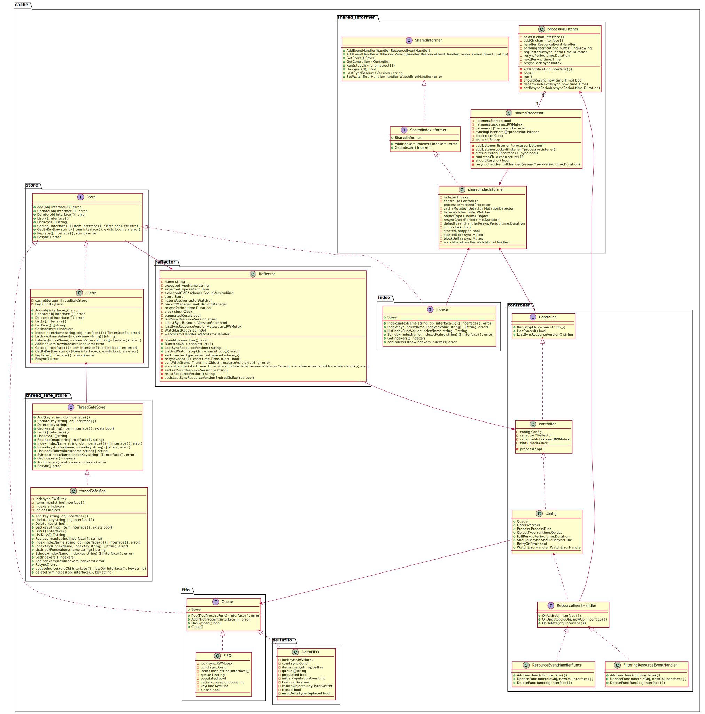

# k8s client-go informer 源码分析（基于 release-1.18 branch)

**NOTE: 由于代码篇幅太多，在分析的过程中会将不重要的部分删除，我将用//.................. 代替了。**

在正式开始之前，我们回顾下上次 [kube-controller-mananger](kube-controller-manager.md) 的分析。在上一篇中，我们只分析了各种 controller 从 workqueue 中取数据，然后进行消费。但是并没有介绍这个 workqueue 中的数据的生产者是谁！它们是怎么从 api-server 那里收到的！

这篇将详细的讲解下这其中的机制。

## informer 的实现机制

阅读源码之前，一定要知道 informer 的实现机制，不然不太好理解。因为这里面还是挺复杂的。informer 主要是通过 list-watch 的的机制对 k8s 各种资源进行事件监听，然后实现快速的进行事件同步。下面我把 informer 的机制流图贴出来，以便后面分析代码的时候进行参照。
下图来源 k8s 官方例子 sample-controller 的文档 [controller-client-go](https://github.com/kubernetes/sample-controller/blob/master/docs/controller-client-go.md).


图中各部分的详细说明，官方例子中的文档有详细说明，此处就不在赘述了！

在开始代码之前，我把 client-go informer 的类图展示一下，方便下面代码理解更加方便。

这个是整个 informer 的类图：


## kube-controller-manager 回顾

上次在讲解 controller 的时候，我们直接跳过了这部分代码。今天我就补下这部分的内容，然后再慢慢的进入到 client-go 的源码中。不然以上来就分析，也不太好将 client-go 和 controller 关联起来。

上次我们看到过这部分的代码：

```go
controllerContext, err := CreateControllerContext(c, rootClientBuilder, clientBuilder, ctx.Done)
if err != nil {
    klog.Fatalf("error building controller context: %v", err)
}
saTokenControllerInitFunc := serviceAccountTokenControllerStarter{rootClientBuilderrootClientBuilder}.startServiceAccountTokenControlle
if err := StartControllers(controllerContext, saTokenControllerInitFuncNewControllerInitializers(controllerContext.LoopMode), unsecuredMux); err != nil {
    klog.Fatalf("error starting controllers: %v", err)

// Start informers, 开始接收相应的事件
controllerContext.InformerFactory.Start(controllerContext.Stop)
controllerContext.ObjectOrMetadataInformerFactory.Start(controllerContext.Stop)
close(controllerContext.InformersStarted)
```

这里我们讲下 CreateControllerContext 函数具体做了些什么呢！

```go
// CreateControllerContext creates a context struct containing references to resources needed by the
// controllers such as the cloud provider and clientBuilder. rootClientBuilder is only used for
// the shared-informers client and token controller.
func CreateControllerContext(s *config.CompletedConfig, rootClientBuilder, clientBuilder controller.ControllerClientBuilder, stop <-chan struct{}) (ControllerContext, error) {
    versionedClient := rootClientBuilder.ClientOrDie("shared-informers")
    // 这里用 NewSharedInformerFactory 接口创建了个 sharedInformers
    sharedInformers := informers.NewSharedInformerFactory(versionedClient, ResyncPeriod(s)())

    metadataClient := metadata.NewForConfigOrDie(rootClientBuilder.ConfigOrDie("metadata-informers"))
    // 这里用 NewSharedInformerFactory 接口创建了个 metadataInformers
    metadataInformers := metadatainformer.NewSharedInformerFactory(metadataClient, ResyncPeriod(s)())

    // If apiserver is not running we should wait for some time and fail only then. This is particularly
    // important when we start apiserver and controller manager at the same time.
    if err := genericcontrollermanager.WaitForAPIServer(versionedClient, 10*time.Second); err != nil {
        return ControllerContext{}, fmt.Errorf("failed to wait for apiserver being healthy: %v", err)
    }

    //..................

    ctx := ControllerContext{
        ClientBuilder:                   clientBuilder,
        InformerFactory:                 sharedInformers,
        ObjectOrMetadataInformerFactory: controller.NewInformerFactory(sharedInformers, metadataInformers),
        ComponentConfig:                 s.ComponentConfig,
        RESTMapper:                      restMapper,
        AvailableResources:              availableResources,
        Cloud:                           cloud,
        LoopMode:                        loopMode,
        Stop:                            stop,
        InformersStarted:                make(chan struct{}),
        ResyncPeriod:                    ResyncPeriod(s),
    }
    return ctx, nil
}
```

从上面看来，CreateControllerContext 函数创建了 sharedInformers 和 metadataInformers 这两个 sharedInformer。

有些同学就会问什么是 sharedInformer 呢？其实这里开始是没有 shared informer 的概念的。开始只有单个 object 的 informer，比如 pod informer，job informer 等。但是后来，有很多 object 其实有些依赖关系的，比如 deployment 就同时需要监听 replicaset 和 pod 的。按照之前的架构，那就会有很多这种相同的 object informer 在工作，之间相互独立，且浪费资源。后来为了避免这些问题，就有了 shared informer。顾名思义，就是很多个 object 可以共享一个 informer。比如 deployment 的 pod 的 informer 就和 replicaset 的 pod 的 informer 重用了。

好了，言归正传，下面从 [NewSharedInformerFactory](https://github.com/kubernetes/kubernetes/blob/release-1.18/staging/src/k8s.io/client-go/informers/factory.go) 这个函数入手，进行分析 client-go 的 informer 到底是怎么按照上面 flow 进行工作的！

这里其实在文件开头可以看到，这些文件都是用 informer-gen 生成的。详细使用可参考 [k8s code-generator](https://github.com/kubernetes/code-generator)

```go
type sharedInformerFactory struct {
    client           kubernetes.Interface
    namespace        string
    tweakListOptions internalinterfaces.TweakListOptionsFunc
    lock             sync.Mutex
    defaultResync    time.Duration
    customResync     map[reflect.Type]time.Duration

    informers map[reflect.Type]cache.SharedIndexInformer
    // startedInformers is used for tracking which informers have been started.
    // This allows Start() to be called multiple times safely.
    startedInformers map[reflect.Type]bool
}

// SharedInformerFactory provides shared informers for resources in all known
// API group versions.
type SharedInformerFactory interface {
    internalinterfaces.SharedInformerFactory
    ForResource(resource schema.GroupVersionResource) (GenericInformer, error)
    WaitForCacheSync(stopCh <-chan struct{}) map[reflect.Type]bool

    Admissionregistration() admissionregistration.Interface
    Apps() apps.Interface
    Auditregistration() auditregistration.Interface
    Autoscaling() autoscaling.Interface
    Batch() batch.Interface
    Certificates() certificates.Interface
    Coordination() coordination.Interface
    Core() core.Interface
    Discovery() discovery.Interface
    Events() events.Interface
    Extensions() extensions.Interface
    Flowcontrol() flowcontrol.Interface
    Networking() networking.Interface
    Node() node.Interface
    Policy() policy.Interface
    Rbac() rbac.Interface
    Scheduling() scheduling.Interface
    Settings() settings.Interface
    Storage() storage.Interface
}

// NewSharedInformerFactory constructs a new instance of sharedInformerFactory for all namespaces.
func NewSharedInformerFactory(client kubernetes.Interface, defaultResync time.Duration) SharedInformerFactory {
    return NewSharedInformerFactoryWithOptions(client, defaultResync)
}

// NewSharedInformerFactoryWithOptions constructs a new instance of a SharedInformerFactory with additional options.
func NewSharedInformerFactoryWithOptions(client kubernetes.Interface, defaultResync time.Duration, options ...SharedInformerOption) SharedInformerFactory {
    factory := &sharedInformerFactory{
        client:           client,
        namespace:        v1.NamespaceAll,
        defaultResync:    defaultResync,
        informers:        make(map[reflect.Type]cache.SharedIndexInformer),
        startedInformers: make(map[reflect.Type]bool),
        customResync:     make(map[reflect.Type]time.Duration),
    }

    // Apply all options
    for _, opt := range options {
        factory = opt(factory)
    }

    return factory
}
```

可以看到 sharedInformerFactory 中的 informers 是一个 map，key 是一个反射类型，value 是一个 SharedIndexInformer。从 SharedInformerFactory 这个接口可以看到，client-go 已经预先实现了各种 informer 了。可以通过相应的 apiversion 进行调用，或者使用下面 InformerFor 函数添加。

```go
// InternalInformerFor returns the SharedIndexInformer for obj using an internal
// client.
func (f *sharedInformerFactory) InformerFor(obj runtime.Object, newFunc internalinterfaces.NewInformerFunc) cache.SharedIndexInformer {
    f.lock.Lock()
    defer f.lock.Unlock()

    informerType := reflect.TypeOf(obj)
    informer, exists := f.informers[informerType]
    if exists {
        return informer
    }

    resyncPeriod, exists := f.customResync[informerType]
    if !exists {
        resyncPeriod = f.defaultResync
    }

    informer = newFunc(f.client, resyncPeriod)
    f.informers[informerType] = informer

    return informer
}

// Start initializes all requested informers.
func (f *sharedInformerFactory) Start(stopCh <-chan struct{}) {
    f.lock.Lock()
    defer f.lock.Unlock()

    for informerType, informer := range f.informers {
        if !f.startedInformers[informerType] {
            go informer.Run(stopCh)
            f.startedInformers[informerType] = true
        }
    }
}
```

然后看到 InformerFor 这个函数就是将具体的 informer 加到上面那个 map 中。然后通过 Start 函数将这些 informer 都异步调用起来。

好了，再以 deployment 为例，在看看 startDeploymentController 和 NewDeploymentController 的时候干了什么。

```go
func startDeploymentController(ctx ControllerContext) (http.Handler, bool, error) {
    if !ctx.AvailableResources[schema.GroupVersionResource{Group: "apps", Version: "v1", Resource: "deployments"}] {
        return nil, false, nil
    }
    dc, err := deployment.NewDeploymentController(
        ctx.InformerFactory.Apps().V1().Deployments(),
        ctx.InformerFactory.Apps().V1().ReplicaSets(),
        ctx.InformerFactory.Core().V1().Pods(),
        ctx.ClientBuilder.ClientOrDie("deployment-controller"),
    )
    if err != nil {
        return nil, true, fmt.Errorf("error creating Deployment controller: %v", err)
    }
    go dc.Run(int(ctx.ComponentConfig.DeploymentController.ConcurrentDeploymentSyncs), ctx.Stop)
    return nil, true, nil
}

// NewDeploymentController creates a new DeploymentController.
func NewDeploymentController(dInformer appsinformers.DeploymentInformer, rsInformer appsinformers.ReplicaSetInformer, podInformer coreinformers.PodInformer, client clientset.Interface) (*DeploymentController, error) {
    //...............................

    dInformer.Informer().AddEventHandler(cache.ResourceEventHandlerFuncs{
        AddFunc:    dc.addDeployment,
        UpdateFunc: dc.updateDeployment,
        // This will enter the sync loop and no-op, because the deployment has been deleted from the store.
        DeleteFunc: dc.deleteDeployment,
    })
    rsInformer.Informer().AddEventHandler(cache.ResourceEventHandlerFuncs{
        AddFunc:    dc.addReplicaSet,
        UpdateFunc: dc.updateReplicaSet,
        DeleteFunc: dc.deleteReplicaSet,
    })
    podInformer.Informer().AddEventHandler(cache.ResourceEventHandlerFuncs{
        DeleteFunc: dc.deletePod,
    })
    //...............................
}
```

DeploymentInformer 实现：

```go
// DeploymentInformer provides access to a shared informer and lister for
// Deployments.
type DeploymentInformer interface {
    Informer() cache.SharedIndexInformer
    Lister() v1.DeploymentLister
}

type deploymentInformer struct {
    factory          internalinterfaces.SharedInformerFactory
    tweakListOptions internalinterfaces.TweakListOptionsFunc
    namespace        string
}

// NewDeploymentInformer constructs a new informer for Deployment type.
// Always prefer using an informer factory to get a shared informer instead of getting an independent
// one. This reduces memory footprint and number of connections to the server.
func NewDeploymentInformer(client kubernetes.Interface, namespace string, resyncPeriod time.Duration, indexers cache.Indexers) cache.SharedIndexInformer {
    return NewFilteredDeploymentInformer(client, namespace, resyncPeriod, indexers, nil)
}

// NewFilteredDeploymentInformer constructs a new informer for Deployment type.
// Always prefer using an informer factory to get a shared informer instead of getting an independent
// one. This reduces memory footprint and number of connections to the server.
func NewFilteredDeploymentInformer(client kubernetes.Interface, namespace string, resyncPeriod time.Duration, indexers cache.Indexers, tweakListOptions internalinterfaces.TweakListOptionsFunc) cache.SharedIndexInformer {
    return cache.NewSharedIndexInformer(
        &cache.ListWatch{
            ListFunc: func(options metav1.ListOptions) (runtime.Object, error) {
                if tweakListOptions != nil {
                    tweakListOptions(&options)
                }
                return client.AppsV1().Deployments(namespace).List(context.TODO(), options)
            },
            WatchFunc: func(options metav1.ListOptions) (watch.Interface, error) {
                if tweakListOptions != nil {
                    tweakListOptions(&options)
                }
                return client.AppsV1().Deployments(namespace).Watch(context.TODO(), options)
            },
        },
        &appsv1.Deployment{},
        resyncPeriod,
        indexers,
    )
}

func (f *deploymentInformer) Informer() cache.SharedIndexInformer {
    return f.factory.InformerFor(&appsv1.Deployment{}, f.defaultInformer)
}

```

通过调用 ctx.InformerFactory.Apps().V1().Deployments() 将返回一个 [DeploymentInformer](https://github.com/kubernetes/kubernetes/blob/release-1.18/staging/src/k8s.io/client-go/informers/apps/v1/deployment.go) 的 interface。然后在 NewDeploymentController 中通过 xxx.Informer() 函数将调用到上面说到的 InformerFor 函数，将这个 informer 添加到 shared informers 的 listeners 中去。

可以看出在 NewDeploymentInformer 的时候调用了 NewFilteredDeploymentInformer，然后调用 client-go 里面的 cache.NewSharedIndexInformer 创建了个 SharedIndexInformer, 并传入了 listwatcher.

## SharedIndexInformer 分析

好了，到这里我们终于要开始揭开 client-go 的面纱了。上面我们提到的 [SharedIndexInformer](https://github.com/kubernetes/kubernetes/blob/release-1.18/staging/src/k8s.io/client-go/tools/cache/shared_informer.go)，这个就是 client-go 实现的功能，那么我们现在开始从这里进行分析。

```go
// SharedIndexInformer provides add and get Indexers ability based on SharedInformer.
type SharedIndexInformer interface {
    SharedInformer
    // AddIndexers add indexers to the informer before it starts.
    AddIndexers(indexers Indexers) error
    GetIndexer() Indexer
}

// NewSharedInformer creates a new instance for the listwatcher.
func NewSharedInformer(lw ListerWatcher, exampleObject runtime.Object, defaultEventHandlerResyncPeriod time.Duration) SharedInformer {
    return NewSharedIndexInformer(lw, exampleObject, defaultEventHandlerResyncPeriod, Indexers{})
}

// NewSharedIndexInformer creates a new instance for the listwatcher.
// The created informer will not do resyncs if the given
// defaultEventHandlerResyncPeriod is zero.  Otherwise: for each
// handler that with a non-zero requested resync period, whether added
// before or after the informer starts, the nominal resync period is
// the requested resync period rounded up to a multiple of the
// informer's resync checking period.  Such an informer's resync
// checking period is established when the informer starts running,
// and is the maximum of (a) the minimum of the resync periods
// requested before the informer starts and the
// defaultEventHandlerResyncPeriod given here and (b) the constant
// `minimumResyncPeriod` defined in this file.
func NewSharedIndexInformer(lw ListerWatcher, exampleObject runtime.Object, defaultEventHandlerResyncPeriod time.Duration, indexers Indexers) SharedIndexInformer {
    realClock := &clock.RealClock{}
    sharedIndexInformer := &sharedIndexInformer{
        processor:                       &sharedProcessor{clock: realClock},
        indexer:                         NewIndexer(DeletionHandlingMetaNamespaceKeyFunc, indexers),
        listerWatcher:                   lw,
        objectType:                      exampleObject,
        resyncCheckPeriod:               defaultEventHandlerResyncPeriod,
        defaultEventHandlerResyncPeriod: defaultEventHandlerResyncPeriod,
        cacheMutationDetector:           NewCacheMutationDetector(fmt.Sprintf("%T", exampleObject)),
        clock:                           realClock,
    }
    return sharedIndexInformer
}

// `*sharedIndexInformer` implements SharedIndexInformer and has three
// main components.  One is an indexed local cache, `indexer Indexer`.
// The second main component is a Controller that pulls
// objects/notifications using the ListerWatcher and pushes them into
// a DeltaFIFO --- whose knownObjects is the informer's local cache
// --- while concurrently Popping Deltas values from that fifo and
// processing them with `sharedIndexInformer::HandleDeltas`.  Each
// invocation of HandleDeltas, which is done with the fifo's lock
// held, processes each Delta in turn.  For each Delta this both
// updates the local cache and stuffs the relevant notification into
// the sharedProcessor.  The third main component is that
// sharedProcessor, which is responsible for relaying those
// notifications to each of the informer's clients.
type sharedIndexInformer struct {
    indexer    Indexer
    controller Controller

    processor             *sharedProcessor
    cacheMutationDetector MutationDetector

    listerWatcher ListerWatcher

    // objectType is an example object of the type this informer is
    // expected to handle.  Only the type needs to be right, except
    // that when that is `unstructured.Unstructured` the object's
    // `"apiVersion"` and `"kind"` must also be right.
    objectType runtime.Object

    // resyncCheckPeriod is how often we want the reflector's resync timer to fire so it can call
    // shouldResync to check if any of our listeners need a resync.
    resyncCheckPeriod time.Duration
    // defaultEventHandlerResyncPeriod is the default resync period for any handlers added via
    // AddEventHandler (i.e. they don't specify one and just want to use the shared informer's default
    // value).
    defaultEventHandlerResyncPeriod time.Duration
    // clock allows for testability
    clock clock.Clock

    started, stopped bool
    startedLock      sync.Mutex

    // blockDeltas gives a way to stop all event distribution so that a late event handler
    // can safely join the shared informer.
    blockDeltas sync.Mutex
}

func (s *sharedIndexInformer) Run(stopCh <-chan struct{}) {
    defer utilruntime.HandleCrash()

    fifo := NewDeltaFIFOWithOptions(DeltaFIFOOptions{
        KnownObjects:          s.indexer,
        EmitDeltaTypeReplaced: true,
    })

    cfg := &Config{
        Queue:            fifo,
        ListerWatcher:    s.listerWatcher,
        ObjectType:       s.objectType,
        FullResyncPeriod: s.resyncCheckPeriod,
        RetryOnError:     false,
        ShouldResync:     s.processor.shouldResync,

        Process: s.HandleDeltas,
    }

    func() {
        s.startedLock.Lock()
        defer s.startedLock.Unlock()

        s.controller = New(cfg)
        s.controller.(*controller).clock = s.clock
        s.started = true
    }()

    // Separate stop channel because Processor should be stopped strictly after controller
    processorStopCh := make(chan struct{})
    var wg wait.Group
    defer wg.Wait()              // Wait for Processor to stop
    defer close(processorStopCh) // Tell Processor to stop
    wg.StartWithChannel(processorStopCh, s.cacheMutationDetector.Run)
    wg.StartWithChannel(processorStopCh, s.processor.run)

    defer func() {
        s.startedLock.Lock()
        defer s.startedLock.Unlock()
        s.stopped = true // Don't want any new listeners
    }()
    s.controller.Run(stopCh)
}

```

## Controller 分析

从 sharedIndexInformer 的 Run 函数中，我们可以看到，它创建了个 DeltaFiFOQueue 赋值给了 Config 结构，然后在创建 Controller 的时候传了进去。然后开了两个线程分别做 s.cacheMutationDetector.Run 和 s.processor.run， 然后再调用了 s.controller.Run，

我们再进入 [controller.go](https://github.com/kubernetes/kubernetes/blob/release-1.18/staging/src/k8s.io/client-go/tools/cache/controller.go) 看看 controller 的 Run。

```go
// Config contains all the settings for one of these low-level controllers.
type Config struct {
    // The queue for your objects - has to be a DeltaFIFO due to
    // assumptions in the implementation. Your Process() function
    // should accept the output of this Queue's Pop() method.
    Queue

    // Something that can list and watch your objects.
    ListerWatcher

    // Something that can process a popped Deltas.
    Process ProcessFunc

    // ObjectType is an example object of the type this controller is
    // expected to handle.  Only the type needs to be right, except
    // that when that is `unstructured.Unstructured` the object's
    // `"apiVersion"` and `"kind"` must also be right.
    ObjectType runtime.Object

    // FullResyncPeriod is the period at which ShouldResync is considered.
    FullResyncPeriod time.Duration

    // ShouldResync is periodically used by the reflector to determine
    // whether to Resync the Queue. If ShouldResync is `nil` or
    // returns true, it means the reflector should proceed with the
    // resync.
    ShouldResync ShouldResyncFunc

    // If true, when Process() returns an error, re-enqueue the object.
    // TODO: add interface to let you inject a delay/backoff or drop
    //       the object completely if desired. Pass the object in
    //       question to this interface as a parameter.  This is probably moot
    //       now that this functionality appears at a higher level.
    RetryOnError bool
}

// `*controller` implements Controller
type controller struct {
    config         Config
    reflector      *Reflector
    reflectorMutex sync.RWMutex
    clock          clock.Clock
}

// Controller is a low-level controller that is parameterized by a
// Config and used in sharedIndexInformer.
type Controller interface {
    // Run does two things.  One is to construct and run a Reflector
    // to pump objects/notifications from the Config's ListerWatcher
    // to the Config's Queue and possibly invoke the occasional Resync
    // on that Queue.  The other is to repeatedly Pop from the Queue
    // and process with the Config's ProcessFunc.  Both of these
    // continue until `stopCh` is closed.
    Run(stopCh <-chan struct{})

    // HasSynced delegates to the Config's Queue
    HasSynced() bool

    // LastSyncResourceVersion delegates to the Reflector when there
    // is one, otherwise returns the empty string
    LastSyncResourceVersion() string
}

// Run begins processing items, and will continue until a value is sent down stopCh or it is closed.
// It's an error to call Run more than once.
// Run blocks; call via go.
func (c *controller) Run(stopCh <-chan struct{}) {
    defer utilruntime.HandleCrash()
    go func() {
        <-stopCh
        c.config.Queue.Close()
    }()
    r := NewReflector(
        c.config.ListerWatcher,
        c.config.ObjectType,
        c.config.Queue,
        c.config.FullResyncPeriod,
    )
    r.ShouldResync = c.config.ShouldResync
    r.clock = c.clock

    c.reflectorMutex.Lock()
    c.reflector = r
    c.reflectorMutex.Unlock()

    var wg wait.Group
    defer wg.Wait()

    wg.StartWithChannel(stopCh, r.Run)

    wait.Until(c.processLoop, time.Second, stopCh)
}

```

从上面的 controller 的这个结构体的 Run 可以看到，它干了两件是，一个是创建了个 Reflector，可以看到传入了一个 ListerWatcher 的实例和一个 Queue, 然后调用 r.Run 将其调用起来，另一个就是调用 c.processLoop.

## Reflector 分析

从上面的 flow 我们可以知道 [Reflector](https://github.com/kubernetes/kubernetes/blob/e1e78ec6b0a2d6050b6076ebe6e34288a6df337e/staging/src/k8s.io/client-go/tools/cache/reflector.go) 的工作就是从 list-watch api server 的各种 object，然后将各种事件添加到 DeltaFIFOQueue 中让 informer 去消费。那我们现在看看 Reflector 的实现：

```go
// NewReflector creates a new Reflector object which will keep the
// given store up to date with the server's contents for the given
// resource. Reflector promises to only put things in the store that
// have the type of expectedType, unless expectedType is nil. If
// resyncPeriod is non-zero, then the reflector will periodically
// consult its ShouldResync function to determine whether to invoke
// the Store's Resync operation; `ShouldResync==nil` means always
// "yes".  This enables you to use reflectors to periodically process
// everything as well as incrementally processing the things that
// change.
func NewReflector(lw ListerWatcher, expectedType interface{}, store Store, resyncPeriod time.Duration) *Reflector {
    return NewNamedReflector(naming.GetNameFromCallsite(internalPackages...), lw, expectedType, store, resyncPeriod)
}

// NewNamedReflector same as NewReflector, but with a specified name for logging
func NewNamedReflector(name string, lw ListerWatcher, expectedType interface{}, store Store, resyncPeriod time.Duration) *Reflector {
    realClock := &clock.RealClock{}
    r := &Reflector{
        name:          name,
        listerWatcher: lw,
        store:         store,
        // We used to make the call every 1sec (1 QPS), the goal here is to achieve ~98% traffic reduction when
        // API server is not healthy. With these parameters, backoff will stop at [30,60) sec interval which is
        // 0.22 QPS. If we don't backoff for 2min, assume API server is healthy and we reset the backoff.
        backoffManager: wait.NewExponentialBackoffManager(800*time.Millisecond, 30*time.Second, 2*time.Minute, 2.0, 1.0, realClock),
        resyncPeriod:   resyncPeriod,
        clock:          realClock,
    }
    r.setExpectedType(expectedType)
    return r
}

// Run repeatedly uses the reflector's ListAndWatch to fetch all the
// objects and subsequent deltas.
// Run will exit when stopCh is closed.
func (r *Reflector) Run(stopCh <-chan struct{}) {
    klog.V(2).Infof("Starting reflector %s (%s) from %s", r.expectedTypeName, r.resyncPeriod, r.name)
    wait.BackoffUntil(func() {
        if err := r.ListAndWatch(stopCh); err != nil {
            utilruntime.HandleError(err)
        }
    }, r.backoffManager, true, stopCh)
    klog.V(2).Infof("Stopping reflector %s (%s) from %s", r.expectedTypeName, r.resyncPeriod, r.name)
}
```

上面可以看到在 NewReflector 的时候将 ListerWatcher 和 queue 传了过来，分别赋值给了 listerWatcher 和 store. 然后在调用 Run 的时候，就调用了 ListAndWatch 进行核心操作。

```go
// ListAndWatch first lists all items and get the resource version at the moment of call,
// and then use the resource version to watch.
// It returns error if ListAndWatch didn't even try to initialize watch.
func (r *Reflector) ListAndWatch(stopCh <-chan struct{}) error {
    klog.V(3).Infof("Listing and watching %v from %s", r.expectedTypeName, r.name)
    var resourceVersion string

    options := metav1.ListOptions{ResourceVersion: r.relistResourceVersion()}

    if err := func() error {
        initTrace := trace.New("Reflector ListAndWatch", trace.Field{"name", r.name})
        defer initTrace.LogIfLong(10 * time.Second)
        var list runtime.Object
        var paginatedResult bool
        var err error
        listCh := make(chan struct{}, 1)
        panicCh := make(chan interface{}, 1)
        go func() {
            defer func() {
                if r := recover(); r != nil {
                    panicCh <- r
                }
            }()
            // Attempt to gather list in chunks, if supported by listerWatcher, if not, the first
            // list request will return the full response.
            pager := pager.New(pager.SimplePageFunc(func(opts metav1.ListOptions) (runtime.Object, error) {
                return r.listerWatcher.List(opts)
            }))
            switch {
            case r.WatchListPageSize != 0:
                pager.PageSize = r.WatchListPageSize
            case r.paginatedResult:
                // We got a paginated result initially. Assume this resource and server honor
                // paging requests (i.e. watch cache is probably disabled) and leave the default
                // pager size set.
            case options.ResourceVersion != "" && options.ResourceVersion != "0":
                // User didn't explicitly request pagination.
                //
                // With ResourceVersion != "", we have a possibility to list from watch cache,
                // but we do that (for ResourceVersion != "0") only if Limit is unset.
                // To avoid thundering herd on etcd (e.g. on master upgrades), we explicitly
                // switch off pagination to force listing from watch cache (if enabled).
                // With the existing semantic of RV (result is at least as fresh as provided RV),
                // this is correct and doesn't lead to going back in time.
                //
                // We also don't turn off pagination for ResourceVersion="0", since watch cache
                // is ignoring Limit in that case anyway, and if watch cache is not enabled
                // we don't introduce regression.
                pager.PageSize = 0
            }

            list, paginatedResult, err = pager.List(context.Background(), options)
            if isExpiredError(err) {
                r.setIsLastSyncResourceVersionExpired(true)
                // Retry immediately if the resource version used to list is expired.
                // The pager already falls back to full list if paginated list calls fail due to an "Expired" error on
                // continuation pages, but the pager might not be enabled, or the full list might fail because the
                // resource version it is listing at is expired, so we need to fallback to resourceVersion="" in all
                // to recover and ensure the reflector makes forward progress.
                list, paginatedResult, err = pager.List(context.Background(), metav1.ListOptions{ResourceVersion: r.relistResourceVersion()})
            }
            close(listCh)
        }()
        select {
        case <-stopCh:
            return nil
        case r := <-panicCh:
            panic(r)
        case <-listCh:
        }
        if err != nil {
            return fmt.Errorf("%s: Failed to list %v: %v", r.name, r.expectedTypeName, err)
        }

        // We check if the list was paginated and if so set the paginatedResult based on that.
        // However, we want to do that only for the initial list (which is the only case
        // when we set ResourceVersion="0"). The reasoning behind it is that later, in some
        // situations we may force listing directly from etcd (by setting ResourceVersion="")
        // which will return paginated result, even if watch cache is enabled. However, in
        // that case, we still want to prefer sending requests to watch cache if possible.
        //
        // Paginated result returned for request with ResourceVersion="0" mean that watch
        // cache is disabled and there are a lot of objects of a given type. In such case,
        // there is no need to prefer listing from watch cache.
        if options.ResourceVersion == "0" && paginatedResult {
            r.paginatedResult = true
        }

        r.setIsLastSyncResourceVersionExpired(false) // list was successful
        initTrace.Step("Objects listed")
        listMetaInterface, err := meta.ListAccessor(list)
        if err != nil {
            return fmt.Errorf("%s: Unable to understand list result %#v: %v", r.name, list, err)
        }
        resourceVersion = listMetaInterface.GetResourceVersion()
        initTrace.Step("Resource version extracted")
        items, err := meta.ExtractList(list)
        if err != nil {
            return fmt.Errorf("%s: Unable to understand list result %#v (%v)", r.name, list, err)
        }
        initTrace.Step("Objects extracted")
        if err := r.syncWith(items, resourceVersion); err != nil {
            return fmt.Errorf("%s: Unable to sync list result: %v", r.name, err)
        }
        initTrace.Step("SyncWith done")
        r.setLastSyncResourceVersion(resourceVersion)
        initTrace.Step("Resource version updated")
        return nil
    }(); err != nil {
        return err
    }

    resyncerrc := make(chan error, 1)
    cancelCh := make(chan struct{})
    defer close(cancelCh)
    go func() {
        resyncCh, cleanup := r.resyncChan()
        defer func() {
            cleanup() // Call the last one written into cleanup
        }()
        for {
            select {
            case <-resyncCh:
            case <-stopCh:
                return
            case <-cancelCh:
                return
            }
            if r.ShouldResync == nil || r.ShouldResync() {
                klog.V(4).Infof("%s: forcing resync", r.name)
                if err := r.store.Resync(); err != nil {
                    resyncerrc <- err
                    return
                }
            }
            cleanup()
            resyncCh, cleanup = r.resyncChan()
        }
    }()

    for {
        // give the stopCh a chance to stop the loop, even in case of continue statements further down on errors
        select {
        case <-stopCh:
            return nil
        default:
        }

        timeoutSeconds := int64(minWatchTimeout.Seconds() * (rand.Float64() + 1.0))
        options = metav1.ListOptions{
            ResourceVersion: resourceVersion,
            // We want to avoid situations of hanging watchers. Stop any wachers that do not
            // receive any events within the timeout window.
            TimeoutSeconds: &timeoutSeconds,
            // To reduce load on kube-apiserver on watch restarts, you may enable watch bookmarks.
            // Reflector doesn't assume bookmarks are returned at all (if the server do not support
            // watch bookmarks, it will ignore this field).
            AllowWatchBookmarks: true,
        }

        // start the clock before sending the request, since some proxies won't flush headers until after the first watch event is sent
        start := r.clock.Now()
        w, err := r.listerWatcher.Watch(options)

        //...........................................

        if err := r.watchHandler(start, w, &resourceVersion, resyncerrc, stopCh); err != nil {
            //...........................................
            return nil
        }
    }
}

// watchHandler watches w and keeps *resourceVersion up to date.
func (r *Reflector) watchHandler(start time.Time, w watch.Interface, resourceVersion *string, errc chan error, stopCh <-chan struct{}) error {
    eventCount := 0

    // Stopping the watcher should be idempotent and if we return from this function there's no way
    // we're coming back in with the same watch interface.
    defer w.Stop()

loop:
    for {
        select {
        case <-stopCh:
            return errorStopRequested
        case err := <-errc:
            return err
        case event, ok := <-w.ResultChan():
            if !ok {
                break loop
            }
            if event.Type == watch.Error {
                return apierrors.FromObject(event.Object)
            }
            if r.expectedType != nil {
                if e, a := r.expectedType, reflect.TypeOf(event.Object); e != a {
                    utilruntime.HandleError(fmt.Errorf("%s: expected type %v, but watch event object had type %v", r.name, e, a))
                    continue
                }
            }
            if r.expectedGVK != nil {
                if e, a := *r.expectedGVK, event.Object.GetObjectKind().GroupVersionKind(); e != a {
                    utilruntime.HandleError(fmt.Errorf("%s: expected gvk %v, but watch event object had gvk %v", r.name, e, a))
                    continue
                }
            }
            meta, err := meta.Accessor(event.Object)
            if err != nil {
                utilruntime.HandleError(fmt.Errorf("%s: unable to understand watch event %#v", r.name, event))
                continue
            }
            newResourceVersion := meta.GetResourceVersion()
            switch event.Type {
            case watch.Added:
                err := r.store.Add(event.Object)
                if err != nil {
                    utilruntime.HandleError(fmt.Errorf("%s: unable to add watch event object (%#v) to store: %v", r.name, event.Object, err))
                }
            case watch.Modified:
                err := r.store.Update(event.Object)
                if err != nil {
                    utilruntime.HandleError(fmt.Errorf("%s: unable to update watch event object (%#v) to store: %v", r.name, event.Object, err))
                }
            case watch.Deleted:
                // TODO: Will any consumers need access to the "last known
                // state", which is passed in event.Object? If so, may need
                // to change this.
                err := r.store.Delete(event.Object)
                if err != nil {
                    utilruntime.HandleError(fmt.Errorf("%s: unable to delete watch event object (%#v) from store: %v", r.name, event.Object, err))
                }
            case watch.Bookmark:
                // A `Bookmark` means watch has synced here, just update the resourceVersion
            default:
                utilruntime.HandleError(fmt.Errorf("%s: unable to understand watch event %#v", r.name, event))
            }
            *resourceVersion = newResourceVersion
            r.setLastSyncResourceVersion(newResourceVersion)
            eventCount++
        }
    }

    watchDuration := r.clock.Since(start)
    if watchDuration < 1*time.Second && eventCount == 0 {
        return fmt.Errorf("very short watch: %s: Unexpected watch close - watch lasted less than a second and no items received", r.name)
    }
    klog.V(4).Infof("%s: Watch close - %v total %v items received", r.name, r.expectedTypeName, eventCount)
    return nil
}
```

上面就是 Reflector 的灵魂俩函数了。对于 ListAndWatch，虽然代码很多，但是从注释上来看，也就是先 list 出所有 object item, 然后获取正在使用的版本，再去 watch 使用的版本 object 的变化事件。然后调用 watchHandler 进行无线循环的接收变化事件，并将各种接收到的事件放入到 Store（也就是那个 DeltaFIFOQueue) 中。
到这里我们知道了 Reflector 的工作方式了，那么它将事件放到 Queue 中，什么时候去处理呢？谁去处理呢？

## Informer 分析

下面就回到 controller 分析小节中，从上面我们知道一个线程就是无限的往 Queue 中加数据，另一个 s.controller.Run 是干什么的？ 我想大家应该想到了。是的，它就是无限的循环在 queue 中取数据进行处理。下面我们就从 [processLoop](https://github.com/kubernetes/kubernetes/blob/e1e78ec6b0a2d6050b6076ebe6e34288a6df337e/staging/src/k8s.io/client-go/tools/cache/controller.go#L171:22) 开始分析！

```go
// processLoop drains the work queue.
// TODO: Consider doing the processing in parallel. This will require a little thought
// to make sure that we don't end up processing the same object multiple times
// concurrently.
//
// TODO: Plumb through the stopCh here (and down to the queue) so that this can
// actually exit when the controller is stopped. Or just give up on this stuff
// ever being stoppable. Converting this whole package to use Context would
// also be helpful.
func (c *controller) processLoop() {
    for {
        obj, err := c.config.Queue.Pop(PopProcessFunc(c.config.Process))
        if err != nil {
            if err == ErrFIFOClosed {
                return
            }
            if c.config.RetryOnError {
                // This is the safe way to re-enqueue.
                c.config.Queue.AddIfNotPresent(obj)
            }
        }
    }
}
```

从代码中可以看到，它确实是这样对的，就是个死循环从 Queue 中读数据，然后调用 Process 进行处理。从 sharedInfomer 中我们分析下来，这个 Queue 就是在 sharedIndexInformer.Run 的时候创建的那个 DeltaFIFOQueue，然后这个 Process 就是 sharedIndexInformer 的 HandleDeltas。

下面看看 [HandleDeltas](https://github.com/kubernetes/kubernetes/blob/99df02cd4ad467279ed758674542cf9a2c042859/staging/src/k8s.io/client-go/tools/cache/shared_informer.go#L527:1)

```go
func (s *sharedIndexInformer) HandleDeltas(obj interface{}) error {
    s.blockDeltas.Lock()
    defer s.blockDeltas.Unlock()

    // from oldest to newest
    for _, d := range obj.(Deltas) {
        switch d.Type {
        case Sync, Replaced, Added, Updated:
            s.cacheMutationDetector.AddObject(d.Object)
            if old, exists, err := s.indexer.Get(d.Object); err == nil && exists {
                if err := s.indexer.Update(d.Object); err != nil {
                    return err
                }

                isSync := false
                switch {
                case d.Type == Sync:
                    // Sync events are only propagated to listeners that requested resync
                    isSync = true
                case d.Type == Replaced:
                    if accessor, err := meta.Accessor(d.Object); err == nil {
                        if oldAccessor, err := meta.Accessor(old); err == nil {
                            // Replaced events that didn't change resourceVersion are treated as resync events
                            // and only propagated to listeners that requested resync
                            isSync = accessor.GetResourceVersion() == oldAccessor.GetResourceVersion()
                        }
                    }
                }
                s.processor.distribute(updateNotification{oldObj: old, newObj: d.Object}, isSync)
            } else {
                if err := s.indexer.Add(d.Object); err != nil {
                    return err
                }
                s.processor.distribute(addNotification{newObj: d.Object}, false)
            }
        case Deleted:
            if err := s.indexer.Delete(d.Object); err != nil {
                return err
            }
            s.processor.distribute(deleteNotification{oldObj: d.Object}, false)
        }
    }
    return nil
}
```

可以看到这个函数真是符合 flow 中的 informer 干的事，将从 DeltaFIFOQueue 中读到的各种事件，进行分发给 custome controller 和将变化的数据更新到 indexer.

下面看看它是怎么将事件分发给各种 controller 的。
从上面 sharedInformer 我们可看到在创建 sharedIndexInformer 的时候，我们创建了个 sharedProcessor 给了 sharedIndexInformer 的 processor，

```go
// sharedProcessor has a collection of processorListener and can
// distribute a notification object to its listeners.  There are two
// kinds of distribute operations.  The sync distributions go to a
// subset of the listeners that (a) is recomputed in the occasional
// calls to shouldResync and (b) every listener is initially put in.
// The non-sync distributions go to every listener.
type sharedProcessor struct {
    listenersStarted bool
    listenersLock    sync.RWMutex
    listeners        []*processorListener
    syncingListeners []*processorListener
    clock            clock.Clock
    wg               wait.Group
}

func (p *sharedProcessor) addListener(listener *processorListener) {
    p.listenersLock.Lock()
    defer p.listenersLock.Unlock()

    p.addListenerLocked(listener)
    if p.listenersStarted {
        p.wg.Start(listener.run)
        p.wg.Start(listener.pop)
    }
}

func (p *sharedProcessor) addListenerLocked(listener *processorListener) {
    p.listeners = append(p.listeners, listener)
    p.syncingListeners = append(p.syncingListeners, listener)
}

func (p *sharedProcessor) distribute(obj interface{}, sync bool) {
    p.listenersLock.RLock()
    defer p.listenersLock.RUnlock()

    if sync {
        for _, listener := range p.syncingListeners {
            listener.add(obj)
        }
    } else {
        for _, listener := range p.listeners {
            listener.add(obj)
        }
    }
}

func (p *sharedProcessor) run(stopCh <-chan struct{}) {
    func() {
        p.listenersLock.RLock()
        defer p.listenersLock.RUnlock()
        for _, listener := range p.listeners {
            p.wg.Start(listener.run)
            p.wg.Start(listener.pop)
        }
        p.listenersStarted = true
    }()
    <-stopCh
    p.listenersLock.RLock()
    defer p.listenersLock.RUnlock()
    for _, listener := range p.listeners {
        close(listener.addCh) // Tell .pop() to stop. .pop() will tell .run() to stop
    }
    p.wg.Wait() // Wait for all .pop() and .run() to stop
}

```

可以看出来，sharedProcessor 维护了两个 processorListener slice, 一个 listeners 和一个 syncingListeners。顾名思义，这两个区别就是一个是全集，一个是正在 syncing 的 listeners。sharedProcessor 提供了 addListener 向两个 slice 中添加 listener，然后调用 processorListene 的 run 和 pop 方法。提供了 distribute 将数据添加到各种添加过的 listeners。

再看看 processorListener 做了什么？

```go
// processorListener relays notifications from a sharedProcessor to
// one ResourceEventHandler --- using two goroutines, two unbuffered
// channels, and an unbounded ring buffer.  The `add(notification)`
// function sends the given notification to `addCh`.  One goroutine
// runs `pop()`, which pumps notifications from `addCh` to `nextCh`
// using storage in the ring buffer while `nextCh` is not keeping up.
// Another goroutine runs `run()`, which receives notifications from
// `nextCh` and synchronously invokes the appropriate handler method.
//
// processorListener also keeps track of the adjusted requested resync
// period of the listener.
type processorListener struct {
    nextCh chan interface{}
    addCh  chan interface{}

    handler ResourceEventHandler

    // pendingNotifications is an unbounded ring buffer that holds all notifications not yet distributed.
    // There is one per listener, but a failing/stalled listener will have infinite pendingNotifications
    // added until we OOM.
    // TODO: This is no worse than before, since reflectors were backed by unbounded DeltaFIFOs, but
    // we should try to do something better.
    pendingNotifications buffer.RingGrowing

    // requestedResyncPeriod is how frequently the listener wants a
    // full resync from the shared informer, but modified by two
    // adjustments.  One is imposing a lower bound,
    // `minimumResyncPeriod`.  The other is another lower bound, the
    // sharedProcessor's `resyncCheckPeriod`, that is imposed (a) only
    // in AddEventHandlerWithResyncPeriod invocations made after the
    // sharedProcessor starts and (b) only if the informer does
    // resyncs at all.
    requestedResyncPeriod time.Duration
    // resyncPeriod is the threshold that will be used in the logic
    // for this listener.  This value differs from
    // requestedResyncPeriod only when the sharedIndexInformer does
    // not do resyncs, in which case the value here is zero.  The
    // actual time between resyncs depends on when the
    // sharedProcessor's `shouldResync` function is invoked and when
    // the sharedIndexInformer processes `Sync` type Delta objects.
    resyncPeriod time.Duration
    // nextResync is the earliest time the listener should get a full resync
    nextResync time.Time
    // resyncLock guards access to resyncPeriod and nextResync
    resyncLock sync.Mutex
}

func (p *processorListener) add(notification interface{}) {
    p.addCh <- notification
}

func (p *processorListener) pop() {
    defer utilruntime.HandleCrash()
    defer close(p.nextCh) // Tell .run() to stop

    var nextCh chan<- interface{}
    var notification interface{}
    for {
        select {
        case nextCh <- notification:
            // Notification dispatched
            var ok bool
            notification, ok = p.pendingNotifications.ReadOne()
            if !ok { // Nothing to pop
                nextCh = nil // Disable this select case
            }
        case notificationToAdd, ok := <-p.addCh:
            if !ok {
                return
            }
            if notification == nil { // No notification to pop (and pendingNotifications is empty)
                // Optimize the case - skip adding to pendingNotifications
                notification = notificationToAdd
                nextCh = p.nextCh
            } else { // There is already a notification waiting to be dispatched
                p.pendingNotifications.WriteOne(notificationToAdd)
            }
        }
    }
}

func (p *processorListener) run() {
    // this call blocks until the channel is closed.  When a panic happens during the notification
    // we will catch it, **the offending item will be skipped!**, and after a short delay (one second)
    // the next notification will be attempted.  This is usually better than the alternative of never
    // delivering again.
    stopCh := make(chan struct{})
    wait.Until(func() {
        for next := range p.nextCh {
            switch notification := next.(type) {
            case updateNotification:
                p.handler.OnUpdate(notification.oldObj, notification.newObj)
            case addNotification:
                p.handler.OnAdd(notification.newObj)
            case deleteNotification:
                p.handler.OnDelete(notification.oldObj)
            default:
                utilruntime.HandleError(fmt.Errorf("unrecognized notification: %T", next))
            }
        }
        // the only way to get here is if the p.nextCh is empty and closed
        close(stopCh)
    }, 1*time.Second, stopCh)
}
```

看到这里，如果写过自己的 controller 的同学们是不是瞬间懂了。原来就是它提供了一个 ResourceEventHandler 给我们自己实现的啊！对，没错，就是这里，它提供了 ResourceEventHandler 这个 interface 给用户，并提供了三个函数 OnAdd，OnUpdate，OnDelete 接口。好了，从代码可以看出，它通过两个 channel addCh，nextCh 实现了两个 go runtine 进行通信。add 方法向 addCh 放数据，pop 方法从 addCh 里面取数据放到 nextCh，然后 run 从 nextCh 里面取数据，给自定义的 OnXXX 函数进行处理。

**NOTE**: 这里 pop 里面的实现逻辑有点不太好懂。我在这里详细的将一下。它定义了一个 nextCh 只写 channel，然后无限循环的从 addCh 里面读，当 addCh 里面放入了数据，这边 pop 就收到了数据，进入了第二个 select case 条件，此时 notification 肯定是个 nil, 然后就把收到的数据放到 notification，然后把定义的局部的 channel nextCh 指向 p.nextCh, 也就是说写入这个只写的 channel 就写入了 p.nextCh 里面了，让 run 去处理。好了，当放到 addCh 里面的速度大于处理的速度，它就放到一个 pendingNotifications （一个无限循 buffer)。当所有事件处理完成，就又把 nextCh channel 设置成了 nil, 也就是 disabled 掉了这个 select case 了，然后当有数据了，就又开始这个逻辑循环。

## Indexer 分析

上面从 Informer 分析部分，可以看到在 HandleDeltas 的时候，也就数据更新到了 indexer 中了。下面就来分析下 Indexer 的代码。同理在创建 SharedIndexInformer 的时候将赋值这个 indexer，但是 sharedinformer 提供了两种接口，NewSharedInformer 和 NewSharedIndexInformer，这两个前者是使用了一个默认的 indexer，后者是使用了传入的 indexer。

在 NewSharedIndexInformer 中将调用 [NewIndexer](https://github.com/kubernetes/kubernetes/blob/release-1.18/staging/src/k8s.io/client-go/tools/cache/store.go#L261:6) 的函数，创建一个 indexer。从下面 NewIndexer 函数中可以看到，它其实是创建了个用线程安全的 store 实现的 [Indexer](https://github.com/kubernetes/kubernetes/blob/release-1.18/staging/src/k8s.io/client-go/tools/cache/index.go)。

```go
// NewIndexer returns an Indexer implemented simply with a map and a lock.
func NewIndexer(keyFunc KeyFunc, indexers Indexers) Indexer {
    return &cache{
        cacheStorage: NewThreadSafeStore(indexers, Indices{}),
        keyFunc:      keyFunc,
    }
}
```

先看看 Store 是个啥东西！

```go
// Store is a generic object storage and processing interface.  A
// Store holds a map from string keys to accumulators, and has
// operations to add, update, and delete a given object to/from the
// accumulator currently associated with a given key.  A Store also
// knows how to extract the key from a given object, so many operations
// are given only the object.
//
// In the simplest Store implementations each accumulator is simply
// the last given object, or empty after Delete, and thus the Store's
// behavior is simple storage.
//
// Reflector knows how to watch a server and update a Store.  This
// package provides a variety of implementations of Store.
type Store interface {

    // Add adds the given object to the accumulator associated with the given object's key
    Add(obj interface{}) error

    // Update updates the given object in the accumulator associated with the given object's key
    Update(obj interface{}) error

    // Delete deletes the given object from the accumulator associated with the given object's key
    Delete(obj interface{}) error

    // List returns a list of all the currently non-empty accumulators
    List() []interface{}

    // ListKeys returns a list of all the keys currently associated with non-empty accumulators
    ListKeys() []string

    // Get returns the accumulator associated with the given object's key
    Get(obj interface{}) (item interface{}, exists bool, err error)

    // GetByKey returns the accumulator associated with the given key
    GetByKey(key string) (item interface{}, exists bool, err error)

    // Replace will delete the contents of the store, using instead the
    // given list. Store takes ownership of the list, you should not reference
    // it after calling this function.
    Replace([]interface{}, string) error

    // Resync is meaningless in the terms appearing here but has
    // meaning in some implementations that have non-trivial
    // additional behavior (e.g., DeltaFIFO).
    Resync() error
}
```

源码中的注释也说到了。这个 Store 是一个通用的 object 存储和处理的接口。然后实现了一系列接口的。

再来看看 Indexer 的结构。

```go
// Indexer extends Store with multiple indices and restricts each
// accumulator to simply hold the current object (and be empty after
// Delete).
//
// There are three kinds of strings here:
// 1. a storage key, as defined in the Store interface,
// 2. a name of an index, and
// 3. an "indexed value", which is produced by an IndexFunc and
//    can be a field value or any other string computed from the object.
type Indexer interface {
    Store
    // Index returns the stored objects whose set of indexed values
    // intersects the set of indexed values of the given object, for
    // the named index
    Index(indexName string, obj interface{}) ([]interface{}, error)
    // IndexKeys returns the storage keys of the stored objects whose
    // set of indexed values for the named index includes the given
    // indexed value
    IndexKeys(indexName, indexedValue string) ([]string, error)
    // ListIndexFuncValues returns all the indexed values of the given index
    ListIndexFuncValues(indexName string) []string
    // ByIndex returns the stored objects whose set of indexed values
    // for the named index includes the given indexed value
    ByIndex(indexName, indexedValue string) ([]interface{}, error)
    // GetIndexer return the indexers
    GetIndexers() Indexers

    // AddIndexers adds more indexers to this store.  If you call this after you already have data
    // in the store, the results are undefined.
    AddIndexers(newIndexers Indexers) error
}
```

源码中的注释也说到了。这个 Indexer 是一个扩展了带有多个索引的 Store，并限制每个累加器只保存当前对象（删除后为空）。

但是其实不管是 Store 还是 Indexer，底层都是使用的 [ThreadSafeStore](https://github.com/kubernetes/kubernetes/blob/release-1.18/staging/src/k8s.io/client-go/tools/cache/thread_safe_store.go),

```go
// ThreadSafeStore is an interface that allows concurrent indexed
// access to a storage backend.  It is like Indexer but does not
// (necessarily) know how to extract the Store key from a given
// object.
//
// TL;DR caveats: you must not modify anything returned by Get or List as it will break
// the indexing feature in addition to not being thread safe.
//
// The guarantees of thread safety provided by List/Get are only valid if the caller
// treats returned items as read-only. For example, a pointer inserted in the store
// through `Add` will be returned as is by `Get`. Multiple clients might invoke `Get`
// on the same key and modify the pointer in a non-thread-safe way. Also note that
// modifying objects stored by the indexers (if any) will *not* automatically lead
// to a re-index. So it's not a good idea to directly modify the objects returned by
// Get/List, in general.
type ThreadSafeStore interface {
    Add(key string, obj interface{})
    Update(key string, obj interface{})
    Delete(key string)
    Get(key string) (item interface{}, exists bool)
    List() []interface{}
    ListKeys() []string
    Replace(map[string]interface{}, string)
    Index(indexName string, obj interface{}) ([]interface{}, error)
    IndexKeys(indexName, indexKey string) ([]string, error)
    ListIndexFuncValues(name string) []string
    ByIndex(indexName, indexKey string) ([]interface{}, error)
    GetIndexers() Indexers

    // AddIndexers adds more indexers to this store.  If you call this after you already have data
    // in the store, the results are undefined.
    AddIndexers(newIndexers Indexers) error
    // Resync is a no-op and is deprecated
    Resync() error
}
```

好了，由于 client-go 里面的代码讲起来实在太多了。由于篇幅原因。对于这部分后面可以再带大家一起分析下这部分的实现。

## References

[kubernetes](https://github.com/kubernetes/kubernetes)

[client-go](https://github.com/kubernetes/client-go)

[sample-controller](https://github.com/kubernetes/sample-controller)
