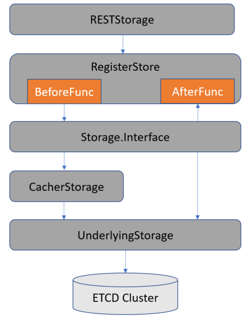
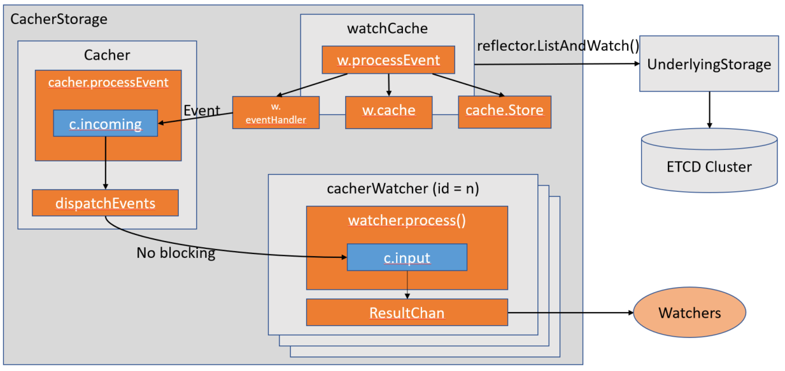

# ETCD Storage 源码分析（基于 release-1.18 branch)

**NOTE: 由于代码篇幅太多，在分析的过程中会将不重要的部分删除，我将用//.................. 代替了。**

**NOTE: 由于 ApiServer 的功能比较多，代码量也不小，且 ApiServer 是 k8s 中唯一能访问 ETCD 的组件，并且 k8s 将这部分代码从源代码中分离开来到 apiserver 这个 repo 下了，所以这次我将它单独拿来分析下。所以我们接下来开始阅读 k8s 对于 ETCD 的相关访问的源码。**

## 代码框架

下面这个是 ETCD storage 的封装层级图：



这里大家要牢记这个框架。因为下面会对每个部分对照源码进行详细的分析。

## 源码分析

### RestfulStorage 分析

首先我们还是从 kubernetes 源码中说起，k8s 中的每种资源都对外提供的是 Restful 的接口，代码主要在 [register](https://github.com/kubernetes/kubernetes/tree/release-1.18/pkg/registry)，点进去看的同学们都应该看的到，所有的资源 Restful 的接口都在这里。下面我将以 deployment 为例，来分析 k8s 的 storage 的接口实现。

大家都知道 deployment 是属于 apps 组下面的，所以点进 register/apps 目录下，大家会看到 apps 下面的资源的 restful 的接口都在这里，然后还有一个 rest 的目录，将这些资源全部通过一个 [NewRESTStorage](https://github.com/kubernetes/kubernetes/blob/release-1.18/pkg/registry/apps/rest/storage_apps.go#L36) 函数实例化出来了。

```go
type RESTStorageProvider struct{}

func (p RESTStorageProvider) NewRESTStorage(apiResourceConfigSource serverstorage.APIResourceConfigSource, restOptionsGetter generic.RESTOptionsGetter) (genericapiserver.APIGroupInfo, bool, error) {
    apiGroupInfo := genericapiserver.NewDefaultAPIGroupInfo(apps.GroupName, legacyscheme.Scheme, legacyscheme.ParameterCodec, legacyscheme.Codecs)
    // If you add a version here, be sure to add an entry in `k8s.io/kubernetes/cmd/kube-apiserver/app/aggregator.go with specific priorities.
    // TODO refactor the plumbing to provide the information in the APIGroupInfo

    if apiResourceConfigSource.VersionEnabled(appsapiv1.SchemeGroupVersion) {
        if storageMap, err := p.v1Storage(apiResourceConfigSource, restOptionsGetter); err != nil {
            return genericapiserver.APIGroupInfo{}, false, err
        } else {
            apiGroupInfo.VersionedResourcesStorageMap[appsapiv1.SchemeGroupVersion.Version] = storageMap
        }
    }

    return apiGroupInfo, true, nil
}

func (p RESTStorageProvider) v1Storage(apiResourceConfigSource serverstorage.APIResourceConfigSource, restOptionsGetter generic.RESTOptionsGetter) (map[string]rest.Storage, error) {
    storage := map[string]rest.Storage{}

    // deployments
    deploymentStorage, err := deploymentstore.NewStorage(restOptionsGetter)
    if err != nil {
        return storage, err
    }
    storage["deployments"] = deploymentStorage.Deployment
    storage["deployments/status"] = deploymentStorage.Status
    storage["deployments/scale"] = deploymentStorage.Scale

    // statefulsets
    statefulSetStorage, err := statefulsetstore.NewStorage(restOptionsGetter)
    if err != nil {
        return storage, err
    }
    storage["statefulsets"] = statefulSetStorage.StatefulSet
    storage["statefulsets/status"] = statefulSetStorage.Status
    storage["statefulsets/scale"] = statefulSetStorage.Scale

    // daemonsets
    daemonSetStorage, daemonSetStatusStorage, err := daemonsetstore.NewREST(restOptionsGetter)
    if err != nil {
        return storage, err
    }
    storage["daemonsets"] = daemonSetStorage
    storage["daemonsets/status"] = daemonSetStatusStorage

    // replicasets
    replicaSetStorage, err := replicasetstore.NewStorage(restOptionsGetter)
    if err != nil {
        return storage, err
    }
    storage["replicasets"] = replicaSetStorage.ReplicaSet
    storage["replicasets/status"] = replicaSetStorage.Status
    storage["replicasets/scale"] = replicaSetStorage.Scale

    // controllerrevisions
    historyStorage, err := controllerrevisionsstore.NewREST(restOptionsGetter)
    if err != nil {
        return storage, err
    }
    storage["controllerrevisions"] = historyStorage

    return storage, nil
}

```

其他的资源也都是一样的结构。此处不过多描述。

上面我们看到创建 deployment 实例的时候是调用了 deploymentstore.NewStorage(restOptionsGetter) 这个函数。下面我们继续看看 deployment 这个 [NewStorage](https://github.com/kubernetes/kubernetes/blob/release-1.18/pkg/registry/apps/deployment/storage/storage.go#L56) 函数的源码。

首先我们来看看这个函数内容

```go
func NewStorage(optsGetter generic.RESTOptionsGetter) (DeploymentStorage, error) {
    deploymentRest, deploymentStatusRest, deploymentRollbackRest, err := NewREST(optsGetter)
    if err != nil {
        return DeploymentStorage{}, err
    }

    return DeploymentStorage{
        Deployment: deploymentRest,
        Status:     deploymentStatusRest,
        Scale:      &ScaleREST{store: deploymentRest.Store},
        Rollback:   deploymentRollbackRest,
    }, nil
}
```

这个函数中就是调用了 NewREST 创建了几个 Rest 的实例并构建了个 DeploymentStorage 的对象，然后我们来看看这个构建的对象的结构内容。

```go
// DeploymentStorage includes dummy storage for Deployments and for Scale subresource.
type DeploymentStorage struct {
    Deployment *REST
    Status     *StatusREST
    Scale      *ScaleREST
    Rollback   *RollbackREST
}

```

这个结构里面包含了 deployment 资源及其子资源的 Restful 的接口。

下面我们来看看 REST,StatusREST，RollbackREST 和 ScaleREST 这四个结构体。

```go
type REST struct {
    *genericregistry.Store
    categories []string
}

// StatusREST implements the REST endpoint for changing the status of a deployment
type StatusREST struct {
    store *genericregistry.Store
}

// RollbackREST implements the REST endpoint for initiating the rollback of a deployment
type RollbackREST struct {
    store *genericregistry.Store
}

type ScaleREST struct {
    store *genericregistry.Store
}

```

从上面看得出来，除了 REST 这个结构体是有一个 genericregistry.Store 的匿名指针变量外，其他三个都是有一个 genericregistry.Store 的指针变量。
**NOTE: 这里讲下匿名变量和正常变量的区别，首先匿名变量，顾名思义，这个变量是没有名字的，它有什么好处呢？golang 中的匿名变量可以使得包含这个变量的结构体或者接口都可以直接使用这个变量的函数或者接口。而正常的变量做不到这点，如果想要访问带名变量的函数或者接口等，就必须要通过这个变量的名字。从这里的源码来看，匿名变量带来的好处就是 REST 这个结构体可以直接使用 genericregistry.Store 的函数或者接口了。而其他三个结构体就必须在封装一层。这里或许是考虑了 REST 这个结构体有这和 Store 一样的接口，所以不需要再来封装一层，而其他三个结构体只需要 Store 的部分接口，所以封装一层从而使得不对外暴露不需要的接口。**

下面再来具体看看 [NewREST](https://github.com/kubernetes/kubernetes/blob/release-1.18/pkg/registry/apps/deployment/storage/storage.go#L76) 这个函数。

```go
// NewREST returns a RESTStorage object that will work against deployments.
func NewREST(optsGetter generic.RESTOptionsGetter) (*REST, *StatusREST, *RollbackREST, error) {
    store := &genericregistry.Store{
        NewFunc:                  func() runtime.Object { return &apps.Deployment{} },
        NewListFunc:              func() runtime.Object { return &apps.DeploymentList{} },
        DefaultQualifiedResource: apps.Resource("deployments"),

        CreateStrategy: deployment.Strategy,
        UpdateStrategy: deployment.Strategy,
        DeleteStrategy: deployment.Strategy,

        TableConvertor: printerstorage.TableConvertor{TableGenerator: printers.NewTableGenerator().With(printersinternal.AddHandlers)},
    }
    options := &generic.StoreOptions{RESTOptions: optsGetter}
    if err := store.CompleteWithOptions(options); err != nil {
        return nil, nil, nil, err
    }

    statusStore := *store
    statusStore.UpdateStrategy = deployment.StatusStrategy
    return &REST{store, []string{"all"}}, &StatusREST{store: &statusStore}, &RollbackREST{store: store}, nil
}
```

这个函数也好理解，就是先实例化了 genericregistry.Store，然后在实例化了返回值中的三个结构体。这里有一个地方需要讲一下，就是 Strategy，这部分代码在 [Strategy](https://github.com/kubernetes/kubernetes/blob/release-1.18/pkg/registry/apps/deployment/strategy.go)，大家从上面那张框架图就可以看到 Strategy 其实是丰富了 RegisterStore 这层的行为。通俗点讲就是在真正执行操作之前或者后做哪些处理。这其实有点类似装饰者模式的。

### RegisterStore 分析

**NOTE: 下面的源码大家可以在 kubernetes 的源码的 vendor 看，也可以找到 apiserver 这个 repo 去阅读。下面我是从 apiserver 这个独立的 repo 分析的。所以其中的链接都是会链到那边去的。**

下面我们真正的开始今天的主题，首先从 [genericregistry.Store](https://github.com/kubernetes/apiserver/blob/release-1.18/pkg/registry/generic/registry/store.go)。

```go
type Store struct {
    // CreateStrategy implements resource-specific behavior during creation.
    CreateStrategy rest.RESTCreateStrategy
    // AfterCreate implements a further operation to run after a resource is
    // created and before it is decorated, optional.
    AfterCreate ObjectFunc

    // UpdateStrategy implements resource-specific behavior during updates.
    UpdateStrategy rest.RESTUpdateStrategy
    // AfterUpdate implements a further operation to run after a resource is
    // updated and before it is decorated, optional.
    AfterUpdate ObjectFunc

    // DeleteStrategy implements resource-specific behavior during deletion.
    DeleteStrategy rest.RESTDeleteStrategy
    // AfterDelete implements a further operation to run after a resource is
    // deleted and before it is decorated, optional.
    AfterDelete ObjectFunc
    // ExportStrategy implements resource-specific behavior during export,
    // optional. Exported objects are not decorated.
    ExportStrategy rest.RESTExportStrategy

    // Storage is the interface for the underlying storage for the
    // resource. It is wrapped into a "DryRunnableStorage" that will
    // either pass-through or simply dry-run.
    Storage DryRunnableStorage

    // Called to cleanup clients used by the underlying Storage; optional.
    DestroyFunc func()
}

```

上面我截取了 Store 结构体中比较重要的变量来进行分析。从代码中也可以看到，Store 实现了 4 种 Strategy，CreateStrategy，UpdateStrategy，DeleteStrategy 和 ExportStrategy。
然后它实现了下面这个 interface 的接口去获取这四类 Strategy. （其实这里我有一点疑惑，就是为什么都重写了 GenericStore 的接口去获取 Strategy，为啥这四个变量还用大写去暴露出去呢？)

```go
// GenericStore interface can be used for type assertions when we need to access the underlying strategies.
type GenericStore interface {
    GetCreateStrategy() rest.RESTCreateStrategy
    GetUpdateStrategy() rest.RESTUpdateStrategy
    GetDeleteStrategy() rest.RESTDeleteStrategy
    GetExportStrategy() rest.RESTExportStrategy
}

// GetCreateStrategy implements GenericStore.
func (e *Store) GetCreateStrategy() rest.RESTCreateStrategy {
    return e.CreateStrategy
}

// GetUpdateStrategy implements GenericStore.
func (e *Store) GetUpdateStrategy() rest.RESTUpdateStrategy {
    return e.UpdateStrategy
}

// GetDeleteStrategy implements GenericStore.
func (e *Store) GetDeleteStrategy() rest.RESTDeleteStrategy {
    return e.DeleteStrategy
}

// GetExportStrategy implements GenericStore.
func (e *Store) GetExportStrategy() rest.RESTExportStrategy {
    return e.ExportStrategy
}
```

然后 Store 还有三种操作资源对象后的操作，AfterCreate，AfterUpdate 和 AfterDelete。分别就是创建资源后，更新资源后和删除资源后的操作。

最后最主要的部分就是 Storage，通过注释可以看到 DryRunnableStorage 这个是对底层 Storage 的 interface 的一层封装。

这里以 Create 的函数为例，

```go
// Create inserts a new item according to the unique key from the object.
func (e *Store) Create(ctx context.Context, obj runtime.Object, createValidation rest.ValidateObjectFunc, options *metav1.CreateOptions) (runtime.Object, error) {
    // create 之前做些预处理
    if err := rest.BeforeCreate(e.CreateStrategy, ctx, obj); err != nil {
        return nil, err
    }
    // at this point we have a fully formed object.  It is time to call the validators that the apiserver
    // handling chain wants to enforce.
    if createValidation != nil {
        if err := createValidation(ctx, obj.DeepCopyObject()); err != nil {
            return nil, err
        }
    }

    name, err := e.ObjectNameFunc(obj)
    if err != nil {
        return nil, err
    }
    key, err := e.KeyFunc(ctx, name)
    if err != nil {
        return nil, err
    }
    qualifiedResource := e.qualifiedResourceFromContext(ctx)
    ttl, err := e.calculateTTL(obj, 0, false)
    if err != nil {
        return nil, err
    }
    out := e.NewFunc()
    // 调用 Storage 的 create 的方法执行 create 操作
    if err := e.Storage.Create(ctx, key, obj, out, ttl, dryrun.IsDryRun(options.DryRun)); err != nil {
        err = storeerr.InterpretCreateError(err, qualifiedResource, name)
        err = rest.CheckGeneratedNameError(e.CreateStrategy, err, obj)
        if !apierrors.IsAlreadyExists(err) {
            return nil, err
        }
        if errGet := e.Storage.Get(ctx, key, "", out, false); errGet != nil {
            return nil, err
        }
        accessor, errGetAcc := meta.Accessor(out)
        if errGetAcc != nil {
            return nil, err
        }
        if accessor.GetDeletionTimestamp() != nil {
            msg := &err.(*apierrors.StatusError).ErrStatus.Message
            *msg = fmt.Sprintf("object is being deleted: %s", *msg)
        }
        return nil, err
    }
    //create 之后做些善后处理
    if e.AfterCreate != nil {
        if err := e.AfterCreate(out); err != nil {
            return nil, err
        }
    }

    //如果需要装饰下结果，就装饰一下，再返回
    if e.Decorator != nil {
        if err := e.Decorator(out); err != nil {
            return nil, err
        }
    }
    return out, nil
}
```

依照顺序，我们先来看看 [rest.BeforeCreate(e.CreateStrategy, ctx, obj)](https://github.com/kubernetes/apiserver/blob/release-1.18/pkg/registry/rest/create.go#L74)。从 BeforeCreate 函数的传入参数可以看得出，是把 Store 的 CreateStrategy 传入了。下面我们来从源码中看看，传入的这个 CreateStrategy 做什么用的。

```go
// BeforeCreate ensures that common operations for all resources are performed on creation. It only returns
// errors that can be converted to api.Status. It invokes PrepareForCreate, then GenerateName, then Validate.
// It returns nil if the object should be created.
func BeforeCreate(strategy RESTCreateStrategy, ctx context.Context, obj runtime.Object) error {
    objectMeta, kind, kerr := objectMetaAndKind(strategy, obj)
    if kerr != nil {
        return kerr
    }

    if strategy.NamespaceScoped() {
        if !ValidNamespace(ctx, objectMeta) {
            return errors.NewBadRequest("the namespace of the provided object does not match the namespace sent on the request")
        }
    } else if len(objectMeta.GetNamespace()) > 0 {
        objectMeta.SetNamespace(metav1.NamespaceNone)
    }
    objectMeta.SetDeletionTimestamp(nil)
    objectMeta.SetDeletionGracePeriodSeconds(nil)
    strategy.PrepareForCreate(ctx, obj)
    FillObjectMetaSystemFields(objectMeta)
    if len(objectMeta.GetGenerateName()) > 0 && len(objectMeta.GetName()) == 0 {
        objectMeta.SetName(strategy.GenerateName(objectMeta.GetGenerateName()))
    }

    // Ensure managedFields is not set unless the feature is enabled
    if !utilfeature.DefaultFeatureGate.Enabled(features.ServerSideApply) {
        objectMeta.SetManagedFields(nil)
    }

    // ClusterName is ignored and should not be saved
    if len(objectMeta.GetClusterName()) > 0 {
        objectMeta.SetClusterName("")
    }

    if errs := strategy.Validate(ctx, obj); len(errs) > 0 {
        return errors.NewInvalid(kind.GroupKind(), objectMeta.GetName(), errs)
    }

    // Custom validation (including name validation) passed
    // Now run common validation on object meta
    // Do this *after* custom validation so that specific error messages are shown whenever possible
    if errs := genericvalidation.ValidateObjectMetaAccessor(objectMeta, strategy.NamespaceScoped(), path.ValidatePathSegmentName, field.NewPath("metadata")); len(errs) > 0 {
        return errors.NewInvalid(kind.GroupKind(), objectMeta.GetName(), errs)
    }

    strategy.Canonicalize(obj)

    return nil
}
```

这部分代码可以看到传入的第一个参数是一个 RESTCreateStrategy 的类型的变量。然后执行传入的这个参数的一系列操作。从上面我们知道这个传入的参数是一个 CreateStrategy，所以里面执行的都是这个 CreateStrategy 的相关操作。而从参数类型来看，RESTCreateStrategy 肯定是一个接口类型。那就是说 CreateStrategy 实现了 RESTCreateStrategy 相关方法。那么下面我们来看看 RESTCreateStrategy 这个接口有哪些方法。

```go
// RESTCreateStrategy defines the minimum validation, accepted input, and
// name generation behavior to create an object that follows Kubernetes
// API conventions.
type RESTCreateStrategy interface {
    runtime.ObjectTyper
    // The name generator is used when the standard GenerateName field is set.
    // The NameGenerator will be invoked prior to validation.
    names.NameGenerator

    // NamespaceScoped returns true if the object must be within a namespace.
    NamespaceScoped() bool
    // PrepareForCreate is invoked on create before validation to normalize
    // the object.  For example: remove fields that are not to be persisted,
    // sort order-insensitive list fields, etc.  This should not remove fields
    // whose presence would be considered a validation error.
    //
    // Often implemented as a type check and an initailization or clearing of
    // status. Clear the status because status changes are internal. External
    // callers of an api (users) should not be setting an initial status on
    // newly created objects.
    PrepareForCreate(ctx context.Context, obj runtime.Object)
    // Validate returns an ErrorList with validation errors or nil.  Validate
    // is invoked after default fields in the object have been filled in
    // before the object is persisted.  This method should not mutate the
    // object.
    Validate(ctx context.Context, obj runtime.Object) field.ErrorList
    // Canonicalize allows an object to be mutated into a canonical form. This
    // ensures that code that operates on these objects can rely on the common
    // form for things like comparison.  Canonicalize is invoked after
    // validation has succeeded but before the object has been persisted.
    // This method may mutate the object. Often implemented as a type check or
    // empty method.
    Canonicalize(obj runtime.Object)
}
```

大家回过头来，再来看看上面提到的 deployment 的 [Strategy](https://github.com/kubernetes/kubernetes/blob/release-1.18/pkg/registry/apps/deployment/strategy.go) 是不是对这些方法的实现呢。

好了分析完了 BeforeCreate, 然后就到了真正处理 Create 的操作了。上面代码可以看到，其实真正执行的还是 DryRunnableStorage 的相关方法。那么下面我们来看看 [DryRunnableStorage](https://github.com/kubernetes/apiserver/blob/release-1.18/pkg/registry/generic/registry/dryrun.go#L27) 的实现。

```go
type DryRunnableStorage struct {
    Storage storage.Interface
    Codec   runtime.Codec
}
```

从 DryRunnableStorage 的定义来看，还真是对 storage.Interface 的一层封装，它包含了 Codec 的相关操作。

先来看看 Codec 的部分。从这个文件里面搜了下，只有下面这个函数里面用到了这个 Codec 去 encode 和 decode。从代码中来看，就是把输入的 runtime.Object 通过 Codec 进去编码，然后在加个数据进行解码，然后返回解码后的 runtime.Object.

```go
func (s *DryRunnableStorage) copyInto(in, out runtime.Object) error {
    var data []byte

    data, err := runtime.Encode(s.Codec, in)
    if err != nil {
        return err
    }
    _, _, err = s.Codec.Decode(data, nil, out)
    if err != nil {
        return err
    }
    return nil

}
```

这个 Codec 就先讲到这里，下面来看看它的 Create 的方法。

```go
func (s *DryRunnableStorage) Create(ctx context.Context, key string, obj, out runtime.Object, ttl uint64, dryRun bool) error {
    if dryRun {
        if err := s.Storage.Get(ctx, key, "", out, false); err == nil {
            return storage.NewKeyExistsError(key, 0)
        }
        return s.copyInto(obj, out)
    }
    return s.Storage.Create(ctx, key, obj, out, ttl)
}
```

这里可以看到下面两种情况

1. 如果是 dryRun（预演）的情况下，就先去 ETCD 里 get 一把，看看数据库里面有没有，如果有了，就返回一个已经存在的错误。如果没有就调用 copyInto 的函数用 Codec 转换一下。然后返回转换后的结果，这里是没有对 ETCD 真的进行 Create 操作，所以也正对应了 dryRun 这个单词的意思了。

2. 如果不是 dryRun，是真的要创建资源的情况，那就调用了 Storage 的 Create 的方法去创建了。

从这里也可以总结写这个 DryRunnableStorage 就是把真正的 storage.Inferface 封装了一层，就是如果是 dryRun 的情况下，只是预演一遍，如果不是 dryRun 的情况下，才去真正的操作 ETCD.

好了，到这里，我们分析完了第二层，下面我们依次往下，看看 [storage.Inferface](https://github.com/kubernetes/apiserver/blob/release-1.18/pkg/storage/interfaces.go#L158)。

### Storage.Interface 分析

```go
// Interface offers a common interface for object marshaling/unmarshaling operations and
// hides all the storage-related operations behind it.
type Interface interface {
    // Returns Versioner associated with this interface.
    Versioner() Versioner

    // Create adds a new object at a key unless it already exists. 'ttl' is time-to-live
    // in seconds (0 means forever). If no error is returned and out is not nil, out will be
    // set to the read value from database.
    Create(ctx context.Context, key string, obj, out runtime.Object, ttl uint64) error

    // Delete removes the specified key and returns the value that existed at that spot.
    // If key didn't exist, it will return NotFound storage error.
    Delete(ctx context.Context, key string, out runtime.Object, preconditions *Preconditions, validateDeletion ValidateObjectFunc) error

    // Watch begins watching the specified key. Events are decoded into API objects,
    // and any items selected by 'p' are sent down to returned watch.Interface.
    // resourceVersion may be used to specify what version to begin watching,
    // which should be the current resourceVersion, and no longer rv+1
    // (e.g. reconnecting without missing any updates).
    // If resource version is "0", this interface will get current object at given key
    // and send it in an "ADDED" event, before watch starts.
    Watch(ctx context.Context, key string, resourceVersion string, p SelectionPredicate) (watch.Interface, error)

    // WatchList begins watching the specified key's items. Items are decoded into API
    // objects and any item selected by 'p' are sent down to returned watch.Interface.
    // resourceVersion may be used to specify what version to begin watching,
    // which should be the current resourceVersion, and no longer rv+1
    // (e.g. reconnecting without missing any updates).
    // If resource version is "0", this interface will list current objects directory defined by key
    // and send them in "ADDED" events, before watch starts.
    WatchList(ctx context.Context, key string, resourceVersion string, p SelectionPredicate) (watch.Interface, error)

    // Get unmarshals json found at key into objPtr. On a not found error, will either
    // return a zero object of the requested type, or an error, depending on ignoreNotFound.
    // Treats empty responses and nil response nodes exactly like a not found error.
    // The returned contents may be delayed, but it is guaranteed that they will
    // be have at least 'resourceVersion'.
    Get(ctx context.Context, key string, resourceVersion string, objPtr runtime.Object, ignoreNotFound bool) error

    // GetToList unmarshals json found at key and opaque it into *List api object
    // (an object that satisfies the runtime.IsList definition).
    // The returned contents may be delayed, but it is guaranteed that they will
    // be have at least 'resourceVersion'.
    GetToList(ctx context.Context, key string, resourceVersion string, p SelectionPredicate, listObj runtime.Object) error

    // List unmarshalls jsons found at directory defined by key and opaque them
    // into *List api object (an object that satisfies runtime.IsList definition).
    // The returned contents may be delayed, but it is guaranteed that they will
    // be have at least 'resourceVersion'.
    List(ctx context.Context, key string, resourceVersion string, p SelectionPredicate, listObj runtime.Object) error

    // GuaranteedUpdate
    GuaranteedUpdate(
        ctx context.Context, key string, ptrToType runtime.Object, ignoreNotFound bool,
        precondtions *Preconditions, tryUpdate UpdateFunc, suggestion ...runtime.Object) error

    // Count returns number of different entries under the key (generally being path prefix).
    Count(key string) (int64, error)
}

```

这个 storage.Inferface 提供了一系列通用存储接口给上层使用。而它的具体实现有两种，一种是 CacherStorage 即带缓存的资源存储对象，一种是 UnderlyingStorage 即不带缓存的底层存储对象。而 CacherStorage 是在 UnderlyingStorage 上又封装了一层 cache 得来的。k8s 默认使用的是 CacherStorage.

### UnderlyingStorage 分析

我们先来看看简单点的 UnderlyingStorage 的实现，在源码中，它又叫 [storagebackend](https://github.com/kubernetes/apiserver/tree/release-1.18/pkg/storage/storagebackend)。所以我们找到这个目录，进行阅读分析。我们可以看到这个 [factory.go](https://github.com/kubernetes/apiserver/blob/release-1.18/pkg/storage/storagebackend/factory/factory.go) 这个文件里面，创建了 ETCD3 的对象。也就是这里的 storagebackend 对象。

```go
// Create creates a storage backend based on given config.
func Create(c storagebackend.Config) (storage.Interface, DestroyFunc, error) {
    switch c.Type {
    case "etcd2":
        return nil, nil, fmt.Errorf("%v is no longer a supported storage backend", c.Type)
    case storagebackend.StorageTypeUnset, storagebackend.StorageTypeETCD3:
        return newETCD3Storage(c)
    default:
        return nil, nil, fmt.Errorf("unknown storage type: %s", c.Type)
    }
}

```

来看看 [newETCD3Storage](https://github.com/kubernetes/apiserver/blob/release-1.18/pkg/storage/storagebackend/factory/etcd3.go#L209) 的实现。

```go
func newETCD3Storage(c storagebackend.Config) (storage.Interface, DestroyFunc, error) {
    stopCompactor, err := startCompactorOnce(c.Transport, c.CompactionInterval)
    if err != nil {
        return nil, nil, err
    }

    client, err := newETCD3Client(c.Transport)
    if err != nil {
        stopCompactor()
        return nil, nil, err
    }

    var once sync.Once
    destroyFunc := func() {
        // we know that storage destroy funcs are called multiple times (due to reuse in subresources).
        // Hence, we only destroy once.
        // TODO: fix duplicated storage destroy calls higher level
        once.Do(func() {
            stopCompactor()
            client.Close()
        })
    }
    transformer := c.Transformer
    if transformer == nil {
        transformer = value.IdentityTransformer
    }
    return etcd3.New(client, c.Codec, c.Prefix, transformer, c.Paging), destroyFunc, nil
}

```

先来看看 newETCD3Client 这个函数，然后再来看看 etcd3.New 这个函数。

```go
func newETCD3Client(c storagebackend.TransportConfig) (*clientv3.Client, error) {
    tlsInfo := transport.TLSInfo{
        CertFile:      c.CertFile,
        KeyFile:       c.KeyFile,
        TrustedCAFile: c.TrustedCAFile,
    }
    tlsConfig, err := tlsInfo.ClientConfig()
    if err != nil {
        return nil, err
    }
    // NOTE: Client relies on nil tlsConfig
    // for non-secure connections, update the implicit variable
    if len(c.CertFile) == 0 && len(c.KeyFile) == 0 && len(c.TrustedCAFile) == 0 {
        tlsConfig = nil
    }
    networkContext := egressselector.Etcd.AsNetworkContext()
    var egressDialer utilnet.DialFunc
    if c.EgressLookup != nil {
        egressDialer, err = c.EgressLookup(networkContext)
        if err != nil {
            return nil, err
        }
    }
    dialOptions := []grpc.DialOption{
        grpc.WithBlock(), // block until the underlying connection is up
        grpc.WithUnaryInterceptor(grpcprom.UnaryClientInterceptor),
        grpc.WithStreamInterceptor(grpcprom.StreamClientInterceptor),
    }
    if egressDialer != nil {
        dialer := func(ctx context.Context, addr string) (net.Conn, error) {
            u, err := url.Parse(addr)
            if err != nil {
                return nil, err
            }
            return egressDialer(ctx, "tcp", u.Host)
        }
        dialOptions = append(dialOptions, grpc.WithContextDialer(dialer))
    }
    cfg := clientv3.Config{
        DialTimeout:          dialTimeout,
        DialKeepAliveTime:    keepaliveTime,
        DialKeepAliveTimeout: keepaliveTimeout,
        DialOptions:          dialOptions,
        Endpoints:            c.ServerList,
        TLS:                  tlsConfig,
    }

    return clientv3.New(cfg)
}
```

这里就是调用 ETCD 的相关接口处创建 ETCD 的 client。

好了，通过这个函数创建了一个 etcd 的 client，然后传入了 etcd3.New 中。我们再来看看 [etcd3.New](https://github.com/kubernetes/apiserver/blob/release-1.18/pkg/storage/etcd3/store.go#L87) 这个函数。

```go
type store struct {
    client *clientv3.Client
    // getOpts contains additional options that should be passed
    // to all Get() calls.
    getOps        []clientv3.OpOption
    codec         runtime.Codec
    versioner     storage.Versioner
    transformer   value.Transformer
    pathPrefix    string
    watcher       *watcher
    pagingEnabled bool
    leaseManager  *leaseManager
}

// New returns an etcd3 implementation of storage.Interface.
func New(c *clientv3.Client, codec runtime.Codec, prefix string, transformer value.Transformer, pagingEnabled bool) storage.Interface {
    return newStore(c, pagingEnabled, codec, prefix, transformer)
}

func newStore(c *clientv3.Client, pagingEnabled bool, codec runtime.Codec, prefix string, transformer value.Transformer) *store {
    versioner := APIObjectVersioner{}
    result := &store{
        client:        c,
        codec:         codec,
        versioner:     versioner,
        transformer:   transformer,
        pagingEnabled: pagingEnabled,
        // for compatibility with etcd2 impl.
        // no-op for default prefix of '/registry'.
        // keeps compatibility with etcd2 impl for custom prefixes that don't start with '/'
        pathPrefix:   path.Join("/", prefix),
        watcher:      newWatcher(c, codec, versioner, transformer),
        leaseManager: newDefaultLeaseManager(c),
    }
    return result
}
```

这里就是创建了个 store 的结构，然后实现了 storage.Interface 的接口。可以从 [store.go](https://github.com/kubernetes/apiserver/blob/release-1.18/pkg/storage/etcd3/store.go) 文件中看到。

### CacherStorage 分析

带有 cache 的 storage 比较复杂，这里给出大致的处理流图：



下面我们再来分析分析复杂的带 cache 的 CacherStorage。

首先通过 [StorageWithCacher](https://github.com/kubernetes/apiserver/blob/release-1.18/pkg/registry/generic/registry/storage_factory.go#L35) 函数创建出 CacherStorage

```go
// Creates a cacher based given storageConfig.
func StorageWithCacher(capacity int) generic.StorageDecorator {
    return func(
        storageConfig *storagebackend.Config,
        resourcePrefix string,
        keyFunc func(obj runtime.Object) (string, error),
        newFunc func() runtime.Object,
        newListFunc func() runtime.Object,
        getAttrsFunc storage.AttrFunc,
        triggerFuncs storage.IndexerFuncs,
        indexers *cache.Indexers) (storage.Interface, factory.DestroyFunc, error) {

        //创建 UnderlyingStorage
        s, d, err := generic.NewRawStorage(storageConfig)
        if err != nil {
            return s, d, err
        }
        if capacity <= 0 {
            klog.V(5).Infof("Storage caching is disabled for %T", newFunc())
            return s, d, nil
        }
        if klog.V(5) {
            klog.Infof("Storage caching is enabled for %T with capacity %v", newFunc(), capacity)
        }

        //配置相关 cacher 的数据
        // TODO: we would change this later to make storage always have cacher and hide low level KV layer inside.
        // Currently it has two layers of same storage interface -- cacher and low level kv.
        cacherConfig := cacherstorage.Config{
            CacheCapacity:  capacity,
            Storage:        s,
            Versioner:      etcd3.APIObjectVersioner{},
            ResourcePrefix: resourcePrefix,
            KeyFunc:        keyFunc,
            NewFunc:        newFunc,
            NewListFunc:    newListFunc,
            GetAttrsFunc:   getAttrsFunc,
            IndexerFuncs:   triggerFuncs,
            Indexers:       indexers,
            Codec:          storageConfig.Codec,
        }
        //创建 cacherStorage
        cacher, err := cacherstorage.NewCacherFromConfig(cacherConfig)
        if err != nil {
            return nil, func() {}, err
        }
        destroyFunc := func() {
            cacher.Stop()
            d()
        }

        // TODO : Remove RegisterStorageCleanup below when PR
        // https://github.com/kubernetes/kubernetes/pull/50690
        // merges as that shuts down storage properly
        RegisterStorageCleanup(destroyFunc)

        return cacher, destroyFunc, nil
    }
}
```

这里返回的是个 generic.StorageDecorator。从名字上看得出来，是个 Decorator 模式的使用。从它的定义来看，就是个函数类型，然后作用就是装饰一下输入得到一个输出。

```go
// StorageDecorator is a function signature for producing a storage.Interface
// and an associated DestroyFunc from given parameters.
type StorageDecorator func(
    config *storagebackend.Config,
    resourcePrefix string,
    keyFunc func(obj runtime.Object) (string, error),
    newFunc func() runtime.Object,
    newListFunc func() runtime.Object,
    getAttrsFunc storage.AttrFunc,
    trigger storage.IndexerFuncs,
    indexers *cache.Indexers) (storage.Interface, factory.DestroyFunc, error)
```

再来看看 generic.NewRawStorage(storageConfig). 这里就是调用了 storagebackend 的 factory 的 Create 函数，创建了一个 UnderlyingStorage。

```go
// NewRawStorage creates the low level kv storage. This is a work-around for current
// two layer of same storage interface.
// TODO: Once cacher is enabled on all registries (event registry is special), we will remove this method.
func NewRawStorage(config *storagebackend.Config) (storage.Interface, factory.DestroyFunc, error) {
    return factory.Create(*config)
}
```

最后就是调用 [cacherstorage.NewCacherFromConfig(cacherConfig)](https://github.com/kubernetes/apiserver/blob/release-1.18/pkg/storage/cacher/cacher.go#L313) 创建了 cacherStorage.

```go
// NewCacherFromConfig creates a new Cacher responsible for servicing WATCH and LIST requests from
// its internal cache and updating its cache in the background based on the
// given configuration.
func NewCacherFromConfig(config Config) (*Cacher, error) {
    stopCh := make(chan struct{})
    obj := config.NewFunc()
    // Give this error when it is constructed rather than when you get the
    // first watch item, because it's much easier to track down that way.
    if err := runtime.CheckCodec(config.Codec, obj); err != nil {
        return nil, fmt.Errorf("storage codec doesn't seem to match given type: %v", err)
    }

    var indexedTrigger *indexedTriggerFunc
    if config.IndexerFuncs != nil {
        // For now, we don't support multiple trigger functions defined
        // for a given resource.
        if len(config.IndexerFuncs) > 1 {
            return nil, fmt.Errorf("cacher %s doesn't support more than one IndexerFunc: ", reflect.TypeOf(obj).String())
        }
        for key, value := range config.IndexerFuncs {
            if value != nil {
                indexedTrigger = &indexedTriggerFunc{
                    indexName:   key,
                    indexerFunc: value,
                }
            }
        }
    }

    clock := clock.RealClock{}
    cacher := &Cacher{
        ready:          newReady(),
        storage:        config.Storage,
        objectType:     reflect.TypeOf(obj),
        versioner:      config.Versioner,
        newFunc:        config.NewFunc,
        indexedTrigger: indexedTrigger,
        watcherIdx:     0,
        watchers: indexedWatchers{
            allWatchers:   make(map[int]*cacheWatcher),
            valueWatchers: make(map[string]watchersMap),
        },
        // TODO: Figure out the correct value for the buffer size.
        incoming:              make(chan watchCacheEvent, 100),
        dispatchTimeoutBudget: newTimeBudget(stopCh),
        // We need to (potentially) stop both:
        // - wait.Until go-routine
        // - reflector.ListAndWatch
        // and there are no guarantees on the order that they will stop.
        // So we will be simply closing the channel, and synchronizing on the WaitGroup.
        stopCh:           stopCh,
        clock:            clock,
        timer:            time.NewTimer(time.Duration(0)),
        bookmarkWatchers: newTimeBucketWatchers(clock),
    }

    // Ensure that timer is stopped.
    if !cacher.timer.Stop() {
        // Consume triggered (but not yet received) timer event
        // so that future reuse does not get a spurious timeout.
        <-cacher.timer.C
    }

    watchCache := newWatchCache(
        config.CacheCapacity, config.KeyFunc, cacher.processEvent, config.GetAttrsFunc, config.Versioner, config.Indexers)
    listerWatcher := NewCacherListerWatcher(config.Storage, config.ResourcePrefix, config.NewListFunc)
    reflectorName := "storage/cacher.go:" + config.ResourcePrefix

    reflector := cache.NewNamedReflector(reflectorName, listerWatcher, obj, watchCache, 0)
    // Configure reflector's pager to for an appropriate pagination chunk size for fetching data from
    // storage. The pager falls back to full list if paginated list calls fail due to an "Expired" error.
    reflector.WatchListPageSize = storageWatchListPageSize

    cacher.watchCache = watchCache
    cacher.reflector = reflector

    go cacher.dispatchEvents()

    cacher.stopWg.Add(1)
    go func() {
        defer cacher.stopWg.Done()
        defer cacher.terminateAllWatchers()
        wait.Until(
            func() {
                if !cacher.isStopped() {
                    cacher.startCaching(stopCh)
                }
            }, time.Second, stopCh,
        )
    }()

    return cacher, nil
}

```

而 CacherStorage 通过 3 个部分实现了 cache 功能。分别是

1. cacheWatcher. 观察者的管理。
2. Cacher. 从 watchCache 中收到事件，然后将分发给每个 cacheWatcher.
3. watchCache. 通过 Reflector 框架于 UnderlyingStorage 进行交互，然后将 UnderlyingStorage 于 ETCD 交互的结果通过回调的方式 eventHandler 进行处理，并且分别储存到 cache 和 Store 中。

下面我们先从 [cacherWatcher](https://github.com/kubernetes/apiserver/blob/release-1.18/pkg/storage/cacher/cacher.go#L1154) 看起。
这里 cacherWatcher 是通过两种不同的 channel 实现了 event 同步的功能。一个是从 Cacher 接收 input 的 watchCacheEvent，然后将这种 event 转换成 watch 的 event，最后发送出去。

下面来分析分析源码

```go
// cacheWatcher implements watch.Interface
// this is not thread-safe
type cacheWatcher struct {
    input     chan *watchCacheEvent
    result    chan watch.Event
    done      chan struct{}
    filter    filterWithAttrsFunc
    stopped   bool
    forget    func()
    versioner storage.Versioner
    // The watcher will be closed by server after the deadline,
    // save it here to send bookmark events before that.
    deadline            time.Time
    allowWatchBookmarks bool
    // Object type of the cache watcher interests
    objectType reflect.Type
}

```

先来看看 [process](https://github.com/kubernetes/apiserver/blob/release-1.18/pkg/storage/cacher/cacher.go#L1333) 函数

```go
func (c *cacheWatcher) process(ctx context.Context, initEvents []*watchCacheEvent, resourceVersion uint64) {
    defer utilruntime.HandleCrash()

    // Check how long we are processing initEvents.
    // As long as these are not processed, we are not processing
    // any incoming events, so if it takes long, we may actually
    // block all watchers for some time.
    // TODO: From the logs it seems that there happens processing
    // times even up to 1s which is very long. However, this doesn't
    // depend that much on the number of initEvents. E.g. from the
    // 2000-node Kubemark run we have logs like this, e.g.:
    // ... processing 13862 initEvents took 66.808689ms
    // ... processing 14040 initEvents took 993.532539ms
    // We should understand what is blocking us in those cases (e.g.
    // is it lack of CPU, network, or sth else) and potentially
    // consider increase size of result buffer in those cases.
    const initProcessThreshold = 500 * time.Millisecond
    startTime := time.Now()
    for _, event := range initEvents {
        c.sendWatchCacheEvent(event)
    }
    objType := c.objectType.String()
    if len(initEvents) > 0 {
        initCounter.WithLabelValues(objType).Add(float64(len(initEvents)))
    }
    processingTime := time.Since(startTime)
    if processingTime > initProcessThreshold {
        klog.V(2).Infof("processing %d initEvents of %s took %v", len(initEvents), objType, processingTime)
    }

    defer close(c.result)
    defer c.Stop()
    for {
        select {
        case event, ok := <-c.input:
            if !ok {
                return
            }
            // only send events newer than resourceVersion
            if event.ResourceVersion > resourceVersion {
                c.sendWatchCacheEvent(event)
            }
        case <-ctx.Done():
            return
        }
    }
}
```

这个函数里面可以看到最后有个死循环接收 input，然后调用 sendWatchCacheEvent 发送出去。**NOTE: 这里从代码看发送事件的条件是资源版本必须要比之前的新才会发送**

再来看看 sendWatchCacheEvent 这个函数。

```go
// NOTE: sendWatchCacheEvent is assumed to not modify <event> !!!
func (c *cacheWatcher) sendWatchCacheEvent(event *watchCacheEvent) {
    watchEvent := c.convertToWatchEvent(event)
    if watchEvent == nil {
        // Watcher is not interested in that object.
        return
    }

    // We need to ensure that if we put event X to the c.result, all
    // previous events were already put into it before, no matter whether
    // c.done is close or not.
    // Thus we cannot simply select from c.done and c.result and this
    // would give us non-determinism.
    // At the same time, we don't want to block infinitely on putting
    // to c.result, when c.done is already closed.

    // This ensures that with c.done already close, we at most once go
    // into the next select after this. With that, no matter which
    // statement we choose there, we will deliver only consecutive
    // events.
    select {
    case <-c.done:
        return
    default:
    }

    select {
    case c.result <- *watchEvent:
    case <-c.done:
    }
}
```

这个函数就是先把传入的 watchCacheEvent 事件转换为 watch 的事件格式，然后在发送给 result channel。

讲完了 cacheWatcher 后，我们来看看 [watchCache](https://github.com/kubernetes/apiserver/blob/release-1.18/pkg/storage/cacher/watch_cache.go#L119).

```go
// watchCache implements a Store interface.
// However, it depends on the elements implementing runtime.Object interface.
//
// watchCache is a "sliding window" (with a limited capacity) of objects
// observed from a watch.
type watchCache struct {
    sync.RWMutex

    // Condition on which lists are waiting for the fresh enough
    // resource version.
    cond *sync.Cond

    // Maximum size of history window.
    capacity int

    // keyFunc is used to get a key in the underlying storage for a given object.
    keyFunc func(runtime.Object) (string, error)

    // getAttrsFunc is used to get labels and fields of an object.
    getAttrsFunc func(runtime.Object) (labels.Set, fields.Set, error)

    // cache is used a cyclic buffer - its first element (with the smallest
    // resourceVersion) is defined by startIndex, its last element is defined
    // by endIndex (if cache is full it will be startIndex + capacity).
    // Both startIndex and endIndex can be greater than buffer capacity -
    // you should always apply modulo capacity to get an index in cache array.
    cache      []*watchCacheEvent
    startIndex int
    endIndex   int

    // store will effectively support LIST operation from the "end of cache
    // history" i.e. from the moment just after the newest cached watched event.
    // It is necessary to effectively allow clients to start watching at now.
    // NOTE: We assume that <store> is thread-safe.
    store cache.Indexer

    // ResourceVersion up to which the watchCache is propagated.
    resourceVersion uint64

    // ResourceVersion of the last list result (populated via Replace() method).
    listResourceVersion uint64

    // This handler is run at the end of every successful Replace() method.
    onReplace func()

    // This handler is run at the end of every Add/Update/Delete method
    // and additionally gets the previous value of the object.
    eventHandler func(*watchCacheEvent)

    // for testing timeouts.
    clock clock.Clock

    // An underlying storage.Versioner.
    versioner storage.Versioner
}

func newWatchCache(
    capacity int,
    keyFunc func(runtime.Object) (string, error),
    eventHandler func(*watchCacheEvent),
    getAttrsFunc func(runtime.Object) (labels.Set, fields.Set, error),
    versioner storage.Versioner,
    indexers *cache.Indexers) *watchCache {
    wc := &watchCache{
        capacity:            capacity,
        keyFunc:             keyFunc,
        getAttrsFunc:        getAttrsFunc,
        cache:               make([]*watchCacheEvent, capacity),
        startIndex:          0,
        endIndex:            0,
        store:               cache.NewIndexer(storeElementKey, storeElementIndexers(indexers)),
        resourceVersion:     0,
        listResourceVersion: 0,
        eventHandler:        eventHandler,
        clock:               clock.RealClock{},
        versioner:           versioner,
    }
    wc.cond = sync.NewCond(wc.RLocker())
    return wc
}

```

这里有三个地方需要重点关注，一个就是 cache，它是一个存储 watchCacheEvent 的循环 buffer。一个是 store，是一个 cache.Indexer，这个我们看过 client-go 的同学们都知道了，是个支持 index 的 cache。最后一个就是 eventHandler，这个就是 Add/Update/Delete 方法的回调。

先来看看 Add 函数。

```go
// Add takes runtime.Object as an argument.
func (w *watchCache) Add(obj interface{}) error {
    object, resourceVersion, err := w.objectToVersionedRuntimeObject(obj)
    if err != nil {
        return err
    }
    event := watch.Event{Type: watch.Added, Object: object}

    f := func(elem *storeElement) error { return w.store.Add(elem) }
    return w.processEvent(event, resourceVersion, f)
}
```

可以看到是将 object 转换到 runtime 的 object，然后再构造一个 watch event，并存储到 store 中。最后调用 processEvent 对 event 进行进一步处理。

下面再来看下 [processEvent](https://github.com/kubernetes/apiserver/blob/release-1.18/pkg/storage/cacher/watch_cache.go#L245) 函数

```go
// processEvent is safe as long as there is at most one call to it in flight
// at any point in time.
func (w *watchCache) processEvent(event watch.Event, resourceVersion uint64, updateFunc func(*storeElement) error) error {
    key, err := w.keyFunc(event.Object)
    if err != nil {
        return fmt.Errorf("couldn't compute key: %v", err)
    }
    elem := &storeElement{Key: key, Object: event.Object}
    elem.Labels, elem.Fields, err = w.getAttrsFunc(event.Object)
    if err != nil {
        return err
    }

    wcEvent := &watchCacheEvent{
        Type:            event.Type,
        Object:          elem.Object,
        ObjLabels:       elem.Labels,
        ObjFields:       elem.Fields,
        Key:             key,
        ResourceVersion: resourceVersion,
    }

    if err := func() error {
        // TODO: We should consider moving this lock below after the watchCacheEvent
        // is created. In such situation, the only problematic scenario is Replace(
        // happening after getting object from store and before acquiring a lock.
        // Maybe introduce another lock for this purpose.
        w.Lock()
        defer w.Unlock()

        previous, exists, err := w.store.Get(elem)
        if err != nil {
            return err
        }
        if exists {
            previousElem := previous.(*storeElement)
            wcEvent.PrevObject = previousElem.Object
            wcEvent.PrevObjLabels = previousElem.Labels
            wcEvent.PrevObjFields = previousElem.Fields
        }

        w.updateCache(wcEvent)
        w.resourceVersion = resourceVersion
        defer w.cond.Broadcast()

        return updateFunc(elem)
    }(); err != nil {
        return err
    }

    // Avoid calling event handler under lock.
    // This is safe as long as there is at most one call to processEvent in flight
    // at any point in time.
    if w.eventHandler != nil {
        w.eventHandler(wcEvent)
    }
    return nil
}

// Assumes that lock is already held for write.
func (w *watchCache) updateCache(event *watchCacheEvent) {
    if w.endIndex == w.startIndex+w.capacity {
        // Cache is full - remove the oldest element.
        w.startIndex++
    }
    w.cache[w.endIndex%w.capacity] = event
    w.endIndex++
}
```

这里看到通过调用 w.updateCache(wcEvent) 函数，将这个 event 存储到了 cache 中。最后再做 event 相关的回调 eventHandler 处理。而这个 eventHandler 是通过 newWatchCache 函数参数出入。从上面的 NewCacherFromConfig 函数中，我们也可以看到，里面调用 newWatchCache 创建 watchCache 的时候，传入的是 Cacher 的 processEvent。所以这里真正执行的是 Cacher 的 processEvent。而这个函数就是将 event 传入到 Cacher 的 incoming 的 channel 中。具体的 Cacher 的实现，我们下面就会分析到。

```go
func (c *Cacher) processEvent(event *watchCacheEvent) {
    if curLen := int64(len(c.incoming)); c.incomingHWM.Update(curLen) {
        // Monitor if this gets backed up, and how much.
        klog.V(1).Infof("cacher (%v): %v objects queued in incoming channel.", c.objectType.String(), curLen)
    }
    c.incoming <- *event
}
```

最后再来分析一下 Cacher 的功能。从之前分析来看，我们知道这个 Cacher 其实是 watchCache 和 cacheWatcher 的纽带，它主要是从 watchCache 中获取事件，然后分发给所有的 Watcher。

```go
// Cacher is responsible for serving WATCH and LIST requests for a given
// resource from its internal cache and updating its cache in the background
// based on the underlying storage contents.
// Cacher implements storage.Interface (although most of the calls are just
// delegated to the underlying storage).
type Cacher struct {
    // HighWaterMarks for performance debugging.
    // Important: Since HighWaterMark is using sync/atomic, it has to be at the top of the struct due to a bug on 32-bit platforms
    // See: https://golang.org/pkg/sync/atomic/ for more information
    incomingHWM storage.HighWaterMark
    // Incoming events that should be dispatched to watchers.
    incoming chan watchCacheEvent

    sync.RWMutex

    // Before accessing the cacher's cache, wait for the ready to be ok.
    // This is necessary to prevent users from accessing structures that are
    // uninitialized or are being repopulated right now.
    // ready needs to be set to false when the cacher is paused or stopped.
    // ready needs to be set to true when the cacher is ready to use after
    // initialization.
    ready *ready

    // Underlying storage.Interface.
    storage storage.Interface

    // Expected type of objects in the underlying cache.
    objectType reflect.Type

    // "sliding window" of recent changes of objects and the current state.
    watchCache *watchCache
    reflector  *cache.Reflector

    // Versioner is used to handle resource versions.
    versioner storage.Versioner

    // newFunc is a function that creates new empty object storing a object of type Type.
    newFunc func() runtime.Object

    // indexedTrigger is used for optimizing amount of watchers that needs to process
    // an incoming event.
    indexedTrigger *indexedTriggerFunc
    // watchers is mapping from the value of trigger function that a
    // watcher is interested into the watchers
    watcherIdx int
    watchers   indexedWatchers

    // Defines a time budget that can be spend on waiting for not-ready watchers
    // while dispatching event before shutting them down.
    dispatchTimeoutBudget *timeBudget

    // Handling graceful termination.
    stopLock sync.RWMutex
    stopped  bool
    stopCh   chan struct{}
    stopWg   sync.WaitGroup

    clock clock.Clock
    // timer is used to avoid unnecessary allocations in underlying watchers.
    timer *time.Timer

    // dispatching determines whether there is currently dispatching of
    // any event in flight.
    dispatching bool
    // watchersBuffer is a list of watchers potentially interested in currently
    // dispatched event.
    watchersBuffer []*cacheWatcher
    // blockedWatchers is a list of watchers whose buffer is currently full.
    blockedWatchers []*cacheWatcher
    // watchersToStop is a list of watchers that were supposed to be stopped
    // during current dispatching, but stopping was deferred to the end of
    // dispatching that event to avoid race with closing channels in watchers.
    watchersToStop []*cacheWatcher
    // Maintain a timeout queue to send the bookmark event before the watcher times out.
    bookmarkWatchers *watcherBookmarkTimeBuckets
}
```

首先这个 Cacher 是实现了 storage.Interface 的所有方法的，是一个 CacherStorage。上面我们有分析到它是怎么从 watchCache 中获取到 event 的，其实就是将 processEvent 这个回调传入 watchCache 中。下面来看看它是怎么分发 event 的。同样，在上面那个 NewCacherFromConfig 函数中，我们看到 go cacher.dispatchEvents()。下面来看看这个函数。

```go
func (c *Cacher) dispatchEvents() {
    // Jitter to help level out any aggregate load.
    bookmarkTimer := c.clock.NewTimer(wait.Jitter(time.Second, 0.25))
    defer bookmarkTimer.Stop()

    lastProcessedResourceVersion := uint64(0)
    for {
        select {
        case event, ok := <-c.incoming:
            if !ok {
                return
            }
            c.dispatchEvent(&event)
            lastProcessedResourceVersion = event.ResourceVersion
        case <-bookmarkTimer.C():
            bookmarkTimer.Reset(wait.Jitter(time.Second, 0.25))
            // Never send a bookmark event if we did not see an event here, this is fine
            // because we don't provide any guarantees on sending bookmarks.
            if lastProcessedResourceVersion == 0 {
                // pop expired watchers in case there has been no update
                c.bookmarkWatchers.popExpiredWatchers()
                continue
            }
            bookmarkEvent := &watchCacheEvent{
                Type:            watch.Bookmark,
                Object:          c.newFunc(),
                ResourceVersion: lastProcessedResourceVersion,
            }
            if err := c.versioner.UpdateObject(bookmarkEvent.Object, bookmarkEvent.ResourceVersion); err != nil {
                klog.Errorf("failure to set resourceVersion to %d on bookmark event %+v", bookmarkEvent.ResourceVersion, bookmarkEvent.Object)
                continue
            }
            c.dispatchEvent(bookmarkEvent)
        case <-c.stopCh:
            return
        }
    }
}
```

显然，我们看到了从 processEvent 那里收到了 event 的 incomingchannel，在这里被消费。然后调用 dispatchEvent 函数去分发了。再来看看 dispatchEvent 这个函数的内容。

```go
func (c *Cacher) dispatchEvent(event *watchCacheEvent) {
    c.startDispatching(event)
    defer c.finishDispatching()
    // Watchers stopped after startDispatching will be delayed to finishDispatching,

    // Since add() can block, we explicitly add when cacher is unlocked.
    // Dispatching event in nonblocking way first, which make faster watchers
    // not be blocked by slower ones.
    if event.Type == watch.Bookmark {
        for _, watcher := range c.watchersBuffer {
            watcher.nonblockingAdd(event)
        }
    } else {
        // Set up caching of object serializations only for dispatching this event.
        //
        // Storing serializations in memory would result in increased memory usage,
        // but it would help for caching encodings for watches started from old
        // versions. However, we still don't have a convincing data that the gain
        // from it justifies increased memory usage, so for now we drop the cached
        // serializations after dispatching this event.
        //
        // Given the deep-copies that are done to create cachingObjects,
        // we try to cache serializations only if there are at least 3 watchers.
        if len(c.watchersBuffer) >= 3 {
            // Make a shallow copy to allow overwriting Object and PrevObject.
            wcEvent := *event
            setCachingObjects(&wcEvent, c.versioner)
            event = &wcEvent
        }

        c.blockedWatchers = c.blockedWatchers[:0]
        for _, watcher := range c.watchersBuffer {
            if !watcher.nonblockingAdd(event) {
                c.blockedWatchers = append(c.blockedWatchers, watcher)
            }
        }

        if len(c.blockedWatchers) > 0 {
            // dispatchEvent is called very often, so arrange
            // to reuse timers instead of constantly allocating.
            startTime := time.Now()
            timeout := c.dispatchTimeoutBudget.takeAvailable()
            c.timer.Reset(timeout)

            // Make sure every watcher will try to send event without blocking first,
            // even if the timer has already expired.
            timer := c.timer
            for _, watcher := range c.blockedWatchers {
                if !watcher.add(event, timer) {
                    // fired, clean the timer by set it to nil.
                    timer = nil
                }
            }

            // Stop the timer if it is not fired
            if timer != nil && !timer.Stop() {
                // Consume triggered (but not yet received) timer event
                // so that future reuse does not get a spurious timeout.
                <-timer.C
            }

            c.dispatchTimeoutBudget.returnUnused(timeout - time.Since(startTime))
        }
    }
}
```

然后调用这个 startDispatching 函数真正的进去分发操作

```go
// startDispatching chooses watchers potentially interested in a given event
// a marks dispatching as true.
func (c *Cacher) startDispatching(event *watchCacheEvent) {
    // It is safe to call triggerValuesThreadUnsafe here, because at this
    // point only this thread can access this event (we create a separate
    // watchCacheEvent for every dispatch).
    triggerValues, supported := c.triggerValuesThreadUnsafe(event)

    c.Lock()
    defer c.Unlock()

    c.dispatching = true
    // We are reusing the slice to avoid memory reallocations in every
    // dispatchEvent() call. That may prevent Go GC from freeing items
    // from previous phases that are sitting behind the current length
    // of the slice, but there is only a limited number of those and the
    // gain from avoiding memory allocations is much bigger.
    c.watchersBuffer = c.watchersBuffer[:0]

    if event.Type == watch.Bookmark {
        c.startDispatchingBookmarkEvents()
        // return here to reduce following code indentation and diff
        return
    }

    // Iterate over "allWatchers" no matter what the trigger function is.
    for _, watcher := range c.watchers.allWatchers {
        c.watchersBuffer = append(c.watchersBuffer, watcher)
    }
    if supported {
        // Iterate over watchers interested in the given values of the trigger.
        for _, triggerValue := range triggerValues {
            for _, watcher := range c.watchers.valueWatchers[triggerValue] {
                c.watchersBuffer = append(c.watchersBuffer, watcher)
            }
        }
    } else {
        // supported equal to false generally means that trigger function
        // is not defined (or not aware of any indexes). In this case,
        // watchers filters should generally also don't generate any
        // trigger values, but can cause problems in case of some
        // misconfiguration. Thus we paranoidly leave this branch.

        // Iterate over watchers interested in exact values for all values.
        for _, watchers := range c.watchers.valueWatchers {
            for _, watcher := range watchers {
                c.watchersBuffer = append(c.watchersBuffer, watcher)
            }
        }
    }
}
```

最后，我们来看看 Cacher 是如何和 cacheWatcher 关联上的。从代码上来看，只要是有人调用了 Watch 的方法或者 WatchList 方法（这个方法其实也是调用了 Watch 的方法），就会创建一个 cacheWatcher，然后存储到 Cacher 的 watchers 中。并且异步调用 cacheWatcher 的 process 方法去接收 event。

```go
// Watch implements storage.Interface.
func (c *Cacher) Watch(ctx context.Context, key string, resourceVersion string, pred storage.SelectionPredicate) (watch.Interface, error) {
    watchRV, err := c.versioner.ParseResourceVersion(resourceVersion)
    if err != nil {
        return nil, err
    }

    c.ready.wait()

    triggerValue, triggerSupported := "", false
    if c.indexedTrigger != nil {
        for _, field := range pred.IndexFields {
            if field == c.indexedTrigger.indexName {
                if value, ok := pred.Field.RequiresExactMatch(field); ok {
                    triggerValue, triggerSupported = value, true
                }
            }
        }
    }

    // If there is indexedTrigger defined, but triggerSupported is false,
    // we can't narrow the amount of events significantly at this point.
    //
    // That said, currently indexedTrigger is defined only for couple resources:
    // Pods, Nodes, Secrets and ConfigMaps and there is only a constant
    // number of watchers for which triggerSupported is false (excluding those
    // issued explicitly by users).
    // Thus, to reduce the risk of those watchers blocking all watchers of a
    // given resource in the system, we increase the sizes of buffers for them.
    chanSize := 10
    if c.indexedTrigger != nil && !triggerSupported {
        // TODO: We should tune this value and ideally make it dependent on the
        // number of objects of a given type and/or their churn.
        chanSize = 1000
    }

    // Determine watch timeout('0' means deadline is not set, ignore checking)
    deadline, _ := ctx.Deadline()
    // Create a watcher here to reduce memory allocations under lock,
    // given that memory allocation may trigger GC and block the thread.
    // Also note that emptyFunc is a placeholder, until we will be able
    // to compute watcher.forget function (which has to happen under lock).
    watcher := newCacheWatcher(chanSize, filterWithAttrsFunction(key, pred), emptyFunc, c.versioner, deadline, pred.AllowWatchBookmarks, c.objectType)

    // We explicitly use thread unsafe version and do locking ourself to ensure that
    // no new events will be processed in the meantime. The watchCache will be unlocked
    // on return from this function.
    // Note that we cannot do it under Cacher lock, to avoid a deadlock, since the
    // underlying watchCache is calling processEvent under its lock.
    c.watchCache.RLock()
    defer c.watchCache.RUnlock()
    initEvents, err := c.watchCache.GetAllEventsSinceThreadUnsafe(watchRV)
    if err != nil {
        // To match the uncached watch implementation, once we have passed authn/authz/admission,
        // and successfully parsed a resource version, other errors must fail with a watch event of type ERROR,
        // rather than a directly returned error.
        return newErrWatcher(err), nil
    }

    // With some events already sent, update resourceVersion so that
    // events that were buffered and not yet processed won't be delivered
    // to this watcher second time causing going back in time.
    if len(initEvents) > 0 {
        watchRV = initEvents[len(initEvents)-1].ResourceVersion
    }

    func() {
        c.Lock()
        defer c.Unlock()
        // Update watcher.forget function once we can compute it.
        watcher.forget = forgetWatcher(c, c.watcherIdx, triggerValue, triggerSupported)
        c.watchers.addWatcher(watcher, c.watcherIdx, triggerValue, triggerSupported)

        // Add it to the queue only when the client support watch bookmarks.
        if watcher.allowWatchBookmarks {
            c.bookmarkWatchers.addWatcher(watcher)
        }
        c.watcherIdx++
    }()

    go watcher.process(ctx, initEvents, watchRV)
    return watcher, nil
}
```

从上面代码中可以看到，在调用 Watch 的时候会根据当前调用这的资源版本去 watchCache 中获取下是否有没有消费的 event，如果有，就会立马给 watcher 去消费了。

到这里，基本从源码上讲完了 CacherStorage 的基本工作原理了。

好了，今天我们讲完了 k8s 对 ETCD 相关的代码了。下面我总结下，我对当前这部分架构的理解。首先有一个 storage.Inferface 对 ETCD 的通用存储访问接口，提供上层使用，这样可以隐藏底层实现对上层接口调用的影响。然后按照 storage.Interface 的接口进行对 ETCD client 的简单封装，就形成了 UnderlyingStorage。然后又根据带有缓存功能，基于在封装好的 UnderlyingStorage 上实现了 Cache 的功能然后形成了 CacherStorage。在 storage.Interface 上层是 register.Store, 它其实又在 storage.Interface 之上又封装了一层，带有策略的预处理和执行完之后的善后处理的功能。这样就可以提供不同资源有不同预处理和善后处理的需求、然后最上层就是各种不同资源的 Restful 的对外暴露的接口了。显然每种资源虽然可能有相同的 ETCD 的访问接口，但是都有可能会有不同的行为，所以 register.Store 层的封装就显得尤为重要了。
