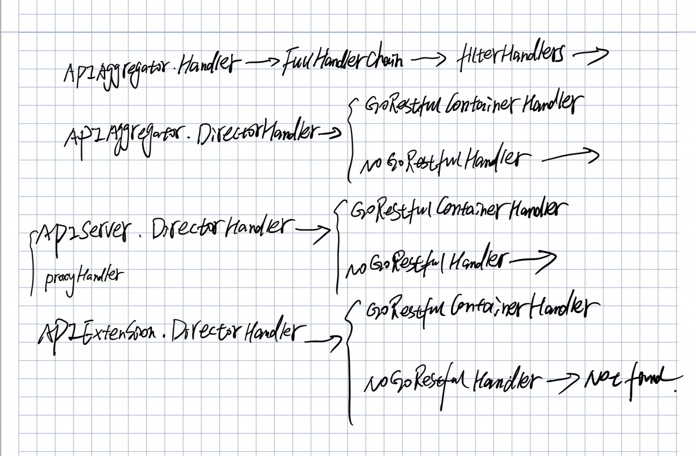

# Kube-apiserver 源码分析（基于 release-1.18 branch)

**NOTE: 由于代码篇幅太多，在分析的过程中会将不重要的部分删除，我将用//.................. 代替了。**

**NOTE: 上次我们在 [etcd-storage](etcd-storage.md) 中讲到，APIServer 的代码量有很多，我们分开来讲，上次主要是将的 k8s 对 etcd 存储的设计。这篇我们将来分析分析 apiserver 中的 APIAggregator，APIServer 和 APIExtension 之间的关系，和它们之间是如何串联起来的。**

首先我觉得很有必要解释一下 APIAggregator，APIServer 和 APIExtension 的各自的职责是什么？

## 组件职责分析

### APIAggregator

下面取自 k8s [官方中文文档](https://kubernetes.io/zh/docs/concepts/extend-kubernetes/api-extension/apiserver-aggregation/)：

>聚合层使您的集群可以安装其他 Kubernetes 风格的 API。这些 API 可以是预编译的、第三方的解决方案提供的例如 service-catalog、或者用户创建的类似 apiserver-builder 一样的 API 可以帮助你上手。
>
>聚合层在 kube-apiserver 进程内运行。在扩展资源注册之前，聚合层不做任何事情。要注册 API，用户必须添加一个 APIService 对象，用它来申领 Kubernetes API 中的 URL 路径。自此以后，聚合层将会把发给该 API 路径的所有内容（例如 /apis/myextension.mycompany.io/v1/…）代理到已注册的 APIService。
>
>正常情况下，APIService 会实现为运行于集群中某 Pod 内的 extension-apiserver。如果需要对增加的资源进行动态管理，extension-apiserver 经常需要和一个或多个控制器一起使用。因此，apiserver-builder 同时提供用来管理新资源的 API 框架和控制器框架。另外一个例子，当安装了 service-catalog 时，它会为自己提供的服务提供 extension-apiserver 和控制器。
>
>extension-apiserver 与 kube-apiserver 之间的连接应具有低延迟。 特别是，发现请求需要在五秒钟或更短的时间内从 kube-apiserver 往返。 如果您的部署无法实现此目的，则应考虑如何进行更改。目前，在 kube-apiserver 上设置 EnableAggregatedDiscoveryTimeout=false 功能开关将禁用超时限制。它将在将来的版本中被删除。

总结一下就是 aggregation 允许我们可以为我们自定义资源提供一个自己写的特定的实现，并部署我们自己的独立的 API Server 进行处理。主 API 服务器将对您处理的自定义资源的请求委托给您，使它们对其所有客户机可用。

### APIServer

APIServer 是处理 k8s 的内置资源，比如 pods，deployments 等。

### APIExtension

APIExtension 目前就是对 CRD(Custom Resource Definition) 的支持。下面是 k8s [官方文档](https://kubernetes.io/docs/concepts/extend-kubernetes/api-extension/custom-resources/#customresourcedefinitions) 的翻译（目前这部分还没有被翻译）：

>[CustomResourceDefinition](https://kubernetes.io/docs/tasks/extend-kubernetes/custom-resources/custom-resource-definitions/) API 资源允许你去定义自定义资源。定义一个 CRD 对象创建一个带有特定名字和 schema 新的自定义资源。Kubernetes API 服务和处理自定义资源的存储。CRD 对象的名字一定是一个有效的 [DNS 子域名](https://kubernetes.io/docs/concepts/overview/working-with-objects/names#dns-subdomain-names)。
>
>这将使你不需要写一个自己的 API Server 去处理自定义资源。但是，这种实现的通用特性意味着它的灵活性不如 [API 服务器聚合](https://kubernetes.io/docs/concepts/extend-kubernetes/api-extension/custom-resources/#api-server-aggregation)。
>
>参考 [自定义控制器示例](https://github.com/kubernetes/sample-controller) 去了解如何注册新的自定义资源，使用新的资源类型的实例以及如何用一个控制器来处理事件。

### 自定义资源的区别

请参考 [选择自定义资源的方法](https://kubernetes.io/docs/concepts/extend-kubernetes/api-extension/custom-resources/#choosing-a-method-for-adding-custom-resources)。

## 代码分析

首先和其他组件一样，apiserver 的 main 函数入口在 [apiserver.go](https://github.com/kubernetes/kubernetes/blob/release-1.18/cmd/kube-apiserver/apiserver.go) 文件中。同样可以看到是使用的 Cobra 的，这里不再过多解释了。我们下面直接进入今天的主题 [Run](https://github.com/kubernetes/kubernetes/blob/release-1.18/cmd/kube-apiserver/app/server.go#L146) 函数。

```go
// Run runs the specified APIServer.  This should never exit.
func Run(completeOptions completedServerRunOptions, stopCh <-chan struct{}) error {
    // To help debugging, immediately log version
    klog.Infof("Version: %+v", version.Get())

    server, err := CreateServerChain(completeOptions, stopCh)
    if err != nil {
        return err
    }

    prepared, err := server.PrepareRun()
    if err != nil {
        return err
    }

    return prepared.Run(stopCh)
}
```

上面 Run 函数看起来非常直观，它干了下面三件事：

1. 通过 CreateServerChain 函数创建了一个 Server。
2. 调用创建的 server 的 PrepareRun 函数，执行一些准备操作。
3. 最后就是调用 Run，真正的开始执行。

好了，下面我们分别来看看这三个函数具体的实现。

### 创建 ServerChain

首先，我们当然要来分析分析 [CreateServerChain](https://github.com/kubernetes/kubernetes/blob/release-1.18/cmd/kube-apiserver/app/server.go#L164) 函数，因为从函数名字也可以看得出来，这个函数很是关键，它应该就是将本文中说到的 APIAggregator,APIServer 和 APIExtension 串一个链。

```go
// CreateServerChain creates the apiservers connected via delegation.
func CreateServerChain(completedOptions completedServerRunOptions, stopCh <-chan struct{}) (*aggregatorapiserver.APIAggregator, error) {
    nodeTunneler, proxyTransport, err := CreateNodeDialer(completedOptions)
    if err != nil {
        return nil, err
    }

    kubeAPIServerConfig, insecureServingInfo, serviceResolver, pluginInitializer, err := CreateKubeAPIServerConfig(completedOptions, nodeTunneler, proxyTransport)
    if err != nil {
        return nil, err
    }

    // If additional API servers are added, they should be gated.
    apiExtensionsConfig, err := createAPIExtensionsConfig(*kubeAPIServerConfig.GenericConfig, kubeAPIServerConfig.ExtraConfig.VersionedInformers, pluginInitializer, completedOptions.ServerRunOptions, completedOptions.MasterCount,
        serviceResolver, webhook.NewDefaultAuthenticationInfoResolverWrapper(proxyTransport, kubeAPIServerConfig.GenericConfig.EgressSelector, kubeAPIServerConfig.GenericConfig.LoopbackClientConfig))
    if err != nil {
        return nil, err
    }
    apiExtensionsServer, err := createAPIExtensionsServer(apiExtensionsConfig, genericapiserver.NewEmptyDelegate())
    if err != nil {
        return nil, err
    }

    kubeAPIServer, err := CreateKubeAPIServer(kubeAPIServerConfig, apiExtensionsServer.GenericAPIServer)
    if err != nil {
        return nil, err
    }

    // aggregator comes last in the chain
    aggregatorConfig, err := createAggregatorConfig(*kubeAPIServerConfig.GenericConfig, completedOptions.ServerRunOptions, kubeAPIServerConfig.ExtraConfig.VersionedInformers, serviceResolver, proxyTransport, pluginInitializer)
    if err != nil {
        return nil, err
    }
    aggregatorServer, err := createAggregatorServer(aggregatorConfig, kubeAPIServer.GenericAPIServer, apiExtensionsServer.Informers)
    if err != nil {
        // we don't need special handling for innerStopCh because the aggregator server doesn't create any go routines
        return nil, err
    }

    if insecureServingInfo != nil {
        insecureHandlerChain := kubeserver.BuildInsecureHandlerChain(aggregatorServer.GenericAPIServer.UnprotectedHandler(), kubeAPIServerConfig.GenericConfig)
        if err := insecureServingInfo.Serve(insecureHandlerChain, kubeAPIServerConfig.GenericConfig.RequestTimeout, stopCh); err != nil {
            return nil, err
        }
    }

    return aggregatorServer, nil
}
```

代码一贴，所有实现都展现在面前，确实这里面就是将上面三者串联起来。形成一个责任链。下面我们逐个来分析分析。

#### CreateKubeAPIServerConfig

首先我们来看看 [CreateKubeAPIServerConfig](https://github.com/kubernetes/kubernetes/blob/release-1.18/cmd/kube-apiserver/app/server.go#L268) 函数。

```go
// CreateKubeAPIServerConfig creates all the resources for running the API server, but runs none of them
func CreateKubeAPIServerConfig(
    s completedServerRunOptions,
    nodeTunneler tunneler.Tunneler,
    proxyTransport *http.Transport,
) (
    *master.Config,
    *genericapiserver.DeprecatedInsecureServingInfo,
    aggregatorapiserver.ServiceResolver,
    []admission.PluginInitializer,
    error,
) {
    genericConfig, versionedInformers, insecureServingInfo, serviceResolver, pluginInitializers, admissionPostStartHook, storageFactory, err := buildGenericConfig(s.ServerRunOptions, proxyTransport)
    //..................

    config := &master.Config{
        GenericConfig: genericConfig,
        //..................
        },
    }
    //..................
    return config, insecureServingInfo, serviceResolver, pluginInitializers, nil
}
```

这里我们主要看下 [buildGenericConfig](https://github.com/kubernetes/kubernetes/blob/release-1.18/cmd/kube-apiserver/app/server.go#L412) 函数。

```go
// BuildGenericConfig takes the master server options and produces the genericapiserver.Config associated with it
func buildGenericConfig(
    s *options.ServerRunOptions,
    proxyTransport *http.Transport,
) (
    genericConfig *genericapiserver.Config,
    versionedInformers clientgoinformers.SharedInformerFactory,
    insecureServingInfo *genericapiserver.DeprecatedInsecureServingInfo,
    serviceResolver aggregatorapiserver.ServiceResolver,
    pluginInitializers []admission.PluginInitializer,
    admissionPostStartHook genericapiserver.PostStartHookFunc,
    storageFactory *serverstorage.DefaultStorageFactory,
    lastErr error,
) {
    genericConfig = genericapiserver.NewConfig(legacyscheme.Codecs)
    genericConfig.MergedResourceConfig = master.DefaultAPIResourceConfigSource()

    genericConfig.OpenAPIConfig = genericapiserver.DefaultOpenAPIConfig(generatedopenapi.GetOpenAPIDefinitions, openapinamer.NewDefinitionNamer(legacyscheme.Scheme, extensionsapiserver.Scheme, aggregatorscheme.Scheme))
    genericConfig.OpenAPIConfig.Info.Title = "Kubernetes"
    genericConfig.LongRunningFunc = filters.BasicLongRunningRequestCheck(
        sets.NewString("watch", "proxy"),
        sets.NewString("attach", "exec", "proxy", "log", "portforward"),
    )

    kubeVersion := version.Get()
    genericConfig.Version = &kubeVersion

    storageFactoryConfig := kubeapiserver.NewStorageFactoryConfig()
    storageFactoryConfig.APIResourceConfig = genericConfig.MergedResourceConfig
    completedStorageFactoryConfig, err := storageFactoryConfig.Complete(s.Etcd)
    if err != nil {
        lastErr = err
        return
    }
    storageFactory, lastErr = completedStorageFactoryConfig.New()
    if lastErr != nil {
        return
    }
    if genericConfig.EgressSelector != nil {
        storageFactory.StorageConfig.Transport.EgressLookup = genericConfig.EgressSelector.Lookup
    }
    if lastErr = s.Etcd.ApplyWithStorageFactoryTo(storageFactory, genericConfig); lastErr != nil {
        return
    }

    // Use protobufs for self-communication.
    // Since not every generic apiserver has to support protobufs, we
    // cannot default to it in generic apiserver and need to explicitly
    // set it in kube-apiserver.
    genericConfig.LoopbackClientConfig.ContentConfig.ContentType = "application/vnd.kubernetes.protobuf"
    // Disable compression for self-communication, since we are going to be
    // on a fast local network
    genericConfig.LoopbackClientConfig.DisableCompression = true

    kubeClientConfig := genericConfig.LoopbackClientConfig
    clientgoExternalClient, err := clientgoclientset.NewForConfig(kubeClientConfig)
    if err != nil {
        lastErr = fmt.Errorf("failed to create real external clientset: %v", err)
        return
    }
    versionedInformers = clientgoinformers.NewSharedInformerFactory(clientgoExternalClient, 10*time.Minute)

    // Authentication.ApplyTo requires already applied OpenAPIConfig and EgressSelector if present
    if lastErr = s.Authentication.ApplyTo(&genericConfig.Authentication, genericConfig.SecureServing, genericConfig.EgressSelector, genericConfig.OpenAPIConfig, clientgoExternalClient, versionedInformers); lastErr != nil {
        return
    }

    genericConfig.Authorization.Authorizer, genericConfig.RuleResolver, err = BuildAuthorizer(s, genericConfig.EgressSelector, versionedInformers)
    if err != nil {
        lastErr = fmt.Errorf("invalid authorization config: %v", err)
        return
    }
    if !sets.NewString(s.Authorization.Modes...).Has(modes.ModeRBAC) {
        genericConfig.DisabledPostStartHooks.Insert(rbacrest.PostStartHookName)
    }

    admissionConfig := &kubeapiserveradmission.Config{
        ExternalInformers:    versionedInformers,
        LoopbackClientConfig: genericConfig.LoopbackClientConfig,
        CloudConfigFile:      s.CloudProvider.CloudConfigFile,
    }
    serviceResolver = buildServiceResolver(s.EnableAggregatorRouting, genericConfig.LoopbackClientConfig.Host, versionedInformers)

    authInfoResolverWrapper := webhook.NewDefaultAuthenticationInfoResolverWrapper(proxyTransport, genericConfig.EgressSelector, genericConfig.LoopbackClientConfig)

    lastErr = s.Audit.ApplyTo(
        genericConfig,
        genericConfig.LoopbackClientConfig,
        versionedInformers,
        serveroptions.NewProcessInfo("kube-apiserver", "kube-system"),
        &serveroptions.WebhookOptions{
            AuthInfoResolverWrapper: authInfoResolverWrapper,
            ServiceResolver:         serviceResolver,
        },
    )
    if lastErr != nil {
        return
    }

    pluginInitializers, admissionPostStartHook, err = admissionConfig.New(proxyTransport, genericConfig.EgressSelector, serviceResolver)
    if err != nil {
        lastErr = fmt.Errorf("failed to create admission plugin initializer: %v", err)
        return
    }

    err = s.Admission.ApplyTo(
        genericConfig,
        versionedInformers,
        kubeClientConfig,
        feature.DefaultFeatureGate,
        pluginInitializers...)
    if err != nil {
        lastErr = fmt.Errorf("failed to initialize admission: %v", err)
    }

    if utilfeature.DefaultFeatureGate.Enabled(genericfeatures.APIPriorityAndFairness) && s.GenericServerRunOptions.EnablePriorityAndFairness {
        genericConfig.FlowControl = BuildPriorityAndFairness(s, clientgoExternalClient, versionedInformers)
    }

    return
}
```

这个函数里还是对 generic 的 config 进行赋值。

#### createAPIExtensionsConfig

这个函数主要是初始化一些 APIExtension 的配置数据，具体内容请参考：[createAPIExtensionsConfig](https://github.com/kubernetes/kubernetes/blob/release-1.18/cmd/kube-apiserver/app/apiextensions.go#L40)。

#### createAPIExtensionsServer

从上面 xxx 我们看到调用了这个函数 createAPIExtensionsServer(apiExtensionsConfig, genericapiserver.NewEmptyDelegate()) 创建了一个 APIExtension 的实例。下面来看看具体实现。

```go
func createAPIExtensionsServer(apiextensionsConfig *apiextensionsapiserver.Config, delegateAPIServer genericapiserver.DelegationTarget) (*apiextensionsapiserver.CustomResourceDefinitions, error) {
    return apiextensionsConfig.Complete().New(delegateAPIServer)
}
```

我们再看看 [apiextensionsConfig.Complete().New(delegateAPIServer)](https://github.com/kubernetes/kubernetes/blob/release-1.18/staging/src/k8s.io/apiextensions-apiserver/pkg/apiserver/apiserver.go#L130)。

```go
// New returns a new instance of CustomResourceDefinitions from the given config.
func (c completedConfig) New(delegationTarget genericapiserver.DelegationTarget) (*CustomResourceDefinitions, error) {
    genericServer, err := c.GenericConfig.New("apiextensions-apiserver", delegationTarget)
    if err != nil {
        return nil, err
    }

    s := &CustomResourceDefinitions{
        GenericAPIServer: genericServer,
    }

    apiResourceConfig := c.GenericConfig.MergedResourceConfig
    apiGroupInfo := genericapiserver.NewDefaultAPIGroupInfo(apiextensions.GroupName, Scheme, metav1.ParameterCodec, Codecs)
    if apiResourceConfig.VersionEnabled(v1beta1.SchemeGroupVersion) {
        storage := map[string]rest.Storage{}
        // customresourcedefinitions
        customResourceDefintionStorage := customresourcedefinition.NewREST(Scheme, c.GenericConfig.RESTOptionsGetter)
        storage["customresourcedefinitions"] = customResourceDefintionStorage
        storage["customresourcedefinitions/status"] = customresourcedefinition.NewStatusREST(Scheme, customResourceDefintionStorage)

        apiGroupInfo.VersionedResourcesStorageMap[v1beta1.SchemeGroupVersion.Version] = storage
    }
    if apiResourceConfig.VersionEnabled(v1.SchemeGroupVersion) {
        storage := map[string]rest.Storage{}
        // customresourcedefinitions
        customResourceDefintionStorage := customresourcedefinition.NewREST(Scheme, c.GenericConfig.RESTOptionsGetter)
        storage["customresourcedefinitions"] = customResourceDefintionStorage
        storage["customresourcedefinitions/status"] = customresourcedefinition.NewStatusREST(Scheme, customResourceDefintionStorage)

        apiGroupInfo.VersionedResourcesStorageMap[v1.SchemeGroupVersion.Version] = storage
    }

    if err := s.GenericAPIServer.InstallAPIGroup(&apiGroupInfo); err != nil {
        return nil, err
    }
    //..................
    return s, nil
}

```

这里我们主要是分析 APIExtension 的创建和 APIGroup 的安装，所以其他的部分都去掉了，目前不分析。所以这个函数主要是做了下面三件事：

1. c.GenericConfig.New("apiextensions-apiserver", delegationTarget) 创建一个 generic 的 server。

   下面详细讲解这个函数。

2. 将 storage 的 REST 服了借口存储到 apiGroup 的 VersionedResourcesStorageMap 中。

   这里比较简单，就是将 CRD 相关的 ETCD 存储的 REST 接口存入到 apiGroup 的 VersionedResourcesStorageMap 中，以便在下面 InstallAPIGroup 的时候，将对外暴露的 API 和 ETCD 存储的 RESTAPI 对应起来。

3. s.GenericAPIServer.InstallAPIGroup(&apiGroupInfo) 安装 APIGroup。

   下面详细讲解这个函数。

这里我们着重研究研究这个 [c.GenericConfig.New](https://github.com/kubernetes/kubernetes/blob/release-1.18/staging/src/k8s.io/apiserver/pkg/server/config.go#L523) 函数。因为这部分是 generic server 的处理逻辑，而后面的 CreateKubeAPIServer 和 createAggregatorServer 的具体实现都是这个 generic server，所以对于三者来说，这是一个通用的处理。

```go
// New creates a new server which logically combines the handling chain with the passed server.
// name is used to differentiate for logging. The handler chain in particular can be difficult as it starts delgating.
// delegationTarget may not be nil.
func (c completedConfig) New(name string, delegationTarget DelegationTarget) (*GenericAPIServer, error) {
    handlerChainBuilder := func(handler http.Handler) http.Handler {
        return c.BuildHandlerChainFunc(handler, c.Config)
    }
    apiServerHandler := NewAPIServerHandler(name, c.Serializer, handlerChainBuilder, delegationTarget.UnprotectedHandler())

    s := &GenericAPIServer{
        delegationTarget:           delegationTarget,
        Handler: apiServerHandler,
    }

    //..................

    s.listedPathProvider = routes.ListedPathProviders{s.listedPathProvider, delegationTarget}

    installAPI(s, c.Config)

    return s, nil
}

```

再来看看 [NewAPIServerHandler](https://github.com/kubernetes/kubernetes/blob/release-1.18/staging/src/k8s.io/apiserver/pkg/server/handler.go#L73) 函数。

```go
// HandlerChainBuilderFn is used to wrap the GoRestfulContainer handler using the provided handler chain.
// It is normally used to apply filtering like authentication and authorization
type HandlerChainBuilderFn func(apiHandler http.Handler) http.Handler

func NewAPIServerHandler(name string, s runtime.NegotiatedSerializer, handlerChainBuilder HandlerChainBuilderFn, notFoundHandler http.Handler) *APIServerHandler {
    nonGoRestfulMux := mux.NewPathRecorderMux(name)
    if notFoundHandler != nil {
        nonGoRestfulMux.NotFoundHandler(notFoundHandler)
    }

    gorestfulContainer := restful.NewContainer()
    gorestfulContainer.ServeMux = http.NewServeMux()
    gorestfulContainer.Router(restful.CurlyRouter{}) // e.g. for proxy/{kind}/{name}/{*}
    gorestfulContainer.RecoverHandler(func(panicReason interface{}, httpWriter http.ResponseWriter) {
        logStackOnRecover(s, panicReason, httpWriter)
    })
    gorestfulContainer.ServiceErrorHandler(func(serviceErr restful.ServiceError, request *restful.Request, response *restful.Response) {
        serviceErrorHandler(s, serviceErr, request, response)
    })

    director := director{
        name:               name,
        goRestfulContainer: gorestfulContainer,
        nonGoRestfulMux:    nonGoRestfulMux,
    }

    return &APIServerHandler{
        FullHandlerChain:   handlerChainBuilder(director),
        GoRestfulContainer: gorestfulContainer,
        NonGoRestfulMux:    nonGoRestfulMux,
        Director:           director,
    }
}

type director struct {
    name               string
    goRestfulContainer *restful.Container
    nonGoRestfulMux    *mux.PathRecorderMux
}
```

首先对传入的 notFoundHandler 判断是否为空，如果不为空，则添加到 nonGoRestfulMux 的 NotFoundHandler 中。**NOTE: 其实这里的 notFoundHandler 还是挺让别人误解的，因为这里其实传入的是 delegationTarget.UnprotectedHandler, 虽然有可能是 NotFoundHandler，但是对于 APIExtension 和 APIServer 和 APIAggregator 三者串联来说，传入的并不是 NotFoundHandler，而是传入的是链的后者的 APIServerHandler 的 Director。例如： APIServer 的后者是 APIExtension, 所以在这里将会把 APIExtension 的 APIServerHandler 的 Director 传入，赋值给 nonGoRestfulMux.NotFoundHandler 中。所以当在处理 CRD 的 API 的时候，APIServer 中的 GoRestfulContainer 没有对应的 Handler, 然后就会到 NonGoRestfulMux 中去查找，是否有对应的 Handler。**

这里还可以看到创建了 director，并将创建的 gorestfulContainer 和 nonGoRestfulMux 存入，最后创建了 APIServerHandler 实例，并返回。

上面 NewAPIServerHandler 中，创建了 APIServerHandler 并赋值了很多种类的 Handler，下面再重点看看 APIServerHandler 的结构，来理解下这几个 Handler 是怎么玩的。

```go
// APIServerHandlers holds the different http.Handlers used by the API server.
// This includes the full handler chain, the director (which chooses between gorestful and nonGoRestful,
// the gorestful handler (used for the API) which falls through to the nonGoRestful handler on unregistered paths,
// and the nonGoRestful handler (which can contain a fallthrough of its own)
// FullHandlerChain -> Director -> {GoRestfulContainer,NonGoRestfulMux} based on inspection of registered web services
type APIServerHandler struct {
    // FullHandlerChain is the one that is eventually served with.  It should include the full filter
    // chain and then call the Director.
    FullHandlerChain http.Handler
    // The registered APIs.  InstallAPIs uses this.  Other servers probably shouldn't access this directly.
    GoRestfulContainer *restful.Container
    // NonGoRestfulMux is the final HTTP handler in the chain.
    // It comes after all filters and the API handling
    // This is where other servers can attach handler to various parts of the chain.
    NonGoRestfulMux *mux.PathRecorderMux

    // Director is here so that we can properly handle fall through and proxy cases.
    // This looks a bit bonkers, but here's what's happening.  We need to have /apis handling registered in gorestful in order to have
    // swagger generated for compatibility.  Doing that with `/apis` as a webservice, means that it forcibly 404s (no defaulting allowed)
    // all requests which are not /apis or /apis/.  We need those calls to fall through behind goresful for proper delegation.  Trying to
    // register for a pattern which includes everything behind it doesn't work because gorestful negotiates for verbs and content encoding
    // and all those things go crazy when gorestful really just needs to pass through.  In addition, openapi enforces unique verb constraints
    // which we don't fit into and it still muddies up swagger.  Trying to switch the webservices into a route doesn't work because the
    //  containing webservice faces all the same problems listed above.
    // This leads to the crazy thing done here.  Our mux does what we need, so we'll place it in front of gorestful.  It will introspect to
    // decide if the route is likely to be handled by goresful and route there if needed.  Otherwise, it goes to PostGoRestful mux in
    // order to handle "normal" paths and delegation. Hopefully no API consumers will ever have to deal with this level of detail.  I think
    // we should consider completely removing gorestful.
    // Other servers should only use this opaquely to delegate to an API server.
    Director http.Handler
}
```

这里可以看到，APIServerHandler 包含了四种 Handler。并且从注释中可以看到，调用顺序是 FullHandlerChain -> Director -> {GoRestfulContainer,NonGoRestfulMux} 。这里我们结合上面 NewAPIServerHandler 来分析分析，这四个 Handler。
首先，FullHandlerChain 是通过 HandlerChainBuilderFn 这个回调函数，并把创建的 director 传入。

在这里，这个 HandlerChainBuilderFn 函数是：DefaultBuildHandlerChain 这个函数。

```go
func DefaultBuildHandlerChain(apiHandler http.Handler, c *Config) http.Handler {
    handler := genericapifilters.WithAuthorization(apiHandler, c.Authorization.Authorizer, c.Serializer)
    if c.FlowControl != nil {
        handler = genericfilters.WithPriorityAndFairness(handler, c.LongRunningFunc, c.FlowControl)
    } else {
        handler = genericfilters.WithMaxInFlightLimit(handler, c.MaxRequestsInFlight, c.MaxMutatingRequestsInFlight, c.LongRunningFunc)
    }
    handler = genericapifilters.WithImpersonation(handler, c.Authorization.Authorizer, c.Serializer)
    handler = genericapifilters.WithAudit(handler, c.AuditBackend, c.AuditPolicyChecker, c.LongRunningFunc)
    failedHandler := genericapifilters.Unauthorized(c.Serializer, c.Authentication.SupportsBasicAuth)
    failedHandler = genericapifilters.WithFailedAuthenticationAudit(failedHandler, c.AuditBackend, c.AuditPolicyChecker)
    handler = genericapifilters.WithAuthentication(handler, c.Authentication.Authenticator, failedHandler, c.Authentication.APIAudiences)
    handler = genericfilters.WithCORS(handler, c.CorsAllowedOriginList, nil, nil, nil, "true")
    handler = genericfilters.WithTimeoutForNonLongRunningRequests(handler, c.LongRunningFunc, c.RequestTimeout)
    handler = genericfilters.WithWaitGroup(handler, c.LongRunningFunc, c.HandlerChainWaitGroup)
    handler = genericapifilters.WithRequestInfo(handler, c.RequestInfoResolver)
    if c.SecureServing != nil && !c.SecureServing.DisableHTTP2 && c.GoawayChance > 0 {
        handler = genericfilters.WithProbabilisticGoaway(handler, c.GoawayChance)
    }
    handler = genericapifilters.WithCacheControl(handler)
    handler = genericfilters.WithPanicRecovery(handler)
    return handler
}
```

这里可以看到，是将传入的 director 进行了 N 次 filterHandler 的包装，例如认证和授权等。

APIServerHandler 中的 Director 是一个 http.Handler 的 interface，通过 NewAPIServerHandler 函数，将创建的 director 的实例赋值给了 Director。并在后面通过 delegationTarget.UnprotectedHandler 获取到。

而这里暴露出来的另外两个 Handler：GoRestfulContainer 和 NonGoRestfulMux，主要作用是在后面动态的将 API 安装到其中。而 Director 指向的 director 实例中包含了这两个类型的指针，所以在后续的处理中，也能够获取到添加的 API。

最后来看看 [installAPI](https://github.com/kubernetes/kubernetes/blob/release-1.18/staging/src/k8s.io/apiserver/pkg/server/config.go#L695) 函数。

```go
func installAPI(s *GenericAPIServer, c *Config) {
    if c.EnableIndex {
        routes.Index{}.Install(s.listedPathProvider, s.Handler.NonGoRestfulMux)
    }
    if c.EnableProfiling {
        routes.Profiling{}.Install(s.Handler.NonGoRestfulMux)
        if c.EnableContentionProfiling {
            goruntime.SetBlockProfileRate(1)
        }
        // so far, only logging related endpoints are considered valid to add for these debug flags.
        routes.DebugFlags{}.Install(s.Handler.NonGoRestfulMux, "v", routes.StringFlagPutHandler(logs.GlogSetter))
    }
    if c.EnableMetrics {
        if c.EnableProfiling {
            routes.MetricsWithReset{}.Install(s.Handler.NonGoRestfulMux)
        } else {
            routes.DefaultMetrics{}.Install(s.Handler.NonGoRestfulMux)
        }
    }

    routes.Version{Version: c.Version}.Install(s.Handler.GoRestfulContainer)

    if c.EnableDiscovery {
        s.Handler.GoRestfulContainer.Add(s.DiscoveryGroupManager.WebService())
    }
}
```

这个函数就是将对应的 APIHandler 添加到 route 中。

下面在聊聊 [s.GenericAPIServer.InstallAPIGroup(&apiGroupInfo)](https://github.com/kubernetes/kubernetes/blob/release-1.18/staging/src/k8s.io/apiserver/pkg/server/genericapiserver.go#L503) 这个函数。它主要是安装相应的 apiGroupInfo 到上面 GenericAPIServer 的 APIServerHandler 中去。基本和 installAPI 功能类似。

```go
// Exposes the given api group in the API.
func (s *GenericAPIServer) InstallAPIGroup(apiGroupInfo *APIGroupInfo) error {
    return s.InstallAPIGroups(apiGroupInfo)
}

// Exposes given api groups in the API.
func (s *GenericAPIServer) InstallAPIGroups(apiGroupInfos ...*APIGroupInfo) error {
    for _, apiGroupInfo := range apiGroupInfos {
        // Do not register empty group or empty version.  Doing so claims /apis/ for the wrong entity to be returned.
        // Catching these here places the error  much closer to its origin
        if len(apiGroupInfo.PrioritizedVersions[0].Group) == 0 {
            return fmt.Errorf("cannot register handler with an empty group for %#v", *apiGroupInfo)
        }
        if len(apiGroupInfo.PrioritizedVersions[0].Version) == 0 {
            return fmt.Errorf("cannot register handler with an empty version for %#v", *apiGroupInfo)
        }
    }

    openAPIModels, err := s.getOpenAPIModels(APIGroupPrefix, apiGroupInfos...)
    if err != nil {
        return fmt.Errorf("unable to get openapi models: %v", err)
    }

    for _, apiGroupInfo := range apiGroupInfos {
        if err := s.installAPIResources(APIGroupPrefix, apiGroupInfo, openAPIModels); err != nil {
            return fmt.Errorf("unable to install api resources: %v", err)
        }

        // setup discovery
        // Install the version handler.
        // Add a handler at /apis/<groupName> to enumerate all versions supported by this group.
        apiVersionsForDiscovery := []metav1.GroupVersionForDiscovery{}
        for _, groupVersion := range apiGroupInfo.PrioritizedVersions {
            // Check the config to make sure that we elide versions that don't have any resources
            if len(apiGroupInfo.VersionedResourcesStorageMap[groupVersion.Version]) == 0 {
                continue
            }
            apiVersionsForDiscovery = append(apiVersionsForDiscovery, metav1.GroupVersionForDiscovery{
                GroupVersion: groupVersion.String(),
                Version:      groupVersion.Version,
            })
        }
        preferredVersionForDiscovery := metav1.GroupVersionForDiscovery{
            GroupVersion: apiGroupInfo.PrioritizedVersions[0].String(),
            Version:      apiGroupInfo.PrioritizedVersions[0].Version,
        }
        apiGroup := metav1.APIGroup{
            Name:             apiGroupInfo.PrioritizedVersions[0].Group,
            Versions:         apiVersionsForDiscovery,
            PreferredVersion: preferredVersionForDiscovery,
        }

        s.DiscoveryGroupManager.AddGroup(apiGroup)
        s.Handler.GoRestfulContainer.Add(discovery.NewAPIGroupHandler(s.Serializer, apiGroup).WebService())
    }
    return nil
}

// installAPIResources is a private method for installing the REST storage backing each api groupversionresource
func (s *GenericAPIServer) installAPIResources(apiPrefix string, apiGroupInfo *APIGroupInfo, openAPIModels openapiproto.Models) error {
    for _, groupVersion := range apiGroupInfo.PrioritizedVersions {
        if len(apiGroupInfo.VersionedResourcesStorageMap[groupVersion.Version]) == 0 {
            klog.Warningf("Skipping API %v because it has no resources.", groupVersion)
            continue
        }

        apiGroupVersion := s.getAPIGroupVersion(apiGroupInfo, groupVersion, apiPrefix)
        if apiGroupInfo.OptionsExternalVersion != nil {
            apiGroupVersion.OptionsExternalVersion = apiGroupInfo.OptionsExternalVersion
        }
        apiGroupVersion.OpenAPIModels = openAPIModels
        apiGroupVersion.MaxRequestBodyBytes = s.maxRequestBodyBytes

        if err := apiGroupVersion.InstallREST(s.Handler.GoRestfulContainer); err != nil {
            return fmt.Errorf("unable to setup API %v: %v", apiGroupInfo, err)
        }
    }

    return nil
}
```

具体就是通过这几个函数将详细的 RESTAPI 加入到 s.Handler.GoRestfulContainer 中。而这里就是将 CRD 的相关的 API 添加进来了。

#### CreateKubeAPIServer

我们再来看看 [CreateKubeAPIServer](https://github.com/kubernetes/kubernetes/blob/release-1.18/cmd/kube-apiserver/app/server.go#L213) 函数。

```go
// CreateKubeAPIServer creates and wires a workable kube-apiserver
func CreateKubeAPIServer(kubeAPIServerConfig *master.Config, delegateAPIServer genericapiserver.DelegationTarget) (*master.Master, error) {
    kubeAPIServer, err := kubeAPIServerConfig.Complete().New(delegateAPIServer)
    if err != nil {
        return nil, err
    }

    return kubeAPIServer, nil
}
```

同样我们需要看看 [kubeAPIServerConfig.Complete().New(delegateAPIServer)](https://github.com/kubernetes/kubernetes/blob/release-1.18/pkg/master/master.go#L336) 这个内容。

```go
// New returns a new instance of Master from the given config.
// Certain config fields will be set to a default value if unset.
// Certain config fields must be specified, including:
//   KubeletClientConfig
func (c completedConfig) New(delegationTarget genericapiserver.DelegationTarget) (*Master, error) {
    if reflect.DeepEqual(c.ExtraConfig.KubeletClientConfig, kubeletclient.KubeletClientConfig{}) {
        return nil, fmt.Errorf("Master.New() called with empty config.KubeletClientConfig")
    }

    s, err := c.GenericConfig.New("kube-apiserver", delegationTarget)
    if err != nil {
        return nil, err
    }

    if c.ExtraConfig.EnableLogsSupport {
        routes.Logs{}.Install(s.Handler.GoRestfulContainer)
    }

    m := &Master{
        GenericAPIServer:          s,
        ClusterAuthenticationInfo: c.ExtraConfig.ClusterAuthenticationInfo,
    }

    // install legacy rest storage
    if c.ExtraConfig.APIResourceConfigSource.VersionEnabled(apiv1.SchemeGroupVersion) {
        legacyRESTStorageProvider := corerest.LegacyRESTStorageProvider{
            StorageFactory:              c.ExtraConfig.StorageFactory,
            ProxyTransport:              c.ExtraConfig.ProxyTransport,
            KubeletClientConfig:         c.ExtraConfig.KubeletClientConfig,
            EventTTL:                    c.ExtraConfig.EventTTL,
            ServiceIPRange:              c.ExtraConfig.ServiceIPRange,
            SecondaryServiceIPRange:     c.ExtraConfig.SecondaryServiceIPRange,
            ServiceNodePortRange:        c.ExtraConfig.ServiceNodePortRange,
            LoopbackClientConfig:        c.GenericConfig.LoopbackClientConfig,
            ServiceAccountIssuer:        c.ExtraConfig.ServiceAccountIssuer,
            ServiceAccountMaxExpiration: c.ExtraConfig.ServiceAccountMaxExpiration,
            APIAudiences:                c.GenericConfig.Authentication.APIAudiences,
        }
        if err := m.InstallLegacyAPI(&c, c.GenericConfig.RESTOptionsGetter, legacyRESTStorageProvider); err != nil {
            return nil, err
        }
    }

    // The order here is preserved in discovery.
    // If resources with identical names exist in more than one of these groups (e.g. "deployments.apps"" and "deployments.extensions"),
    // the order of this list determines which group an unqualified resource name (e.g. "deployments") should prefer.
    // This priority order is used for local discovery, but it ends up aggregated in `k8s.io/kubernetes/cmd/kube-apiserver/app/aggregator.go
    // with specific priorities.
    // TODO: describe the priority all the way down in the RESTStorageProviders and plumb it back through the various discovery
    // handlers that we have.
    restStorageProviders := []RESTStorageProvider{
        auditregistrationrest.RESTStorageProvider{},
        authenticationrest.RESTStorageProvider{Authenticator: c.GenericConfig.Authentication.Authenticator, APIAudiences: c.GenericConfig.Authentication.APIAudiences},
        authorizationrest.RESTStorageProvider{Authorizer: c.GenericConfig.Authorization.Authorizer, RuleResolver: c.GenericConfig.RuleResolver},
        autoscalingrest.RESTStorageProvider{},
        batchrest.RESTStorageProvider{},
        certificatesrest.RESTStorageProvider{},
        coordinationrest.RESTStorageProvider{},
        discoveryrest.StorageProvider{},
        extensionsrest.RESTStorageProvider{},
        networkingrest.RESTStorageProvider{},
        noderest.RESTStorageProvider{},
        policyrest.RESTStorageProvider{},
        rbacrest.RESTStorageProvider{Authorizer: c.GenericConfig.Authorization.Authorizer},
        schedulingrest.RESTStorageProvider{},
        settingsrest.RESTStorageProvider{},
        storagerest.RESTStorageProvider{},
        flowcontrolrest.RESTStorageProvider{},
        // keep apps after extensions so legacy clients resolve the extensions versions of shared resource names.
        // See https://github.com/kubernetes/kubernetes/issues/42392
        appsrest.RESTStorageProvider{},
        admissionregistrationrest.RESTStorageProvider{},
        eventsrest.RESTStorageProvider{TTL: c.ExtraConfig.EventTTL},
    }
    if err := m.InstallAPIs(c.ExtraConfig.APIResourceConfigSource, c.GenericConfig.RESTOptionsGetter, restStorageProviders...); err != nil {
        return nil, err
    }

    return m, nil
}
```

这里和 createAPIExtensionsServer 函数类似。先调用 c.GenericConfig.New("kube-apiserver", delegationTarget) 创建了 kube-apiserver 的一个 generic server，然后这里要注意的是，这里的 delegationTarget 是之前创建的 APIExtensionServer 的 Director，最后就是调用 InstallLegacyAPI 和 InstallAPIs 来安装 k8s 自己内置的资源 REST。这里就不贴代码了。

#### createAggregatorConfig

这个函数主要是初始化一些 APIAggregator 的配置数据，具体内容请参考：[createAggregatorConfig](https://github.com/kubernetes/kubernetes/blob/release-1.18/cmd/kube-apiserver/app/aggregator.go#L57)。

#### createAggregatorServer

最后调用的就是 [createAggregatorServer](https://github.com/kubernetes/kubernetes/blob/release-1.18/cmd/kube-apiserver/app/aggregator.go#L129) 了，也就是说这个链的最外层就是 APIAggregator 了。

```go
func createAggregatorServer(aggregatorConfig *aggregatorapiserver.Config, delegateAPIServer genericapiserver.DelegationTarget, apiExtensionInformers apiextensionsinformers.SharedInformerFactory) (*aggregatorapiserver.APIAggregator, error) {
    aggregatorServer, err := aggregatorConfig.Complete().NewWithDelegate(delegateAPIServer)

    return aggregatorServer, nil
}

```

可以看到重点函数是这个 [aggregatorConfig.Complete().NewWithDelegate(delegateAPIServer)](https://github.com/kubernetes/kubernetes/blob/release-1.18/staging/src/k8s.io/kube-aggregator/pkg/apiserver/apiserver.go#L160)。

```go
// NewWithDelegate returns a new instance of APIAggregator from the given config.
func (c completedConfig) NewWithDelegate(delegationTarget genericapiserver.DelegationTarget) (*APIAggregator, error) {
    // Prevent generic API server to install OpenAPI handler. Aggregator server
    // has its own customized OpenAPI handler.
    openAPIConfig := c.GenericConfig.OpenAPIConfig
    c.GenericConfig.OpenAPIConfig = nil

    genericServer, err := c.GenericConfig.New("kube-aggregator", delegationTarget)
    if err != nil {
        return nil, err
    }

    s := &APIAggregator{
        GenericAPIServer:         genericServer,
        delegateHandler:          delegationTarget.UnprotectedHandler(),
        proxyClientCert:          c.ExtraConfig.ProxyClientCert,
        proxyClientKey:           c.ExtraConfig.ProxyClientKey,
        proxyTransport:           c.ExtraConfig.ProxyTransport,
        proxyHandlers:            map[string]*proxyHandler{},
        handledGroups:            sets.String{},
        lister:                   informerFactory.Apiregistration().V1().APIServices().Lister(),
        APIRegistrationInformers: informerFactory,
        serviceResolver:          c.ExtraConfig.ServiceResolver,
        openAPIConfig:            openAPIConfig,
        egressSelector:           c.GenericConfig.EgressSelector,
    }

    apiGroupInfo := apiservicerest.NewRESTStorage(c.GenericConfig.MergedResourceConfig, c.GenericConfig.RESTOptionsGetter)
    if err := s.GenericAPIServer.InstallAPIGroup(&apiGroupInfo); err != nil {
        return nil, err
    }

    enabledVersions := sets.NewString()
    for v := range apiGroupInfo.VersionedResourcesStorageMap {
        enabledVersions.Insert(v)
    }
    if !enabledVersions.Has(v1.SchemeGroupVersion.Version) {
        return nil, fmt.Errorf("API group/version %s must be enabled", v1.SchemeGroupVersion.String())
    }

    apisHandler := &apisHandler{
        codecs:         aggregatorscheme.Codecs,
        lister:         s.lister,
        discoveryGroup: discoveryGroup(enabledVersions),
    }
    s.GenericAPIServer.Handler.NonGoRestfulMux.Handle("/apis", apisHandler)
    s.GenericAPIServer.Handler.NonGoRestfulMux.UnlistedHandle("/apis/", apisHandler)

    return s, nil
}
```

这个函数里面的大致流程大家已经熟悉了。是的和另外两个类似，先通过调用 c.GenericConfig.New("kube-aggregator", delegationTarget) 去创建 kube-aggregator 的 generic server。然后通过调用 generic 的 InstallAPIGroup 方法将相应的 Rest 添加到 Handler 中。同样这里的重点是 delegateAPIServer，这里是将 APIServer 的 generic service 传入。然后将它的 APIServerHandler 中的 Director 添加到了 APIAggregator 中 APIServerHandler 中的 NonGoRestfulMux。

#### 小结

到这里，三者的创建过程分析完毕了。我们可以总结出三者的具体责任链是 APIAggregator -> APIServer -> APIExtension。

下面用图来总结下，三者 Handler 的关系。具体的流图请看：



### 执行 Run 之前的准备操作

从上面的分析，我们可以看到最后调用 PrepareRun 的是 APIAggregator，因为它在链的最前面。下面我们来看看具体的实现：

```go
// PrepareRun prepares the aggregator to run, by setting up the OpenAPI spec and calling
// the generic PrepareRun.
func (s *APIAggregator) PrepareRun() (preparedAPIAggregator, error) {
    // add post start hook before generic PrepareRun in order to be before /healthz installation
    if s.openAPIConfig != nil {
        s.GenericAPIServer.AddPostStartHookOrDie("apiservice-openapi-controller", func(context genericapiserver.PostStartHookContext) error {
            go s.openAPIAggregationController.Run(context.StopCh)
            return nil
        })
    }

    prepared := s.GenericAPIServer.PrepareRun()

    // delay OpenAPI setup until the delegate had a chance to setup their OpenAPI handlers
    if s.openAPIConfig != nil {
        specDownloader := openapiaggregator.NewDownloader()
        openAPIAggregator, err := openapiaggregator.BuildAndRegisterAggregator(
            &specDownloader,
            s.GenericAPIServer.NextDelegate(),
            s.GenericAPIServer.Handler.GoRestfulContainer.RegisteredWebServices(),
            s.openAPIConfig,
            s.GenericAPIServer.Handler.NonGoRestfulMux)
        if err != nil {
            return preparedAPIAggregator{}, err
        }
        s.openAPIAggregationController = openapicontroller.NewAggregationController(&specDownloader, openAPIAggregator)
    }

    return preparedAPIAggregator{APIAggregator: s, runnable: prepared}, nil
}
```

好了，这里调用的是 genericServer 的 PrepareRun。咋们在一起去看看这个函数 [s.GenericAPIServer.PrepareRun()](https://github.com/kubernetes/kubernetes/blob/release-1.18/staging/src/k8s.io/apiserver/pkg/server/genericapiserver.go#L283)。

```go
// PrepareRun does post API installation setup steps. It calls recursively the same function of the delegates.
func (s *GenericAPIServer) PrepareRun() preparedGenericAPIServer {
    s.delegationTarget.PrepareRun()

    if s.openAPIConfig != nil {
        s.OpenAPIVersionedService, s.StaticOpenAPISpec = routes.OpenAPI{
            Config: s.openAPIConfig,
        }.Install(s.Handler.GoRestfulContainer, s.Handler.NonGoRestfulMux)
    }

    s.installHealthz()
    s.installLivez()
    err := s.addReadyzShutdownCheck(s.readinessStopCh)
    if err != nil {
        klog.Errorf("Failed to install readyz shutdown check %s", err)
    }
    s.installReadyz()

    // Register audit backend preShutdownHook.
    if s.AuditBackend != nil {
        err := s.AddPreShutdownHook("audit-backend", func() error {
            s.AuditBackend.Shutdown()
            return nil
        })
        if err != nil {
            klog.Errorf("Failed to add pre-shutdown hook for audit-backend %s", err)
        }
    }

    return preparedGenericAPIServer{s}
}
```

这里没什么好说的，就是加入一些探针类的 API 到 s.Handler.NonGoRestfulMux 中。

### 开始处理

最后就是调用 APIAggregator 的 Run 函数开始 server 处理了。

```go
func (s preparedAPIAggregator) Run(stopCh <-chan struct{}) error {
    return s.runnable.Run(stopCh)
}
```

结合上面的 PrepareRun，我们知道这里的 runnable 是 s.GenericAPIServer.PrepareRun() 的结果，那这里真正 [Run](https://github.com/kubernetes/kubernetes/blob/release-1.18/staging/src/k8s.io/apiserver/pkg/server/genericapiserver.go#L316) 的是 preparedGenericAPIServer 这个实例。下面我们来看看具体的代码。

```go
// Run spawns the secure http server. It only returns if stopCh is closed
// or the secure port cannot be listened on initially.
func (s preparedGenericAPIServer) Run(stopCh <-chan struct{}) error {
    delayedStopCh := make(chan struct{})

    go func() {
        defer close(delayedStopCh)

        <-stopCh

        // As soon as shutdown is initiated, /readyz should start returning failure.
        // This gives the load balancer a window defined by ShutdownDelayDuration to detect that /readyz is red
        // and stop sending traffic to this server.
        close(s.readinessStopCh)

        time.Sleep(s.ShutdownDelayDuration)
    }()

    // close socket after delayed stopCh
    err := s.NonBlockingRun(delayedStopCh)
    if err != nil {
        return err
    }

    <-stopCh

    // run shutdown hooks directly. This includes deregistering from the kubernetes endpoint in case of kube-apiserver.
    err = s.RunPreShutdownHooks()
    if err != nil {
        return err
    }

    // wait for the delayed stopCh before closing the handler chain (it rejects everything after Wait has been called).
    <-delayedStopCh

    // Wait for all requests to finish, which are bounded by the RequestTimeout variable.
    s.HandlerChainWaitGroup.Wait()

    return nil
}
```

通过 NonBlockingRun 进行非阻塞的运行 server。

```go
// NonBlockingRun spawns the secure http server. An error is
// returned if the secure port cannot be listened on.
func (s preparedGenericAPIServer) NonBlockingRun(stopCh <-chan struct{}) error {
    // Use an stop channel to allow graceful shutdown without dropping audit events
    // after http server shutdown.
    auditStopCh := make(chan struct{})

    // Start the audit backend before any request comes in. This means we must call Backend.Run
    // before http server start serving. Otherwise the Backend.ProcessEvents call might block.
    if s.AuditBackend != nil {
        if err := s.AuditBackend.Run(auditStopCh); err != nil {
            return fmt.Errorf("failed to run the audit backend: %v", err)
        }
    }

    // Use an internal stop channel to allow cleanup of the listeners on error.
    internalStopCh := make(chan struct{})
    var stoppedCh <-chan struct{}
    if s.SecureServingInfo != nil && s.Handler != nil {
        var err error
        stoppedCh, err = s.SecureServingInfo.Serve(s.Handler, s.ShutdownTimeout, internalStopCh)
        if err != nil {
            close(internalStopCh)
            close(auditStopCh)
            return err
        }
    }

    // Now that listener have bound successfully, it is the
    // responsibility of the caller to close the provided channel to
    // ensure cleanup.
    go func() {
        <-stopCh
        close(internalStopCh)
        if stoppedCh != nil {
            <-stoppedCh
        }
        s.HandlerChainWaitGroup.Wait()
        close(auditStopCh)
    }()

    s.RunPostStartHooks(stopCh)

    if _, err := systemd.SdNotify(true, "READY=1\n"); err != nil {
        klog.Errorf("Unable to send systemd daemon successful start message: %v\n", err)
    }

    return nil
}
```

再通过调用 s.SecureServingInfo.Serve(s.Handler, s.ShutdownTimeout, internalStopCh) 。

```go
// Serve runs the secure http server. It fails only if certificates cannot be loaded or the initial listen call fails.
// The actual server loop (stoppable by closing stopCh) runs in a go routine, i.e. Serve does not block.
// It returns a stoppedCh that is closed when all non-hijacked active requests have been processed.
func (s *SecureServingInfo) Serve(handler http.Handler, shutdownTimeout time.Duration, stopCh <-chan struct{}) (<-chan struct{}, error) {
    if s.Listener == nil {
        return nil, fmt.Errorf("listener must not be nil")
    }

    tlsConfig, err := s.tlsConfig(stopCh)
    if err != nil {
        return nil, err
    }

    secureServer := &http.Server{
        Addr:           s.Listener.Addr().String(),
        Handler:        handler,
        MaxHeaderBytes: 1 << 20,
        TLSConfig:      tlsConfig,
    }

    // At least 99% of serialized resources in surveyed clusters were smaller than 256kb.
    // This should be big enough to accommodate most API POST requests in a single frame,
    // and small enough to allow a per connection buffer of this size multiplied by `MaxConcurrentStreams`.
    const resourceBody99Percentile = 256 * 1024

    http2Options := &http2.Server{}

    // shrink the per-stream buffer and max framesize from the 1MB default while still accommodating most API POST requests in a single frame
    http2Options.MaxUploadBufferPerStream = resourceBody99Percentile
    http2Options.MaxReadFrameSize = resourceBody99Percentile

    // use the overridden concurrent streams setting or make the default of 250 explicit so we can size MaxUploadBufferPerConnection appropriately
    if s.HTTP2MaxStreamsPerConnection > 0 {
        http2Options.MaxConcurrentStreams = uint32(s.HTTP2MaxStreamsPerConnection)
    } else {
        http2Options.MaxConcurrentStreams = 250
    }

    // increase the connection buffer size from the 1MB default to handle the specified number of concurrent streams
    http2Options.MaxUploadBufferPerConnection = http2Options.MaxUploadBufferPerStream * int32(http2Options.MaxConcurrentStreams)

    if !s.DisableHTTP2 {
        // apply settings to the server
        if err := http2.ConfigureServer(secureServer, http2Options); err != nil {
            return nil, fmt.Errorf("error configuring http2: %v", err)
        }
    }

    klog.Infof("Serving securely on %s", secureServer.Addr)
    return RunServer(secureServer, s.Listener, shutdownTimeout, stopCh)
}
```

然后通过 RunServer 真正的开始一个 server。

```go
// RunServer spawns a go-routine continuously serving until the stopCh is
// closed.
// It returns a stoppedCh that is closed when all non-hijacked active requests
// have been processed.
// This function does not block
// TODO: make private when insecure serving is gone from the kube-apiserver
func RunServer(
    server *http.Server,
    ln net.Listener,
    shutDownTimeout time.Duration,
    stopCh <-chan struct{},
) (<-chan struct{}, error) {
    if ln == nil {
        return nil, fmt.Errorf("listener must not be nil")
    }

    // Shutdown server gracefully.
    stoppedCh := make(chan struct{})
    go func() {
        defer close(stoppedCh)
        <-stopCh
        ctx, cancel := context.WithTimeout(context.Background(), shutDownTimeout)
        server.Shutdown(ctx)
        cancel()
    }()

    go func() {
        defer utilruntime.HandleCrash()

        var listener net.Listener
        listener = tcpKeepAliveListener{ln.(*net.TCPListener)}
        if server.TLSConfig != nil {
            listener = tls.NewListener(listener, server.TLSConfig)
        }

        err := server.Serve(listener)

        msg := fmt.Sprintf("Stopped listening on %s", ln.Addr().String())
        select {
        case <-stopCh:
            klog.Info(msg)
        default:
            panic(fmt.Sprintf("%s due to error: %v", msg, err))
        }
    }()

    return stoppedCh, nil
}
```

## 总结

好了，到这里，我们基本上分析完了，APIAggregator，APIServer 和 APIExtenstion 三者的创建和依赖关系了。不过过程中，还是有很多内容被我忽略了。比如 Aggregator 的 discovery 控制器，它通过 discovery APIServer 资源，然后根据不同配置，添加的对应的 APIServerHandler 中去。例如 metrics，就是通过 proxyHandler，也就是当 APIAggregator 收到 metrics 的 API 请求，它会通过 proxyHandler 去代理到 metrics 的自定义 server 中去请求数据。 而同样 CRD 也是有很多控制器的，这里我都没有去分析。
