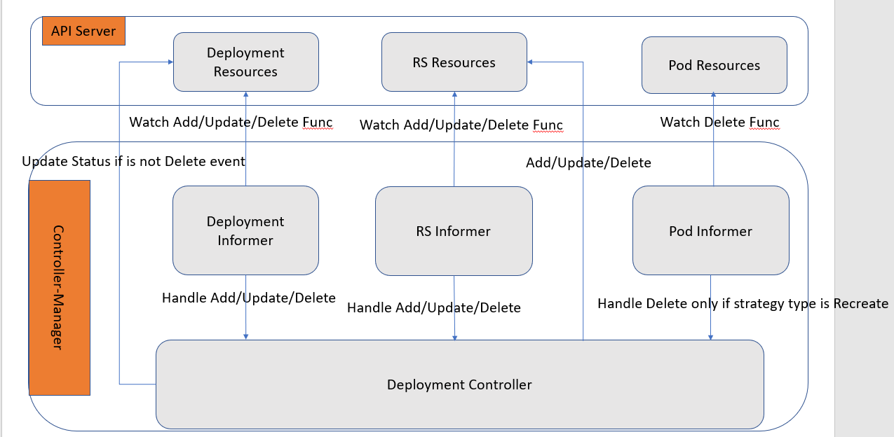

# kube-controller-manager 源码分析（基于 release-1.18 branch)

**NOTE: 由于代码篇幅太多，在分析的过程中会将不重要的部分删除，我将用//.................. 代替了。**

## 函数入口

首先找到 kube-controller-manager 的函数入口：[controller-manager.go](https://github.com/kubernetes/kubernetes/blob/release-1.18/cmd/kube-controller-manager/controller-manager.go)。

``` golang
func main() {
    rand.Seed(time.Now().UnixNano())

    command := app.NewControllerManagerCommand()

    // TODO: once we switch everything over to Cobra commands, we can go back to calling
    // utilflag.InitFlags() (by removing its pflag.Parse() call). For now, we have to set the
    // normalize func and add the go flag set by hand.
    // utilflag.InitFlags()
    logs.InitLogs()
    defer logs.FlushLogs()

    if err := command.Execute(); err != nil {
        os.Exit(1)
    }
}
```

## 控制器是如何被创建的

进入 [NewControllerManagerCommand](https://github.com/kubernetes/kubernetes/blob/release-1.18/cmd/kube-controller-manager/app/controllermanager.go#L92:6) 看下实现细节。

看到用的是 [cobra](https://github.com/spf13/cobra) 的库（一个非常牛的 CLI 的库，在很多项目中都有使用，这里不讲 cobra 具体怎么使用）。这里定义了一个函数赋值给了 cobra.Commnad 的 Run，它将在 main 函数中调用 command.Execute() 后被执行。

```go
// NewControllerManagerCommand creates a *cobra.Command object with default parameters
func NewControllerManagerCommand() *cobra.Command {
   //..................

    cmd := &cobra.Command{
        Use: "kube-controller-manager",
        Long: `The Kubernetes controller manager is a daemon that embeds
the core control loops shipped with Kubernetes. In applications of robotics and
automation, a control loop is a non-terminating loop that regulates the state of
the system. In Kubernetes, a controller is a control loop that watches the shared
state of the cluster through the apiserver and makes changes attempting to move the
current state towards the desired state. Examples of controllers that ship with
Kubernetes today are the replication controller, endpoints controller, namespace
controller, and serviceaccounts controller.`,
        Run: func(cmd *cobra.Command, args []string) {
            verflag.PrintAndExitIfRequested()
            utilflag.PrintFlags(cmd.Flags())

            c, err := s.Config(KnownControllers(), ControllersDisabledByDefault.List())
            if err != nil {
                fmt.Fprintf(os.Stderr, "%v\n", err)
                os.Exit(1)
            }

            if err := Run(c.Complete(), wait.NeverStop); err != nil {
                fmt.Fprintf(os.Stderr, "%v\n", err)
                os.Exit(1)
            }
        },
    }

    //..................

    return cmd
}
```

然后这个函数中调到了真正的 Run 函数，这个函数里面才是进行真正的启动 kube-controller-manager 的逻辑处理。

```go
// Run runs the KubeControllerManagerOptions.  This should never exit.
func Run(c *config.CompletedConfig, stopCh <-chan struct{}) error {
    // To help debugging, immediately log version
    klog.Infof("Version: %+v", version.Get())

    if cfgz, err := configz.New(ConfigzName); err == nil {
        cfgz.Set(c.ComponentConfig)
    } else {
        klog.Errorf("unable to register configz: %v", err)
    }

    // Setup any healthz checks we will want to use.
    var checks []healthz.HealthChecker
    var electionChecker *leaderelection.HealthzAdaptor
    if c.ComponentConfig.Generic.LeaderElection.LeaderElect {
        electionChecker = leaderelection.NewLeaderHealthzAdaptor(time.Second * 20)
        checks = append(checks, electionChecker)
    }

    // Start the controller manager HTTP server
    // unsecuredMux is the handler for these controller *after* authn/authz filters have been applied
    var unsecuredMux *mux.PathRecorderMux
    if c.SecureServing != nil {
        unsecuredMux = genericcontrollermanager.NewBaseHandler(&c.ComponentConfig.Generic.Debugging, checks...)
        handler := genericcontrollermanager.BuildHandlerChain(unsecuredMux, &c.Authorization, &c.Authentication)
        // TODO: handle stoppedCh returned by c.SecureServing.Serve
        if _, err := c.SecureServing.Serve(handler, 0, stopCh); err != nil {
            return err
        }
    }
    if c.InsecureServing != nil {
        unsecuredMux = genericcontrollermanager.NewBaseHandler(&c.ComponentConfig.Generic.Debugging, checks...)
        insecureSuperuserAuthn := server.AuthenticationInfo{Authenticator: &server.InsecureSuperuser{}}
        handler := genericcontrollermanager.BuildHandlerChain(unsecuredMux, nil, &insecureSuperuserAuthn)
        if err := c.InsecureServing.Serve(handler, 0, stopCh); err != nil {
            return err
        }
    }

    run := func(ctx context.Context) {
        // 判断使用哪种 client，simple client or dynamic client
        rootClientBuilder := controller.SimpleControllerClientBuilder{
            ClientConfig: c.Kubeconfig,
        }
        var clientBuilder controller.ControllerClientBuilder
        if c.ComponentConfig.KubeCloudShared.UseServiceAccountCredentials {
            if len(c.ComponentConfig.SAController.ServiceAccountKeyFile) == 0 {
                // It's possible another controller process is creating the tokens for us.
                // If one isn't, we'll timeout and exit when our client builder is unable to create the tokens.
                klog.Warningf("--use-service-account-credentials was specified without providing a --service-account-private-key-file")
            }

            if shouldTurnOnDynamicClient(c.Client) {
                klog.V(1).Infof("using dynamic client builder")
                //Dynamic builder will use TokenRequest feature and refresh service account token periodically
                clientBuilder = controller.NewDynamicClientBuilder(
                    restclient.AnonymousClientConfig(c.Kubeconfig),
                    c.Client.CoreV1(),
                    "kube-system")
            } else {
                klog.V(1).Infof("using legacy client builder")
                clientBuilder = controller.SAControllerClientBuilder{
                    ClientConfig:         restclient.AnonymousClientConfig(c.Kubeconfig),
                    CoreClient:           c.Client.CoreV1(),
                    AuthenticationClient: c.Client.AuthenticationV1(),
                    Namespace:            "kube-system",
                }
            }
        } else {
            clientBuilder = rootClientBuilder
        }
        controllerContext, err := CreateControllerContext(c, rootClientBuilder, clientBuilder, ctx.Done())
        if err != nil {
            klog.Fatalf("error building controller context: %v", err)
        }
        saTokenControllerInitFunc := serviceAccountTokenControllerStarter{rootClientBuilder: rootClientBuilder}.startServiceAccountTokenController

        if err := StartControllers(controllerContext, saTokenControllerInitFunc, NewControllerInitializers(controllerContext.LoopMode), unsecuredMux); err != nil {
            klog.Fatalf("error starting controllers: %v", err)
        }

        // Start informers, 开始接收相应的事件
        controllerContext.InformerFactory.Start(controllerContext.Stop)
        controllerContext.ObjectOrMetadataInformerFactory.Start(controllerContext.Stop)
        close(controllerContext.InformersStarted)

        select {}
    }

    if !c.ComponentConfig.Generic.LeaderElection.LeaderElect {
        run(context.TODO())
        panic("unreachable")
    }

    id, err := os.Hostname()
    if err != nil {
        return err
    }

    // add a uniquifier so that two processes on the same host don't accidentally both become active
    id = id + "_" + string(uuid.NewUUID())

    rl, err := resourcelock.New(c.ComponentConfig.Generic.LeaderElection.ResourceLock,
        c.ComponentConfig.Generic.LeaderElection.ResourceNamespace,
        c.ComponentConfig.Generic.LeaderElection.ResourceName,
        c.LeaderElectionClient.CoreV1(),
        c.LeaderElectionClient.CoordinationV1(),
        resourcelock.ResourceLockConfig{
            Identity:      id,
            EventRecorder: c.EventRecorder,
        })
    if err != nil {
        klog.Fatalf("error creating lock: %v", err)
    }

    leaderelection.RunOrDie(context.TODO(), leaderelection.LeaderElectionConfig{
        Lock:          rl,
        LeaseDuration: c.ComponentConfig.Generic.LeaderElection.LeaseDuration.Duration,
        RenewDeadline: c.ComponentConfig.Generic.LeaderElection.RenewDeadline.Duration,
        RetryPeriod:   c.ComponentConfig.Generic.LeaderElection.RetryPeriod.Duration,
        Callbacks: leaderelection.LeaderCallbacks{
            OnStartedLeading: run,
            OnStoppedLeading: func() {
                klog.Fatalf("leaderelection lost")
            },
        },
        WatchDog: electionChecker,
        Name:     "kube-controller-manager",
    })
    panic("unreachable")
}
```

这里首先重点讲下这里的 leader 选举的机制。这部分是由 client-go 中的 leaderelection 包中实现的选举机制，主要目的是当有多个 kube-controller-manager 运行时，只会选择一个作为 leader，进行处理，其他的实例作为备份，当 leader 挂了或者其他错误，则会在备份的实例中重新选举一个作为 leader 进行处理。这样的实现机制提高了 kube-controller-manager 的高可用性。而这个机制也同样被使用在 kube-scheduler 中。具体的 leader 选举实现，可以参考我的 client-go(TODO: ADD leader election later)。

然后我们再具体看下 StartControllers 和 NewControllerInitializers 函数的实现，就能看出它是如何把多个 controller 调用起来的。

```go
func StartControllers(ctx ControllerContext, startSATokenController InitFunc, controllers map[string]InitFunc, unsecuredMux *mux.PathRecorderMux) error {
    // Always start the SA token controller first using a full-power client, since it needs to mint tokens for the rest
    // If this fails, just return here and fail since other controllers won't be able to get credentials.
    if _, _, err := startSATokenController(ctx); err != nil {
        return err
    }

    // Initialize the cloud provider with a reference to the clientBuilder only after token controller
    // has started in case the cloud provider uses the client builder.
    if ctx.Cloud != nil {
        ctx.Cloud.Initialize(ctx.ClientBuilder, ctx.Stop)
    }

    for controllerName, initFn := range controllers {
        if !ctx.IsControllerEnabled(controllerName) {
            klog.Warningf("%q is disabled", controllerName)
            continue
        }

        time.Sleep(wait.Jitter(ctx.ComponentConfig.Generic.ControllerStartInterval.Duration, ControllerStartJitter))

        klog.V(1).Infof("Starting %q", controllerName)
        // 这里的 initFn 就是 NewControllerInitializers 函数返回的每个 InitFunc，也就是每个资源的 startXXXController 函数。
        debugHandler, started, err := initFn(ctx)
        if err != nil {
            klog.Errorf("Error starting %q", controllerName)
            return err
        }
        if !started {
            klog.Warningf("Skipping %q", controllerName)
            continue
        }
        if debugHandler != nil && unsecuredMux != nil {
            basePath := "/debug/controllers/" + controllerName
            unsecuredMux.UnlistedHandle(basePath, http.StripPrefix(basePath, debugHandler))
            unsecuredMux.UnlistedHandlePrefix(basePath+"/", http.StripPrefix(basePath, debugHandler))
        }
        klog.Infof("Started %q", controllerName)
    }

    return nil
}

// NewControllerInitializers is a public map of named controller groups (you can start more than one in an init func)
// paired to their InitFunc.  This allows for structured downstream composition and subdivision.
func NewControllerInitializers(loopMode ControllerLoopMode) map[string]InitFunc {
    controllers := map[string]InitFunc{}
    controllers["endpoint"] = startEndpointController
    controllers["endpointslice"] = startEndpointSliceController
    controllers["replicationcontroller"] = startReplicationController
    controllers["podgc"] = startPodGCController
    controllers["resourcequota"] = startResourceQuotaController
    controllers["namespace"] = startNamespaceController
    controllers["serviceaccount"] = startServiceAccountController
    controllers["garbagecollector"] = startGarbageCollectorController
    controllers["daemonset"] = startDaemonSetController
    controllers["job"] = startJobController
    controllers["deployment"] = startDeploymentController
    controllers["replicaset"] = startReplicaSetController
    controllers["horizontalpodautoscaling"] = startHPAController
    controllers["disruption"] = startDisruptionController
    controllers["statefulset"] = startStatefulSetController
    controllers["cronjob"] = startCronJobController
    controllers["csrsigning"] = startCSRSigningController
    controllers["csrapproving"] = startCSRApprovingController
    controllers["csrcleaner"] = startCSRCleanerController
    controllers["ttl"] = startTTLController
    controllers["bootstrapsigner"] = startBootstrapSignerController
    controllers["tokencleaner"] = startTokenCleanerController
    controllers["nodeipam"] = startNodeIpamController
    controllers["nodelifecycle"] = startNodeLifecycleController
    if loopMode == IncludeCloudLoops {
        controllers["service"] = startServiceController
        controllers["route"] = startRouteController
        controllers["cloud-node-lifecycle"] = startCloudNodeLifecycleController
        // TODO: volume controller into the IncludeCloudLoops only set.
    }
    controllers["persistentvolume-binder"] = startPersistentVolumeBinderController
    controllers["attachdetach"] = startAttachDetachController
    controllers["persistentvolume-expander"] = startVolumeExpandController
    controllers["clusterrole-aggregation"] = startClusterRoleAggregrationController
    controllers["pvc-protection"] = startPVCProtectionController
    controllers["pv-protection"] = startPVProtectionController
    controllers["ttl-after-finished"] = startTTLAfterFinishedController
    controllers["root-ca-cert-publisher"] = startRootCACertPublisher

    return controllers
}
```

这里首先通过 NewControllerInitializers 函数将所有的 controller 加入到一个 map 中，然后在调用 StartControllers 函数时，一个一个进行启动，但是这里有一个 controller 需要特别的注意，它就是 SATokenController，这个是需要在其他的 controller 启动之前启动的。具体原因，看注释是说，其他的 controller 依赖这个 SATokenController 的结果。

## 以 deployment controller 为例，分析控制器机制

好了，下面再以 deployment 为例，进行深入分析，controller 是如何调用处理的。我们首先进入 [startDeploymentController](https://github.com/kubernetes/kubernetes/blob/release-1.18/cmd/kube-controller-manager/app/apps.go#L82:6) 看下这个函数具体实现。

```go
func startDeploymentController(ctx ControllerContext) (http.Handler, bool, error) {
    if !ctx.AvailableResources[schema.GroupVersionResource{Group: "apps", Version: "v1", Resource: "deployments"}] {
        return nil, false, nil
    }
    dc, err := deployment.NewDeploymentController(
        ctx.InformerFactory.Apps().V1().Deployments(),
        ctx.InformerFactory.Apps().V1().ReplicaSets(),
        ctx.InformerFactory.Core().V1().Pods(),
        ctx.ClientBuilder.ClientOrDie("deployment-controller"),
    )
    if err != nil {
        return nil, true, fmt.Errorf("error creating Deployment controller: %v", err)
    }
    go dc.Run(int(ctx.ComponentConfig.DeploymentController.ConcurrentDeploymentSyncs), ctx.Stop)
    return nil, true, nil
}
```

大家肯定知道，当我们手动创建一个 deployment 资源，它将会自己创建一个对应的 replicaset 和对应期待个数的 pod。所以 deployment 的 controller 同时要实现对 deployment，replicaset 和 pod 的资源的处理。从上面的 NewDeploymentController 函数中，也确实能看到这点。

具体的处理流程可以参考下图：


我们下面再来看看 [NewDeploymentController](https://github.com/kubernetes/kubernetes/blob/release-1.18/pkg/controller/deployment/deployment_controller.go#L101:6)，看看它的具体实现！

其实到了这里，如果大家有研究过 k8s 提供的 client-go（大家可以参考这个官方例子 [workqueue](https://github.com/kubernetes/client-go/blob/master/examples/workqueue/main.go)) 的话，就很容易看懂每个具体的 controller 了，因为它们都是按照同样的框架写的。具体 client-go 的实现逻辑可以参考 [client-go](client-go.md)。

```go
// NewDeploymentController creates a new DeploymentController.
func NewDeploymentController(dInformer appsinformers.DeploymentInformer, rsInformer appsinformers.ReplicaSetInformer, podInformer coreinformers.PodInformer, client clientset.Interface) (*DeploymentController, error) {
    eventBroadcaster := record.NewBroadcaster()
    eventBroadcaster.StartLogging(klog.Infof)
    eventBroadcaster.StartRecordingToSink(&v1core.EventSinkImpl{Interface: client.CoreV1().Events("")})

    if client != nil && client.CoreV1().RESTClient().GetRateLimiter() != nil {
        if err := ratelimiter.RegisterMetricAndTrackRateLimiterUsage("deployment_controller", client.CoreV1().RESTClient().GetRateLimiter()); err != nil {
            return nil, err
        }
    }
    dc := &DeploymentController{
        client:        client,
        eventRecorder: eventBroadcaster.NewRecorder(scheme.Scheme, v1.EventSource{Component: "deployment-controller"}),
        queue:         workqueue.NewNamedRateLimitingQueue(workqueue.DefaultControllerRateLimiter(), "deployment"),
    }
    dc.rsControl = controller.RealRSControl{
        KubeClient: client,
        Recorder:   dc.eventRecorder,
    }

    dInformer.Informer().AddEventHandler(cache.ResourceEventHandlerFuncs{
        AddFunc:    dc.addDeployment,
        UpdateFunc: dc.updateDeployment,
        // This will enter the sync loop and no-op, because the deployment has been deleted from the store.
        DeleteFunc: dc.deleteDeployment,
    })
    rsInformer.Informer().AddEventHandler(cache.ResourceEventHandlerFuncs{
        AddFunc:    dc.addReplicaSet,
        UpdateFunc: dc.updateReplicaSet,
        DeleteFunc: dc.deleteReplicaSet,
    })
    podInformer.Informer().AddEventHandler(cache.ResourceEventHandlerFuncs{
        DeleteFunc: dc.deletePod,
    })

    dc.syncHandler = dc.syncDeployment
    dc.enqueueDeployment = dc.enqueue
    return dc, nil
}
```

这里就是通过自定义资源的 Add,Update,Delete 的事件处理逻辑，就能实现当资源产生这些相应的事件时，相应的 handler 函数就会被执行。但是由于这里实现了 workqueue 的机制，你将会发现，这里的 handler 都是往一个 queue 里面装数据，然后真正从 queue 里面取出事件，并执行的是 syncHandler 这个接口，在上面函数里，可以看到，它其实指向了 dc.syncDeployment 这个函数，也就是说，最后真正执行逻辑处理的是这个函数。

所以具体的处理逻辑在这个 [syncDeployment](https://github.com/kubernetes/kubernetes/blob/release-1.18/pkg/controller/deployment/deployment_controller.go#L563:33) 函数中。

```go
func (dc *DeploymentController) syncDeployment(key string) error {
    startTime := time.Now()
    klog.V(4).Infof("Started syncing deployment %q (%v)", key, startTime)
    defer func() {
        klog.V(4).Infof("Finished syncing deployment %q (%v)", key, time.Since(startTime))
    }()

    namespace, name, err := cache.SplitMetaNamespaceKey(key)
    if err != nil {
        return err
    }
    // 获取指定 namespace 和 name 的 deployment
    deployment, err := dc.dLister.Deployments(namespace).Get(name)
    if errors.IsNotFound(err) {
        klog.V(2).Infof("Deployment %v has been deleted", key)
        return nil
    }
    if err != nil {
        return err
    }

    // Deep-copy otherwise we are mutating our cache.
    // TODO: Deep-copy only when needed.
    d := deployment.DeepCopy()

    everything := metav1.LabelSelector{}
    if reflect.DeepEqual(d.Spec.Selector, &everything) {
        dc.eventRecorder.Eventf(d, v1.EventTypeWarning, "SelectingAll", "This deployment is selecting all pods. A non-empty selector is required.")
        if d.Status.ObservedGeneration < d.Generation {
            d.Status.ObservedGeneration = d.Generation
            dc.client.AppsV1().Deployments(d.Namespace).UpdateStatus(context.TODO(), d, metav1.UpdateOptions{})
        }
        return nil
    }

    // 获取这个 deployment 下的 replicaset
    rsList, err := dc.getReplicaSetsForDeployment(d)
    if err != nil {
        return err
    }
    // 列出 deployment 下 replicaset 产生的 pod
    podMap, err := dc.getPodMapForDeployment(d, rsList)
    if err != nil {
        return err
    }

    // 如果是删除中，只是同步状态
    if d.DeletionTimestamp != nil {
        return dc.syncStatusOnly(d, rsList)
    }

    // Update deployment conditions with an Unknown condition when pausing/resuming
    // a deployment. In this way, we can be sure that we won't timeout when a user
    // resumes a Deployment with a set progressDeadlineSeconds.
    if err = dc.checkPausedConditions(d); err != nil {
        return err
    }

    //如果 deployment 是 Paused 状态，则调用 sync 同步
    if d.Spec.Paused {
        return dc.sync(d, rsList)
    }

    // rollback is not re-entrant in case the underlying replica sets are updated with a new
    // revision so we should ensure that we won't proceed to update replica sets until we
    // make sure that the deployment has cleaned up its rollback spec in subsequent enqueues.
    if getRollbackTo(d) != nil {
        return dc.rollback(d, rsList)
    }

    // check 这里是不是需要 scaling 操作
    scalingEvent, err := dc.isScalingEvent(d, rsList)
    if err != nil {
        return err
    }
    if scalingEvent {
        // 进行同步更新操作
        return dc.sync(d, rsList)
    }

    switch d.Spec.Strategy.Type {
    case apps.RecreateDeploymentStrategyType:
        return dc.rolloutRecreate(d, rsList, podMap)
    case apps.RollingUpdateDeploymentStrategyType:
        return dc.rolloutRolling(d, rsList)
    }
    return fmt.Errorf("unexpected deployment strategy type: %s", d.Spec.Strategy.Type)
}
```

上面这个函数中，实现了当发生 deployment controller 监听的事件时，进行相应的处理。大致的意思可以理解为，当 deployment 处于删除状态时，调用 syncStatusOnly 更新状态即可；当 d.Spec.Paused 为 true 的时候，调用
dc.sync(d, rsList) 去更新；当 roll back 操作时，则调用 dc.rollback(d, rsList) 去处理；当 scale 的时候，调用 dc.sync(d, rsList) 去处理；最后就是修改 deployment 或者其他监听事件发生的时候（例如修改 deployment 中 image 的 tag)，则首先判断 d.Spec.Strategy.Type 是什么类型，如果是 Recreate 时，则调用 dc.rolloutRecreate(d, rsList, podMap) 去处理，如果是 RollingUpdata 则调用 dc.rolloutRolling(d, rsList) 进行处理，如果两种都不是，则返回错误。具体各种操作请参考 [controller deployment](https://kubernetes.io/docs/concepts/workloads/controllers/deployment/)。

下面将分析分析各种处理函数：

### syncStatusOnly 处理

首先我们分析更新状态函数，这里是最简单的处理函数，因为这个函数只是去更新下 deployment 的状态。下面看下函数具体实现：

```go
// syncStatusOnly only updates Deployments Status and doesn't take any mutating actions.
func (dc *DeploymentController) syncStatusOnly(d *apps.Deployment, rsList []*apps.ReplicaSet) error {
    newRS, oldRSs, err := dc.getAllReplicaSetsAndSyncRevision(d, rsList, false)
    if err != nil {
        return err
    }

    allRSs := append(oldRSs, newRS)
    return dc.syncDeploymentStatus(allRSs, newRS, d)
}
```

这里要首先分析下 getAllReplicaSetsAndSyncRevision 这个函数，因为这个函数后面都在使用。

```go
func (dc *DeploymentController) getAllReplicaSetsAndSyncRevision(d *apps.Deployment, rsList []*apps.ReplicaSet, createIfNotExisted bool) (*apps.ReplicaSet, []*apps.ReplicaSet, error) {
    _, allOldRSs := deploymentutil.FindOldReplicaSets(d, rsList)

    // Get new replica set with the updated revision number
    newRS, err := dc.getNewReplicaSet(d, rsList, allOldRSs, createIfNotExisted)
    if err != nil {
        return nil, nil, err
    }

    return newRS, allOldRSs, nil
}
```

首先我们来看看一个特殊的参数 createIfNotExisted， 这个参数决定了调用这个函数的时候会不会去创建一个新的 RS， 如果这个值是 false，则不会去创建，否则，没有就会去创建一个新的 RS。

这里的 getAllReplicaSetsAndSyncRevision 是简单的封装了下 getNewReplicaSet 函数，所以具体的实现，我们来看看 getNewReplicaSet 这个函数：

```go
// Returns a replica set that matches the intent of the given deployment. Returns nil if the new replica set doesn't exist yet.
// 1. Get existing new RS (the RS that the given deployment targets, whose pod template is the same as deployment's).
// 2. If there's existing new RS, update its revision number if it's smaller than (maxOldRevision + 1), where maxOldRevision is the max revision number among all old RSes.
// 3. If there's no existing new RS and createIfNotExisted is true, create one with appropriate revision number (maxOldRevision + 1) and replicas.
// Note that the pod-template-hash will be added to adopted RSes and pods.
func (dc *DeploymentController) getNewReplicaSet(d *apps.Deployment, rsList, oldRSs []*apps.ReplicaSet, createIfNotExisted bool) (*apps.ReplicaSet, error) {
    existingNewRS := deploymentutil.FindNewReplicaSet(d, rsList)

    // Calculate the max revision number among all old RSes
    maxOldRevision := deploymentutil.MaxRevision(oldRSs)
    // Calculate revision number for this new replica set
    newRevision := strconv.FormatInt(maxOldRevision+1, 10)

    // Latest replica set exists. We need to sync its annotations (includes copying all but
    // annotationsToSkip from the parent deployment, and update revision, desiredReplicas,
    // and maxReplicas) and also update the revision annotation in the deployment with the
    // latest revision.
    if existingNewRS != nil {
        rsCopy := existingNewRS.DeepCopy()

        // Set existing new replica set's annotation
        annotationsUpdated := deploymentutil.SetNewReplicaSetAnnotations(d, rsCopy, newRevision, true, maxRevHistoryLengthInChars)
        minReadySecondsNeedsUpdate := rsCopy.Spec.MinReadySeconds != d.Spec.MinReadySeconds
        if annotationsUpdated || minReadySecondsNeedsUpdate {
            rsCopy.Spec.MinReadySeconds = d.Spec.MinReadySeconds
            return dc.client.AppsV1().ReplicaSets(rsCopy.ObjectMeta.Namespace).Update(context.TODO(), rsCopy, metav1.UpdateOptions{})
        }

        // Should use the revision in existingNewRS's annotation, since it set by before
        needsUpdate := deploymentutil.SetDeploymentRevision(d, rsCopy.Annotations[deploymentutil.RevisionAnnotation])
        // If no other Progressing condition has been recorded and we need to estimate the progress
        // of this deployment then it is likely that old users started caring about progress. In that
        // case we need to take into account the first time we noticed their new replica set.
        cond := deploymentutil.GetDeploymentCondition(d.Status, apps.DeploymentProgressing)
        if deploymentutil.HasProgressDeadline(d) && cond == nil {
            msg := fmt.Sprintf("Found new replica set %q", rsCopy.Name)
            condition := deploymentutil.NewDeploymentCondition(apps.DeploymentProgressing, v1.ConditionTrue, deploymentutil.FoundNewRSReason, msg)
            deploymentutil.SetDeploymentCondition(&d.Status, *condition)
            needsUpdate = true
        }

        if needsUpdate {
            var err error
            if d, err = dc.client.AppsV1().Deployments(d.Namespace).UpdateStatus(context.TODO(), d, metav1.UpdateOptions{}); err != nil {
                return nil, err
            }
        }
        return rsCopy, nil
    }

    if !createIfNotExisted {
        return nil, nil
    }

    // new ReplicaSet does not exist, create one.
    newRSTemplate := *d.Spec.Template.DeepCopy()
    podTemplateSpecHash := controller.ComputeHash(&newRSTemplate, d.Status.CollisionCount)
    newRSTemplate.Labels = labelsutil.CloneAndAddLabel(d.Spec.Template.Labels, apps.DefaultDeploymentUniqueLabelKey, podTemplateSpecHash)
    // Add podTemplateHash label to selector.
    newRSSelector := labelsutil.CloneSelectorAndAddLabel(d.Spec.Selector, apps.DefaultDeploymentUniqueLabelKey, podTemplateSpecHash)

    // Create new ReplicaSet
    newRS := apps.ReplicaSet{
        ObjectMeta: metav1.ObjectMeta{
            // Make the name deterministic, to ensure idempotence
            Name:            d.Name + "-" + podTemplateSpecHash,
            Namespace:       d.Namespace,
            OwnerReferences: []metav1.OwnerReference{*metav1.NewControllerRef(d, controllerKind)},
            Labels:          newRSTemplate.Labels,
        },
        Spec: apps.ReplicaSetSpec{
            Replicas:        new(int32),
            MinReadySeconds: d.Spec.MinReadySeconds,
            Selector:        newRSSelector,
            Template:        newRSTemplate,
        },
    }
    allRSs := append(oldRSs, &newRS)
    newReplicasCount, err := deploymentutil.NewRSNewReplicas(d, allRSs, &newRS)
    if err != nil {
        return nil, err
    }

    *(newRS.Spec.Replicas) = newReplicasCount
    // Set new replica set's annotation
    deploymentutil.SetNewReplicaSetAnnotations(d, &newRS, newRevision, false, maxRevHistoryLengthInChars)
    // Create the new ReplicaSet. If it already exists, then we need to check for possible
    // hash collisions. If there is any other error, we need to report it in the status of
    // the Deployment.
    alreadyExists := false
    createdRS, err := dc.client.AppsV1().ReplicaSets(d.Namespace).Create(context.TODO(), &newRS, metav1.CreateOptions{})
    switch {
    // We may end up hitting this due to a slow cache or a fast resync of the Deployment.
    case errors.IsAlreadyExists(err):
        alreadyExists = true

        // Fetch a copy of the ReplicaSet.
        rs, rsErr := dc.rsLister.ReplicaSets(newRS.Namespace).Get(newRS.Name)
        if rsErr != nil {
            return nil, rsErr
        }

        // If the Deployment owns the ReplicaSet and the ReplicaSet's PodTemplateSpec is semantically
        // deep equal to the PodTemplateSpec of the Deployment, it's the Deployment's new ReplicaSet.
        // Otherwise, this is a hash collision and we need to increment the collisionCount field in
        // the status of the Deployment and requeue to try the creation in the next sync.
        controllerRef := metav1.GetControllerOf(rs)
        if controllerRef != nil && controllerRef.UID == d.UID && deploymentutil.EqualIgnoreHash(&d.Spec.Template, &rs.Spec.Template) {
            createdRS = rs
            err = nil
            break
        }

        // Matching ReplicaSet is not equal - increment the collisionCount in the DeploymentStatus
        // and requeue the Deployment.
        if d.Status.CollisionCount == nil {
            d.Status.CollisionCount = new(int32)
        }
        preCollisionCount := *d.Status.CollisionCount
        *d.Status.CollisionCount++
        // Update the collisionCount for the Deployment and let it requeue by returning the original
        // error.
        _, dErr := dc.client.AppsV1().Deployments(d.Namespace).UpdateStatus(context.TODO(), d, metav1.UpdateOptions{})
        if dErr == nil {
            klog.V(2).Infof("Found a hash collision for deployment %q - bumping collisionCount (%d->%d) to resolve it", d.Name, preCollisionCount, *d.Status.CollisionCount)
        }
        return nil, err
    case errors.HasStatusCause(err, v1.NamespaceTerminatingCause):
        // if the namespace is terminating, all subsequent creates will fail and we can safely do nothing
        return nil, err
    case err != nil:
        msg := fmt.Sprintf("Failed to create new replica set %q: %v", newRS.Name, err)
        if deploymentutil.HasProgressDeadline(d) {
            cond := deploymentutil.NewDeploymentCondition(apps.DeploymentProgressing, v1.ConditionFalse, deploymentutil.FailedRSCreateReason, msg)
            deploymentutil.SetDeploymentCondition(&d.Status, *cond)
            // We don't really care about this error at this point, since we have a bigger issue to report.
            // TODO: Identify which errors are permanent and switch DeploymentIsFailed to take into account
            // these reasons as well. Related issue: https://github.com/kubernetes/kubernetes/issues/18568
            _, _ = dc.client.AppsV1().Deployments(d.Namespace).UpdateStatus(context.TODO(), d, metav1.UpdateOptions{})
        }
        dc.eventRecorder.Eventf(d, v1.EventTypeWarning, deploymentutil.FailedRSCreateReason, msg)
        return nil, err
    }
    if !alreadyExists && newReplicasCount > 0 {
        dc.eventRecorder.Eventf(d, v1.EventTypeNormal, "ScalingReplicaSet", "Scaled up replica set %s to %d", createdRS.Name, newReplicasCount)
    }

    needsUpdate := deploymentutil.SetDeploymentRevision(d, newRevision)
    if !alreadyExists && deploymentutil.HasProgressDeadline(d) {
        msg := fmt.Sprintf("Created new replica set %q", createdRS.Name)
        condition := deploymentutil.NewDeploymentCondition(apps.DeploymentProgressing, v1.ConditionTrue, deploymentutil.NewReplicaSetReason, msg)
        deploymentutil.SetDeploymentCondition(&d.Status, *condition)
        needsUpdate = true
    }
    if needsUpdate {
        _, err = dc.client.AppsV1().Deployments(d.Namespace).UpdateStatus(context.TODO(), d, metav1.UpdateOptions{})
    }
    return createdRS, err
}
```

我们下面来看看它具体实现了什么功能。

1. 首先获取下新的 RS 是不是存在，然后算一下新的 Revision 是多少
2. 如果新的 RS 存在时，如果 deployment 的信息与新的 RS 的信息不一致，则更新新的 RS 的信息。否则判断是否需要更新 deployment，如果需要则更新。
3. 判断传入的参数 createIfNotExisted，如果 false，则退出，否则继续处理。
4. 创建新的 RS，判断是否需要更新 deployment，如果需要则更新。

我们再来看看 syncDeploymentStatus 函数：

```go
// syncDeploymentStatus checks if the status is up-to-date and sync it if necessary
func (dc *DeploymentController) syncDeploymentStatus(allRSs []*apps.ReplicaSet, newRS *apps.ReplicaSet, d *apps.Deployment) error {
    newStatus := calculateStatus(allRSs, newRS, d)

    if reflect.DeepEqual(d.Status, newStatus) {
        return nil
    }

    newDeployment := d
    newDeployment.Status = newStatus
    _, err := dc.client.AppsV1().Deployments(newDeployment.Namespace).UpdateStatus(context.TODO(), newDeployment, metav1.UpdateOptions{})
    return err
}
```

这个函数首先计算下新的状态，然后再调用 UpdateStatus 函数去更新 deployment 的状态。

那我们再来看看 calculateStatus 函数：

```go
// calculateStatus calculates the latest status for the provided deployment by looking into the provided replica sets.
func calculateStatus(allRSs []*apps.ReplicaSet, newRS *apps.ReplicaSet, deployment *apps.Deployment) apps.DeploymentStatus {
    availableReplicas := deploymentutil.GetAvailableReplicaCountForReplicaSets(allRSs)
    totalReplicas := deploymentutil.GetReplicaCountForReplicaSets(allRSs)
    unavailableReplicas := totalReplicas - availableReplicas
    // If unavailableReplicas is negative, then that means the Deployment has more available replicas running than
    // desired, e.g. whenever it scales down. In such a case we should simply default unavailableReplicas to zero.
    if unavailableReplicas < 0 {
        unavailableReplicas = 0
    }

    status := apps.DeploymentStatus{
        // TODO: Ensure that if we start retrying status updates, we won't pick up a new Generation value.
        ObservedGeneration:  deployment.Generation,
        Replicas:            deploymentutil.GetActualReplicaCountForReplicaSets(allRSs),
        UpdatedReplicas:     deploymentutil.GetActualReplicaCountForReplicaSets([]*apps.ReplicaSet{newRS}),
        ReadyReplicas:       deploymentutil.GetReadyReplicaCountForReplicaSets(allRSs),
        AvailableReplicas:   availableReplicas,
        UnavailableReplicas: unavailableReplicas,
        CollisionCount:      deployment.Status.CollisionCount,
    }

    // Copy conditions one by one so we won't mutate the original object.
    conditions := deployment.Status.Conditions
    for i := range conditions {
        status.Conditions = append(status.Conditions, conditions[i])
    }

    if availableReplicas >= *(deployment.Spec.Replicas)-deploymentutil.MaxUnavailable(*deployment) {
        minAvailability := deploymentutil.NewDeploymentCondition(apps.DeploymentAvailable, v1.ConditionTrue, deploymentutil.MinimumReplicasAvailable, "Deployment has minimum availability.")
        deploymentutil.SetDeploymentCondition(&status, *minAvailability)
    } else {
        noMinAvailability := deploymentutil.NewDeploymentCondition(apps.DeploymentAvailable, v1.ConditionFalse, deploymentutil.MinimumReplicasUnavailable, "Deployment does not have minimum availability.")
        deploymentutil.SetDeploymentCondition(&status, *noMinAvailability)
    }

    return status
}
```

看来这个函数就是更新下 deployment status 字段的一下值。

好了， 到这里，这个 syncStatusOnly 的函数处理就分析完了，总结下它主要是做了：首先判断是否有新的 RS，如果有则更新下状态然后再去更新 deployment 的状态，否则就直接去更新 deployment 的状态。

### sync 处理

我们再来看看 sync 函数，当 deployment 的 spec 的 Paused 字段是 true 的时候，或者是 scaling 事件的时候，都会调用这个函数处理。

```go
// sync is responsible for reconciling deployments on scaling events or when they
// are paused.
func (dc *DeploymentController) sync(d *apps.Deployment, rsList []*apps.ReplicaSet) error {
    newRS, oldRSs, err := dc.getAllReplicaSetsAndSyncRevision(d, rsList, false)
    if err != nil {
        return err
    }
    if err := dc.scale(d, newRS, oldRSs); err != nil {
        // If we get an error while trying to scale, the deployment will be requeued
        // so we can abort this resync
        return err
    }

    // Clean up the deployment when it's paused and no rollback is in flight.
    if d.Spec.Paused && getRollbackTo(d) == nil {
        if err := dc.cleanupDeployment(oldRSs, d); err != nil {
            return err
        }
    }

    allRSs := append(oldRSs, newRS)
    return dc.syncDeploymentStatus(allRSs, newRS, d)
}
```

这里看到这个函数里面和刚刚 syncStatusOnly 的有点类似，只是在中间加了 scale 的处理，和可能会做下 cleanup deployment 的处理。
下面我们分别来看看这两个函数。

首先看看 scale 函数：

```go
// scale scales proportionally in order to mitigate risk. Otherwise, scaling up can increase the size
// of the new replica set and scaling down can decrease the sizes of the old ones, both of which would
// have the effect of hastening the rollout progress, which could produce a higher proportion of unavailable
// replicas in the event of a problem with the rolled out template. Should run only on scaling events or
// when a deployment is paused and not during the normal rollout process.
func (dc *DeploymentController) scale(deployment *apps.Deployment, newRS *apps.ReplicaSet, oldRSs []*apps.ReplicaSet) error {
    // If there is only one active replica set then we should scale that up to the full count of the
    // deployment. If there is no active replica set, then we should scale up the newest replica set.
    if activeOrLatest := deploymentutil.FindActiveOrLatest(newRS, oldRSs); activeOrLatest != nil {
        if *(activeOrLatest.Spec.Replicas) == *(deployment.Spec.Replicas) {
            return nil
        }
        _, _, err := dc.scaleReplicaSetAndRecordEvent(activeOrLatest, *(deployment.Spec.Replicas), deployment)
        return err
    }

    // If the new replica set is saturated, old replica sets should be fully scaled down.
    // This case handles replica set adoption during a saturated new replica set.
    if deploymentutil.IsSaturated(deployment, newRS) {
        for _, old := range controller.FilterActiveReplicaSets(oldRSs) {
            if _, _, err := dc.scaleReplicaSetAndRecordEvent(old, 0, deployment); err != nil {
                return err
            }
        }
        return nil
    }

    // There are old replica sets with pods and the new replica set is not saturated.
    // We need to proportionally scale all replica sets (new and old) in case of a
    // rolling deployment.
    if deploymentutil.IsRollingUpdate(deployment) {
        allRSs := controller.FilterActiveReplicaSets(append(oldRSs, newRS))
        allRSsReplicas := deploymentutil.GetReplicaCountForReplicaSets(allRSs)

        allowedSize := int32(0)
        if *(deployment.Spec.Replicas) > 0 {
            allowedSize = *(deployment.Spec.Replicas) + deploymentutil.MaxSurge(*deployment)
        }

        // Number of additional replicas that can be either added or removed from the total
        // replicas count. These replicas should be distributed proportionally to the active
        // replica sets.
        deploymentReplicasToAdd := allowedSize - allRSsReplicas

        // The additional replicas should be distributed proportionally amongst the active
        // replica sets from the larger to the smaller in size replica set. Scaling direction
        // drives what happens in case we are trying to scale replica sets of the same size.
        // In such a case when scaling up, we should scale up newer replica sets first, and
        // when scaling down, we should scale down older replica sets first.
        var scalingOperation string
        switch {
        case deploymentReplicasToAdd > 0:
            sort.Sort(controller.ReplicaSetsBySizeNewer(allRSs))
            scalingOperation = "up"

        case deploymentReplicasToAdd < 0:
            sort.Sort(controller.ReplicaSetsBySizeOlder(allRSs))
            scalingOperation = "down"
        }

        // Iterate over all active replica sets and estimate proportions for each of them.
        // The absolute value of deploymentReplicasAdded should never exceed the absolute
        // value of deploymentReplicasToAdd.
        deploymentReplicasAdded := int32(0)
        nameToSize := make(map[string]int32)
        for i := range allRSs {
            rs := allRSs[i]

            // Estimate proportions if we have replicas to add, otherwise simply populate
            // nameToSize with the current sizes for each replica set.
            if deploymentReplicasToAdd != 0 {
                proportion := deploymentutil.GetProportion(rs, *deployment, deploymentReplicasToAdd, deploymentReplicasAdded)

                nameToSize[rs.Name] = *(rs.Spec.Replicas) + proportion
                deploymentReplicasAdded += proportion
            } else {
                nameToSize[rs.Name] = *(rs.Spec.Replicas)
            }
        }

        // Update all replica sets
        for i := range allRSs {
            rs := allRSs[i]

            // Add/remove any leftovers to the largest replica set.
            if i == 0 && deploymentReplicasToAdd != 0 {
                leftover := deploymentReplicasToAdd - deploymentReplicasAdded
                nameToSize[rs.Name] = nameToSize[rs.Name] + leftover
                if nameToSize[rs.Name] < 0 {
                    nameToSize[rs.Name] = 0
                }
            }

            // TODO: Use transactions when we have them.
            if _, _, err := dc.scaleReplicaSet(rs, nameToSize[rs.Name], deployment, scalingOperation); err != nil {
                // Return as soon as we fail, the deployment is requeued
                return err
            }
        }
    }
    return nil
}
```

1. 首先查找是否有 active 或者最新的一个，如果找到了，且 replicas 和 deployment 的值不一致，则用 deployment 的 replicas 值更新 RS 的值。
2. 否则，看看它是不是已经饱和了，如果饱和了，则将老的 RS 的 replicas 的值更新为 0 了。
3. 如果 d.Spec.Strategy.Type 是 RollingUpdate，则需要做 update 相关的处理。

最后是 清除 deployment 处理。这里调用这个函数是有前提条件的：1) Spec.Paused 是 true，2) 不是 rollback 操作。

然后就是调用 cleanupDeployment 函数根据 RevisionHistoryLimit 的配置值去选择是否删除或者删除多少个老的 RS。

### rollback 处理

这里我们再看看 rollback 这个函数。

```go
// rollback the deployment to the specified revision. In any case cleanup the rollback spec.
func (dc *DeploymentController) rollback(d *apps.Deployment, rsList []*apps.ReplicaSet) error {
    newRS, allOldRSs, err := dc.getAllReplicaSetsAndSyncRevision(d, rsList, true)
    if err != nil {
        return err
    }

    allRSs := append(allOldRSs, newRS)
    rollbackTo := getRollbackTo(d)
    // If rollback revision is 0, rollback to the last revision
    if rollbackTo.Revision == 0 {
        if rollbackTo.Revision = deploymentutil.LastRevision(allRSs); rollbackTo.Revision == 0 {
            // If we still can't find the last revision, gives up rollback
            dc.emitRollbackWarningEvent(d, deploymentutil.RollbackRevisionNotFound, "Unable to find last revision.")
            // Gives up rollback
            return dc.updateDeploymentAndClearRollbackTo(d)
        }
    }
    for _, rs := range allRSs {
        v, err := deploymentutil.Revision(rs)
        if err != nil {
            klog.V(4).Infof("Unable to extract revision from deployment's replica set %q: %v", rs.Name, err)
            continue
        }
        if v == rollbackTo.Revision {
            klog.V(4).Infof("Found replica set %q with desired revision %d", rs.Name, v)
            // rollback by copying podTemplate.Spec from the replica set
            // revision number will be incremented during the next getAllReplicaSetsAndSyncRevision call
            // no-op if the spec matches current deployment's podTemplate.Spec
            performedRollback, err := dc.rollbackToTemplate(d, rs)
            if performedRollback && err == nil {
                dc.emitRollbackNormalEvent(d, fmt.Sprintf("Rolled back deployment %q to revision %d", d.Name, rollbackTo.Revision))
            }
            return err
        }
    }
    dc.emitRollbackWarningEvent(d, deploymentutil.RollbackRevisionNotFound, "Unable to find the revision to rollback to.")
    // Gives up rollback
    return dc.updateDeploymentAndClearRollbackTo(d)
}
```

首先我们要注意的是 getAllReplicaSetsAndSyncRevision 这个函数的 createIfNotExisted 参数是 true，也就是说，当没有的时候，会创建一个新的 RS。

这里下面主要有两个逻辑：

1. 当 rollback 的 revision 是 0 的时候，找一个最新的，如果还是找不到，则返回 not found。
2. 其他情况就是从所有 RS 的 revision 中找对应的想要 rollback 回去的 revision，如果匹配上了，则执行 rollback 到找到的版本上，否则 not found。

下面我们看看真正执行 rollback 的函数：

```go
// rollbackToTemplate compares the templates of the provided deployment and replica set and
// updates the deployment with the replica set template in case they are different. It also
// cleans up the rollback spec so subsequent requeues of the deployment won't end up in here.
func (dc *DeploymentController) rollbackToTemplate(d *apps.Deployment, rs *apps.ReplicaSet) (bool, error) {
    performedRollback := false
    if !deploymentutil.EqualIgnoreHash(&d.Spec.Template, &rs.Spec.Template) {
        klog.V(4).Infof("Rolling back deployment %q to template spec %+v", d.Name, rs.Spec.Template.Spec)
        deploymentutil.SetFromReplicaSetTemplate(d, rs.Spec.Template)
        // set RS (the old RS we'll rolling back to) annotations back to the deployment;
        // otherwise, the deployment's current annotations (should be the same as current new RS) will be copied to the RS after the rollback.
        //
        // For example,
        // A Deployment has old RS1 with annotation {change-cause:create}, and new RS2 {change-cause:edit}.
        // Note that both annotations are copied from Deployment, and the Deployment should be annotated {change-cause:edit} as well.
        // Now, rollback Deployment to RS1, we should update Deployment's pod-template and also copy annotation from RS1.
        // Deployment is now annotated {change-cause:create}, and we have new RS1 {change-cause:create}, old RS2 {change-cause:edit}.
        //
        // If we don't copy the annotations back from RS to deployment on rollback, the Deployment will stay as {change-cause:edit},
        // and new RS1 becomes {change-cause:edit} (copied from deployment after rollback), old RS2 {change-cause:edit}, which is not correct.
        deploymentutil.SetDeploymentAnnotationsTo(d, rs)
        performedRollback = true
    } else {
        klog.V(4).Infof("Rolling back to a revision that contains the same template as current deployment %q, skipping rollback...", d.Name)
        eventMsg := fmt.Sprintf("The rollback revision contains the same template as current deployment %q", d.Name)
        dc.emitRollbackWarningEvent(d, deploymentutil.RollbackTemplateUnchanged, eventMsg)
    }

    return performedRollback, dc.updateDeploymentAndClearRollbackTo(d)
}

// updateDeploymentAndClearRollbackTo sets .spec.rollbackTo to nil and update the input deployment
// It is assumed that the caller will have updated the deployment template appropriately (in case
// we want to rollback).
func (dc *DeploymentController) updateDeploymentAndClearRollbackTo(d *apps.Deployment) error {
    klog.V(4).Infof("Cleans up rollbackTo of deployment %q", d.Name)
    setRollbackTo(d, nil)
    _, err := dc.client.AppsV1().Deployments(d.Namespace).Update(context.TODO(), d, metav1.UpdateOptions{})
    return err
}
```

### rolloutRecreate 处理

下面我们来看看 rolloutRecreate 函数

```go
// rolloutRecreate implements the logic for recreating a replica set.
func (dc *DeploymentController) rolloutRecreate(d *apps.Deployment, rsList []*apps.ReplicaSet, podMap map[types.UID][]*v1.Pod) error {
    // Don't create a new RS if not already existed, so that we avoid scaling up before scaling down.
    newRS, oldRSs, err := dc.getAllReplicaSetsAndSyncRevision(d, rsList, false)
    if err != nil {
        return err
    }
    allRSs := append(oldRSs, newRS)
    activeOldRSs := controller.FilterActiveReplicaSets(oldRSs)

    // scale down old replica sets.
    scaledDown, err := dc.scaleDownOldReplicaSetsForRecreate(activeOldRSs, d)
    if err != nil {
        return err
    }
    if scaledDown {
        // Update DeploymentStatus.
        return dc.syncRolloutStatus(allRSs, newRS, d)
    }

    // Do not process a deployment when it has old pods running.
    if oldPodsRunning(newRS, oldRSs, podMap) {
        return dc.syncRolloutStatus(allRSs, newRS, d)
    }

    // If we need to create a new RS, create it now.
    if newRS == nil {
        newRS, oldRSs, err = dc.getAllReplicaSetsAndSyncRevision(d, rsList, true)
        if err != nil {
            return err
        }
        allRSs = append(oldRSs, newRS)
    }

    // scale up new replica set.
    if _, err := dc.scaleUpNewReplicaSetForRecreate(newRS, d); err != nil {
        return err
    }

    if util.DeploymentComplete(d, &d.Status) {
        if err := dc.cleanupDeployment(oldRSs, d); err != nil {
            return err
        }
    }

    // Sync deployment status.
    return dc.syncRolloutStatus(allRSs, newRS, d)
}

```

这个其实比较简单，基本思路就是将老的 RS 的 replicas 值设置为 0，直到所有的 pod 都不是 running 状态，再创建新的 RS，然后在将 deployment 中的 replicas 的值赋值给新的 RS。最后，当 deployment recreate 完成，则会根据 RevisionHistoryLimit 的配置值去选择是否删除或者删除多少个老的 RS。

这里的主要函数是：

```go
// scaleDownOldReplicaSetsForRecreate scales down old replica sets when deployment strategy is "Recreate".
func (dc *DeploymentController) scaleDownOldReplicaSetsForRecreate(oldRSs []*apps.ReplicaSet, deployment *apps.Deployment) (bool, error) {
    scaled := false
    for i := range oldRSs {
        rs := oldRSs[i]
        // Scaling not required.
        if *(rs.Spec.Replicas) == 0 {
            continue
        }
        scaledRS, updatedRS, err := dc.scaleReplicaSetAndRecordEvent(rs, 0, deployment)
        if err != nil {
            return false, err
        }
        if scaledRS {
            oldRSs[i] = updatedRS
            scaled = true
        }
    }
    return scaled, nil
}

// scaleUpNewReplicaSetForRecreate scales up new replica set when deployment strategy is "Recreate".
func (dc *DeploymentController) scaleUpNewReplicaSetForRecreate(newRS *apps.ReplicaSet, deployment *apps.Deployment) (bool, error) {
    scaled, _, err := dc.scaleReplicaSetAndRecordEvent(newRS, *(deployment.Spec.Replicas), deployment)
    return scaled, err
}

```

### rolloutRolling 处理

最后就是 rolloutRolling 的函数了。这个函数稍稍复杂，因为它要根据 MaxUnavailable 和 MaxSurge 的配置，计算最大和最小值。首先，同样，我们来看看 rolloutRolling 函数：

```go
// rolloutRolling implements the logic for rolling a new replica set.
func (dc *DeploymentController) rolloutRolling(d *apps.Deployment, rsList []*apps.ReplicaSet) error {
    newRS, oldRSs, err := dc.getAllReplicaSetsAndSyncRevision(d, rsList, true)
    if err != nil {
        return err
    }
    allRSs := append(oldRSs, newRS)

    // Scale up, if we can.
    scaledUp, err := dc.reconcileNewReplicaSet(allRSs, newRS, d)
    if err != nil {
        return err
    }
    if scaledUp {
        // Update DeploymentStatus
        return dc.syncRolloutStatus(allRSs, newRS, d)
    }

    // Scale down, if we can.
    scaledDown, err := dc.reconcileOldReplicaSets(allRSs, controller.FilterActiveReplicaSets(oldRSs), newRS, d)
    if err != nil {
        return err
    }
    if scaledDown {
        // Update DeploymentStatus
        return dc.syncRolloutStatus(allRSs, newRS, d)
    }

    if deploymentutil.DeploymentComplete(d, &d.Status) {
        if err := dc.cleanupDeployment(oldRSs, d); err != nil {
            return err
        }
    }

    // Sync deployment status
    return dc.syncRolloutStatus(allRSs, newRS, d)
}
```

首先通过这个 reconcileNewReplicaSet 函数调解是否需要对新的 RS 做 replicas 值的更新。

```go
func (dc *DeploymentController) reconcileNewReplicaSet(allRSs []*apps.ReplicaSet, newRS *apps.ReplicaSet, deployment *apps.Deployment) (bool, error) {
    if *(newRS.Spec.Replicas) == *(deployment.Spec.Replicas) {
        // Scaling not required.
        return false, nil
    }
    if *(newRS.Spec.Replicas) > *(deployment.Spec.Replicas) {
        // Scale down.
        scaled, _, err := dc.scaleReplicaSetAndRecordEvent(newRS, *(deployment.Spec.Replicas), deployment)
        return scaled, err
    }
    newReplicasCount, err := deploymentutil.NewRSNewReplicas(deployment, allRSs, newRS)
    if err != nil {
        return false, err
    }
    scaled, _, err := dc.scaleReplicaSetAndRecordEvent(newRS, newReplicasCount, deployment)
    return scaled, err
}
```

1. 当新的 RS 的 replicas 的值和 deployment 的 replicas 的值一致，则不需调整。
2. 当新的 RS 的 replicas 的值大于 deployment 的 replicas 的值，则需要将新的 RS 的 replicas 更新为 deployment 的 replicas 值。这里则理解为需要 scale down。
3. 当新的 RS 的 replicas 的值小于 deployment 的 replicas 值，则首先通 NewRSNewReplicas 函数统计出可以 scale 的总数，然后再用这个值去更新 RS 的 replicas 值。

这里我们重点看看 NewRSNewReplicas 函数，是如何计算的：

```go
// NewRSNewReplicas calculates the number of replicas a deployment's new RS should have.
// When one of the followings is true, we're rolling out the deployment; otherwise, we're scaling it.
// 1) The new RS is saturated: newRS's replicas == deployment's replicas
// 2) Max number of pods allowed is reached: deployment's replicas + maxSurge == all RSs' replicas
func NewRSNewReplicas(deployment *apps.Deployment, allRSs []*apps.ReplicaSet, newRS *apps.ReplicaSet) (int32, error) {
    switch deployment.Spec.Strategy.Type {
    case apps.RollingUpdateDeploymentStrategyType:
        // Check if we can scale up.
        maxSurge, err := intstrutil.GetValueFromIntOrPercent(deployment.Spec.Strategy.RollingUpdate.MaxSurge, int(*(deployment.Spec.Replicas)), true)
        if err != nil {
            return 0, err
        }
        // Find the total number of pods
        currentPodCount := GetReplicaCountForReplicaSets(allRSs)
        maxTotalPods := *(deployment.Spec.Replicas) + int32(maxSurge)
        if currentPodCount >= maxTotalPods {
            // Cannot scale up.
            return *(newRS.Spec.Replicas), nil
        }
        // Scale up.
        scaleUpCount := maxTotalPods - currentPodCount
        // Do not exceed the number of desired replicas.
        scaleUpCount = int32(integer.IntMin(int(scaleUpCount), int(*(deployment.Spec.Replicas)-*(newRS.Spec.Replicas))))
        return *(newRS.Spec.Replicas) + scaleUpCount, nil
    case apps.RecreateDeploymentStrategyType:
        return *(deployment.Spec.Replicas), nil
    default:
        return 0, fmt.Errorf("deployment type %v isn't supported", deployment.Spec.Strategy.Type)
    }
}
```

我们这里只看看 rollingupdate 的情况。它会执行下面几步：

1. 获取配置的 MaxSurge 的值，
2. 然后获取运行的 pod 的总数，
3. 计算出最大可以 scale 的 pod 总数。
4. 如果当前 pod 总数大于最大可以 scale 的总数，则不能 scale up，并返回新 RS 的 replicas 值。
5. 否则，可以表示可以 scale up，并返回新的 RS 的 replicas 值和可以 scale up 的个数的总和。

最后就是调用 reconcileOldReplicaSets 函数调整老的 RS。

```go
func (dc *DeploymentController) reconcileOldReplicaSets(allRSs []*apps.ReplicaSet, oldRSs []*apps.ReplicaSet, newRS *apps.ReplicaSet, deployment *apps.Deployment) (bool, error) {
    oldPodsCount := deploymentutil.GetReplicaCountForReplicaSets(oldRSs)
    if oldPodsCount == 0 {
        // Can't scale down further
        return false, nil
    }

    allPodsCount := deploymentutil.GetReplicaCountForReplicaSets(allRSs)
    klog.V(4).Infof("New replica set %s/%s has %d available pods.", newRS.Namespace, newRS.Name, newRS.Status.AvailableReplicas)
    maxUnavailable := deploymentutil.MaxUnavailable(*deployment)

    // Check if we can scale down. We can scale down in the following 2 cases:
    // * Some old replica sets have unhealthy replicas, we could safely scale down those unhealthy replicas since that won't further
    //  increase unavailability.
    // * New replica set has scaled up and it's replicas becomes ready, then we can scale down old replica sets in a further step.
    //
    // maxScaledDown := allPodsCount - minAvailable - newReplicaSetPodsUnavailable
    // take into account not only maxUnavailable and any surge pods that have been created, but also unavailable pods from
    // the newRS, so that the unavailable pods from the newRS would not make us scale down old replica sets in a further
    // step(that will increase unavailability).
    //
    // Concrete example:
    //
    // * 10 replicas
    // * 2 maxUnavailable (absolute number, not percent)
    // * 3 maxSurge (absolute number, not percent)
    //
    // case 1:
    // * Deployment is updated, newRS is created with 3 replicas, oldRS is scaled down to 8, and newRS is scaled up to 5.
    // * The new replica set pods crashloop and never become available.
    // * allPodsCount is 13. minAvailable is 8. newRSPodsUnavailable is 5.
    // * A node fails and causes one of the oldRS pods to become unavailable. However, 13 - 8 - 5 = 0, so the oldRS won't be scaled down.
    // * The user notices the crashloop and does kubectl rollout undo to rollback.
    // * newRSPodsUnavailable is 1, since we rolled back to the good replica set, so maxScaledDown = 13 - 8 - 1 = 4. 4 of the crashlooping pods will be scaled down.
    // * The total number of pods will then be 9 and the newRS can be scaled up to 10.
    //
    // case 2:
    // Same example, but pushing a new pod template instead of rolling back (aka "roll over"):
    // * The new replica set created must start with 0 replicas because allPodsCount is already at 13.
    // * However, newRSPodsUnavailable would also be 0, so the 2 old replica sets could be scaled down by 5 (13 - 8 - 0), which would then
    // allow the new replica set to be scaled up by 5.
    minAvailable := *(deployment.Spec.Replicas) - maxUnavailable
    newRSUnavailablePodCount := *(newRS.Spec.Replicas) - newRS.Status.AvailableReplicas
    maxScaledDown := allPodsCount - minAvailable - newRSUnavailablePodCount
    if maxScaledDown <= 0 {
        return false, nil
    }

    // Clean up unhealthy replicas first, otherwise unhealthy replicas will block deployment
    // and cause timeout. See https://github.com/kubernetes/kubernetes/issues/16737
    oldRSs, cleanupCount, err := dc.cleanupUnhealthyReplicas(oldRSs, deployment, maxScaledDown)
    if err != nil {
        return false, nil
    }
    klog.V(4).Infof("Cleaned up unhealthy replicas from old RSes by %d", cleanupCount)

    // Scale down old replica sets, need check maxUnavailable to ensure we can scale down
    allRSs = append(oldRSs, newRS)
    scaledDownCount, err := dc.scaleDownOldReplicaSetsForRollingUpdate(allRSs, oldRSs, deployment)
    if err != nil {
        return false, nil
    }
    klog.V(4).Infof("Scaled down old RSes of deployment %s by %d", deployment.Name, scaledDownCount)

    totalScaledDown := cleanupCount + scaledDownCount
    return totalScaledDown > 0, nil
}
```

这里 scale down 的时候就需要配置的 MixUnavailable 的值计算出最小可得的 replicas 总数，进行相关的 scale down 操作。这里的算法，源码中的注释写的很清楚。这里就不在赘述了。

## Reference

[kubernetes](https://github.com/kubernetes/kubernetes)

[client-go](https://github.com/kubernetes/client-go)
