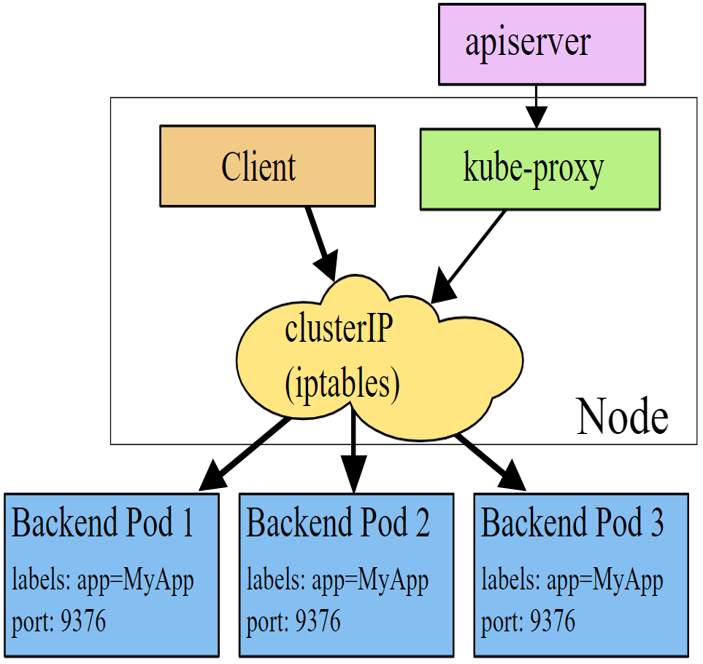
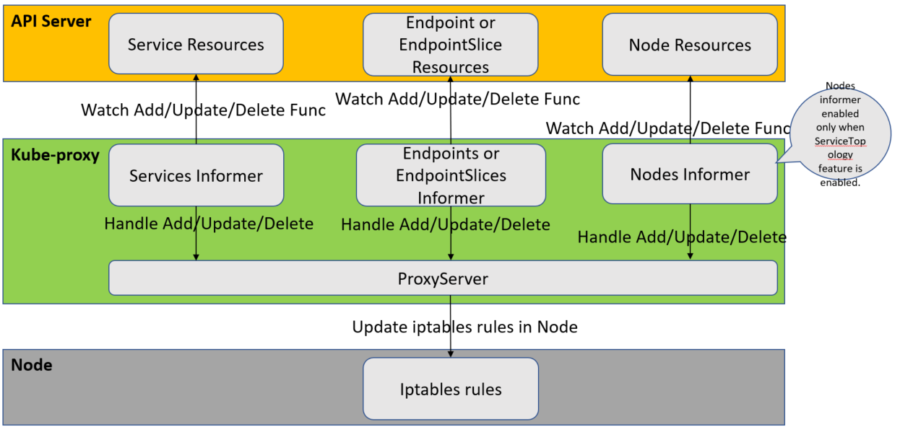
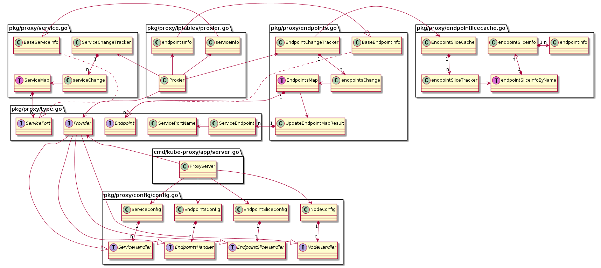
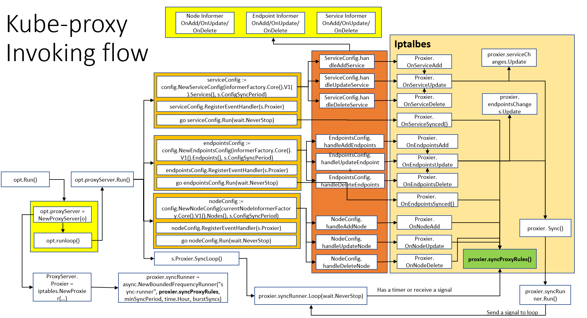

# Kube-proxy 源码分析（基于 release-1.18 branch)

**NOTE: 由于代码篇幅太多，在分析的过程中会将不重要的部分删除，我将用//.................. 代替了。**

## 前言

kube-proxy 部署在每一个 Node 节点上，主要实现了服务之间的通信和负载均衡。它主要作用从 APIServer 中获取 Service 的信息，然后根据这些信息去创建相应的代理服务，从而实现 Server 到 Pod 的请求路由和转发。当前它主要实现了三种 proxy 模式，user space， iptables 和 ipvs。不过本篇源码分析只对 iptables 部分进行阅读。

## 源码框架总览

首先，我们来看看官网的架构图。



这张图很好的展示了 iptables 模式下的交互流程。这里也没有必要过多解释了。

下面我们从 informer 的角度看看它 watch 了哪些 resource 并做哪些处理。



这张图中描述了 kube-proxy 其实监听了四种 resource，分别是 Service, Endpoint, EndpointSlice 和 Node。不过从源码中能看到，这些并不是都同时监听的。对于 EndpointSlice 只有当开启了 EndpointSlice 这个功能的时候，才进行 watch，而这个时候就不监听 Endpoint 资源了，也就是这两个是互斥的。而对于 Node 资源的监听，也是在开启了 ServiceTopology 这个特性的时候，才会去监听。

下面我们再从类图角度来看下 proxy 的类之间的关系。



这是个简单的类之间的关系，由于加上类的属性会导致内容太多，看不清楚，所以我就直接去掉了所有的类的属性。如果有兴趣看全的类图，请参考：[kube-proxy 全类图](images/proxy/kubeproxy.png)。

最后为了便于理解源码的处理逻辑，在此给出函数的调用流程图(仅是Iptables的处理)。



这张图中可以看到各个函数的调用关系，从而在阅读源码的时候，可以很好地参考这个去理解函数之前的调用。

## 源码分析

首先 proxy 函数的入口和其他组件的一样，可以在 [这里](https://github.com/kubernetes/kubernetes/blob/release-1.18/cmd/kube-proxy/proxy.go) 找到。

可以看到这里确实是同样适用了 cobra 的，所以我们直接进入真正运行的函数开始阅读。

主要逻辑，我们从 [opt.Run](https://github.com/kubernetes/kubernetes/blob/release-1.18/cmd/kube-proxy/app/server.go#L308) 函数开始。

```go
func (o *Options) Run() error {
    defer close(o.errCh)
    if len(o.WriteConfigTo) > 0 {
        return o.writeConfigFile()
    }

    proxyServer, err := NewProxyServer(o)
    if err != nil {
        return err
    }

    if o.CleanupAndExit {
        return proxyServer.CleanupAndExit()
    }

    o.proxyServer = proxyServer
    return o.runLoop()
}
```

这里看到通过调用 NewProxyServer 函数创建了一个 proxyServer 然后赋值给了 Options 这个对象。并最后运行`o.runLoop()`。

我们先简单的看看 runLoop 这个函数。

```go
// runLoop will watch on the update change of the proxy server's configuration file.
// Return an error when updated
func (o *Options) runLoop() error {
    if o.watcher != nil {
        o.watcher.Run()
    }

    // run the proxy in goroutine
    go func() {
        err := o.proxyServer.Run()
        o.errCh <- err
    }()

    for {
        err := <-o.errCh
        if err != nil {
            return err
        }
    }
}

```

可以看到这里使用 go routine 调用了 proxyServer.Run 函数，然后就死在这里了。一直等 proxyServer.Run 函数返回错误才退出。

在分析 proxyServer.Run 函数之前我们来看看上面的那个 [NewProxyServer](https://github.com/kubernetes/kubernetes/blob/release-1.18/cmd/kube-proxy/app/server_others.go#L75)。

```go
func newProxyServer(
    config *proxyconfigapi.KubeProxyConfiguration,
    cleanupAndExit bool,
    master string) (*ProxyServer, error) {
    //..................
    if proxyMode == proxyModeIPTables {
        klog.V(0).Info("Using iptables Proxier.")
        if config.IPTables.MasqueradeBit == nil {
            // MasqueradeBit must be specified or defaulted.
            return nil, fmt.Errorf("unable to read IPTables MasqueradeBit from config")
        }

        if utilfeature.DefaultFeatureGate.Enabled(features.IPv6DualStack) {
            klog.V(0).Info("creating dualStackProxier for iptables.")

            // Create iptables handlers for both families, one is already created
            // Always ordered as IPv4, IPv6
            var ipt [2]utiliptables.Interface
            if iptInterface.IsIpv6() {
                ipt[1] = iptInterface
                ipt[0] = utiliptables.New(execer, utiliptables.ProtocolIpv4)
            } else {
                ipt[0] = iptInterface
                ipt[1] = utiliptables.New(execer, utiliptables.ProtocolIpv6)
            }

            // Always ordered to match []ipt
            var localDetectors [2]proxyutiliptables.LocalTrafficDetector
            localDetectors, err = getDualStackLocalDetectorTuple(detectLocalMode, config, ipt, nodeInfo)
            if err != nil {
                return nil, fmt.Errorf("unable to create proxier: %v", err)
            }

            // TODO this has side effects that should only happen when Run() is invoked.
            proxier, err = iptables.NewDualStackProxier(
                ipt,
                utilsysctl.New(),
                execer,
                config.IPTables.SyncPeriod.Duration,
                config.IPTables.MinSyncPeriod.Duration,
                config.IPTables.MasqueradeAll,
                int(*config.IPTables.MasqueradeBit),
                localDetectors,
                hostname,
                nodeIPTuple(config.BindAddress),
                recorder,
                healthzServer,
                config.NodePortAddresses,
            )
        } else { // Create a single-stack proxier.
            var localDetector proxyutiliptables.LocalTrafficDetector
            localDetector, err = getLocalDetector(detectLocalMode, config, iptInterface, nodeInfo)
            if err != nil {
                return nil, fmt.Errorf("unable to create proxier: %v", err)
            }

            // TODO this has side effects that should only happen when Run() is invoked.
            proxier, err = iptables.NewProxier(
                iptInterface,
                utilsysctl.New(),
                execer,
                config.IPTables.SyncPeriod.Duration,
                config.IPTables.MinSyncPeriod.Duration,
                config.IPTables.MasqueradeAll,
                int(*config.IPTables.MasqueradeBit),
                localDetector,
                hostname,
                nodeIP,
                recorder,
                healthzServer,
                config.NodePortAddresses,
            )
        }

        if err != nil {
            return nil, fmt.Errorf("unable to create proxier: %v", err)
        }
        proxymetrics.RegisterMetrics()
    } else if proxyMode == proxyModeIPVS {
        // using IPVS mode.
        //..................
    } else {
        // using user space mode.
        //..................
    }

    return &ProxyServer{
        Client:                 client,
        EventClient:            eventClient,
        IptInterface:           iptInterface,
        IpvsInterface:          ipvsInterface,
        IpsetInterface:         ipsetInterface,
        execer:                 execer,
        Proxier:                proxier,
        Broadcaster:            eventBroadcaster,
        Recorder:               recorder,
        ConntrackConfiguration: config.Conntrack,
        Conntracker:            &realConntracker{},
        ProxyMode:              proxyMode,
        NodeRef:                nodeRef,
        MetricsBindAddress:     config.MetricsBindAddress,
        EnableProfiling:        config.EnableProfiling,
        OOMScoreAdj:            config.OOMScoreAdj,
        ConfigSyncPeriod:       config.ConfigSyncPeriod.Duration,
        HealthzServer:          healthzServer,
        UseEndpointSlices:      utilfeature.DefaultFeatureGate.Enabled(features.EndpointSliceProxying),
    }, nil
}
```

这个函数主要是创建了 proxier 的实例，通过不同模式创建不同的实例，例如配置的是 iptables 就创建 iptables 的 proxy。由于这里的代码太长，我将一些源码删除了只保留了部分 iptables proxy 创建的部分。

这里可以看到是支持 dualstack 的，并且如果开启了 dualstack 的支持，就调用 iptables.NewDualStackProxier 函数创建 iptables proxy 的实例。否则调用 iptables.NewProxier 函数创建实例。

这里我们阅读简单的情况了，所以下面看看 [iptables.NewProxier](https://github.com/kubernetes/kubernetes/blob/release-1.18/pkg/proxy/iptables/proxier.go#L257) 函数。

```go
// NewProxier returns a new Proxier given an iptables Interface instance.
// Because of the iptables logic, it is assumed that there is only a single Proxier active on a machine.
// An error will be returned if iptables fails to update or acquire the initial lock.
// Once a proxier is created, it will keep iptables up to date in the background and
// will not terminate if a particular iptables call fails.
func NewProxier(ipt utiliptables.Interface,
    sysctl utilsysctl.Interface,
    exec utilexec.Interface,
    syncPeriod time.Duration,
    minSyncPeriod time.Duration,
    masqueradeAll bool,
    masqueradeBit int,
    localDetector proxyutiliptables.LocalTrafficDetector,
    hostname string,
    nodeIP net.IP,
    recorder record.EventRecorder,
    healthzServer healthcheck.ProxierHealthUpdater,
    nodePortAddresses []string,
) (*Proxier, error) {
    // Set the route_localnet sysctl we need for
    if val, _ := sysctl.GetSysctl(sysctlRouteLocalnet); val != 1 {
        if err := sysctl.SetSysctl(sysctlRouteLocalnet, 1); err != nil {
            return nil, fmt.Errorf("can't set sysctl %s: %v", sysctlRouteLocalnet, err)
        }
    }

    // Proxy needs br_netfilter and bridge-nf-call-iptables=1 when containers
    // are connected to a Linux bridge (but not SDN bridges).  Until most
    // plugins handle this, log when config is missing
    if val, err := sysctl.GetSysctl(sysctlBridgeCallIPTables); err == nil && val != 1 {
        klog.Warning("missing br-netfilter module or unset sysctl br-nf-call-iptables; proxy may not work as intended")
    }

    // Generate the masquerade mark to use for SNAT rules.
    masqueradeValue := 1 << uint(masqueradeBit)
    masqueradeMark := fmt.Sprintf("%#08x", masqueradeValue)

    endpointSlicesEnabled := utilfeature.DefaultFeatureGate.Enabled(features.EndpointSliceProxying)

    serviceHealthServer := healthcheck.NewServiceHealthServer(hostname, recorder)

    isIPv6 := ipt.IsIpv6()
    proxier := &Proxier{
        portsMap:                 make(map[utilproxy.LocalPort]utilproxy.Closeable),
        serviceMap:               make(proxy.ServiceMap),
        serviceChanges:           proxy.NewServiceChangeTracker(newServiceInfo, &isIPv6, recorder),
        endpointsMap:             make(proxy.EndpointsMap),
        endpointsChanges:         proxy.NewEndpointChangeTracker(hostname, newEndpointInfo, &isIPv6, recorder, endpointSlicesEnabled),
        syncPeriod:               syncPeriod,
        iptables:                 ipt,
        masqueradeAll:            masqueradeAll,
        masqueradeMark:           masqueradeMark,
        exec:                     exec,
        localDetector:            localDetector,
        hostname:                 hostname,
        nodeIP:                   nodeIP,
        portMapper:               &listenPortOpener{},
        recorder:                 recorder,
        serviceHealthServer:      serviceHealthServer,
        healthzServer:            healthzServer,
        precomputedProbabilities: make([]string, 0, 1001),
        iptablesData:             bytes.NewBuffer(nil),
        existingFilterChainsData: bytes.NewBuffer(nil),
        filterChains:             bytes.NewBuffer(nil),
        filterRules:              bytes.NewBuffer(nil),
        natChains:                bytes.NewBuffer(nil),
        natRules:                 bytes.NewBuffer(nil),
        nodePortAddresses:        nodePortAddresses,
        networkInterfacer:        utilproxy.RealNetwork{},
    }
    burstSyncs := 2
    klog.V(3).Infof("minSyncPeriod: %v, syncPeriod: %v, burstSyncs: %d", minSyncPeriod, syncPeriod, burstSyncs)
    // We pass syncPeriod to ipt.Monitor, which will call us only if it needs to.
    // We need to pass *some* maxInterval to NewBoundedFrequencyRunner anyway though.
    // time.Hour is arbitrary.
    proxier.syncRunner = async.NewBoundedFrequencyRunner("sync-runner", proxier.syncProxyRules, minSyncPeriod, time.Hour, burstSyncs)
    go ipt.Monitor(utiliptables.Chain("KUBE-PROXY-CANARY"),
        []utiliptables.Table{utiliptables.TableMangle, utiliptables.TableNAT, utiliptables.TableFilter},
        proxier.syncProxyRules, syncPeriod, wait.NeverStop)
    return proxier, nil
}
```

这个函数里面需要注意的就是 `proxier.syncRunner = async.NewBoundedFrequencyRunner("sync-runner", proxier.syncProxyRules, minSyncPeriod, time.Hour, burstSyncs)`。 这里将 `proxier.syncProxyRules` 函数通过 async.NewBoundedFrequencyRunner 进行了一下封装，再赋值给了 proxier.syncRunner。**NOTE： 之所以这里特别提出，因为从上面的调用流程图中也能看的出来，后面有部分函数会调用到这个函数。**

好了，我们再回过头来看看 [proxyServer.Run()](https://github.com/kubernetes/kubernetes/blob/release-1.18/cmd/kube-proxy/app/server.go#L581) 函数。

```go
// Run runs the specified ProxyServer.  This should never exit (unless CleanupAndExit is set).
// TODO: At the moment, Run() cannot return a nil error, otherwise it's caller will never exit. Update callers of Run to handle nil errors.
func (s *ProxyServer) Run() error {
    // To help debugging, immediately log version
    klog.Infof("Version: %+v", version.Get())

    // TODO(vmarmol): Use container config for this.
    var oomAdjuster *oom.OOMAdjuster
    if s.OOMScoreAdj != nil {
        oomAdjuster = oom.NewOOMAdjuster()
        if err := oomAdjuster.ApplyOOMScoreAdj(0, int(*s.OOMScoreAdj)); err != nil {
            klog.V(2).Info(err)
        }
    }

    if s.Broadcaster != nil && s.EventClient != nil {
        s.Broadcaster.StartRecordingToSink(&v1core.EventSinkImpl{Interface: s.EventClient.Events("")})
    }

    // Start up a healthz server if requested
    if s.HealthzServer != nil {
        s.HealthzServer.Run()
    }

    // Start up a metrics server if requested
    if len(s.MetricsBindAddress) > 0 {
        proxyMux := mux.NewPathRecorderMux("kube-proxy")
        healthz.InstallHandler(proxyMux)
        proxyMux.HandleFunc("/proxyMode", func(w http.ResponseWriter, r *http.Request) {
            w.Header().Set("Content-Type", "text/plain; charset=utf-8")
            w.Header().Set("X-Content-Type-Options", "nosniff")
            fmt.Fprintf(w, "%s", s.ProxyMode)
        })
        //lint:ignore SA1019 See the Metrics Stability Migration KEP
        proxyMux.Handle("/metrics", legacyregistry.Handler())
        if s.EnableProfiling {
            routes.Profiling{}.Install(proxyMux)
        }
        configz.InstallHandler(proxyMux)
        go wait.Until(func() {
            err := http.ListenAndServe(s.MetricsBindAddress, proxyMux)
            if err != nil {
                utilruntime.HandleError(fmt.Errorf("starting metrics server failed: %v", err))
            }
        }, 5*time.Second, wait.NeverStop)
    }

    // Tune conntrack, if requested
    // Conntracker is always nil for windows
    if s.Conntracker != nil {
        max, err := getConntrackMax(s.ConntrackConfiguration)
        if err != nil {
            return err
        }
        if max > 0 {
            err := s.Conntracker.SetMax(max)
            if err != nil {
                if err != errReadOnlySysFS {
                    return err
                }
                // errReadOnlySysFS is caused by a known docker issue (https://github.com/docker/docker/issues/24000),
                // the only remediation we know is to restart the docker daemon.
                // Here we'll send an node event with specific reason and message, the
                // administrator should decide whether and how to handle this issue,
                // whether to drain the node and restart docker.  Occurs in other container runtimes
                // as well.
                // TODO(random-liu): Remove this when the docker bug is fixed.
                const message = "CRI error: /sys is read-only: " +
                    "cannot modify conntrack limits, problems may arise later (If running Docker, see docker issue #24000)"
                s.Recorder.Eventf(s.NodeRef, api.EventTypeWarning, err.Error(), message)
            }
        }

        if s.ConntrackConfiguration.TCPEstablishedTimeout != nil && s.ConntrackConfiguration.TCPEstablishedTimeout.Duration > 0 {
            timeout := int(s.ConntrackConfiguration.TCPEstablishedTimeout.Duration / time.Second)
            if err := s.Conntracker.SetTCPEstablishedTimeout(timeout); err != nil {
                return err
            }
        }

        if s.ConntrackConfiguration.TCPCloseWaitTimeout != nil && s.ConntrackConfiguration.TCPCloseWaitTimeout.Duration > 0 {
            timeout := int(s.ConntrackConfiguration.TCPCloseWaitTimeout.Duration / time.Second)
            if err := s.Conntracker.SetTCPCloseWaitTimeout(timeout); err != nil {
                return err
            }
        }
    }

    noProxyName, err := labels.NewRequirement(apis.LabelServiceProxyName, selection.DoesNotExist, nil)
    if err != nil {
        return err
    }

    noHeadlessEndpoints, err := labels.NewRequirement(v1.IsHeadlessService, selection.DoesNotExist, nil)
    if err != nil {
        return err
    }

    labelSelector := labels.NewSelector()
    labelSelector = labelSelector.Add(*noProxyName, *noHeadlessEndpoints)

    // Make informers that filter out objects that want a non-default service proxy.
    informerFactory := informers.NewSharedInformerFactoryWithOptions(s.Client, s.ConfigSyncPeriod,
        informers.WithTweakListOptions(func(options *metav1.ListOptions) {
            options.LabelSelector = labelSelector.String()
        }))

    // Create configs (i.e. Watches for Services and Endpoints or EndpointSlices)
    // Note: RegisterHandler() calls need to happen before creation of Sources because sources
    // only notify on changes, and the initial update (on process start) may be lost if no handlers
    // are registered yet.
    serviceConfig := config.NewServiceConfig(informerFactory.Core().V1().Services(), s.ConfigSyncPeriod)
    serviceConfig.RegisterEventHandler(s.Proxier)
    go serviceConfig.Run(wait.NeverStop)

    if s.UseEndpointSlices {
        endpointSliceConfig := config.NewEndpointSliceConfig(informerFactory.Discovery().V1beta1().EndpointSlices(), s.ConfigSyncPeriod)
        endpointSliceConfig.RegisterEventHandler(s.Proxier)
        go endpointSliceConfig.Run(wait.NeverStop)
    } else {
        endpointsConfig := config.NewEndpointsConfig(informerFactory.Core().V1().Endpoints(), s.ConfigSyncPeriod)
        endpointsConfig.RegisterEventHandler(s.Proxier)
        go endpointsConfig.Run(wait.NeverStop)
    }

    // This has to start after the calls to NewServiceConfig and NewEndpointsConfig because those
    // functions must configure their shared informer event handlers first.
    informerFactory.Start(wait.NeverStop)

    if utilfeature.DefaultFeatureGate.Enabled(features.ServiceTopology) {
        // Make an informer that selects for our nodename.
        currentNodeInformerFactory := informers.NewSharedInformerFactoryWithOptions(s.Client, s.ConfigSyncPeriod,
            informers.WithTweakListOptions(func(options *metav1.ListOptions) {
                options.FieldSelector = fields.OneTermEqualSelector("metadata.name", s.NodeRef.Name).String()
            }))
        nodeConfig := config.NewNodeConfig(currentNodeInformerFactory.Core().V1().Nodes(), s.ConfigSyncPeriod)
        nodeConfig.RegisterEventHandler(s.Proxier)
        go nodeConfig.Run(wait.NeverStop)

        // This has to start after the calls to NewNodeConfig because that must
        // configure the shared informer event handler first.
        currentNodeInformerFactory.Start(wait.NeverStop)
    }

    // Birth Cry after the birth is successful
    s.birthCry()

    // Just loop forever for now...
    s.Proxier.SyncLoop()
    return nil
}
```

这里就能看出来各种 informer 的创建和 start。并最后调用了 `s.Proxier.SyncLoop()`。

我们先来看看 `s.Proxier.SyncLoop()` 函数。

```go
// SyncLoop runs periodic work.  This is expected to run as a goroutine or as the main loop of the app.  It does not return.
func (proxier *Proxier) SyncLoop() {
    // Update healthz timestamp at beginning in case Sync() never succeeds.
    if proxier.healthzServer != nil {
        proxier.healthzServer.Updated()
    }
    proxier.syncRunner.Loop(wait.NeverStop)
}
```

这里则调用了 `proxier.syncRunner.Loop(wait.NeverStop)` 函数进行处理。上面我们知道我们已经将 `proxier.syncProxyRules` 函数通过 async.NewBoundedFrequencyRunner 进行了一下封装，再赋值给了 proxier.syncRunner。所以这里的 Loop 函数最后肯定能调用到 `proxier.syncProxyRules` 这个函数。这里我们先不做分析。到下面我们一起分析下这个 async.NewBoundedFrequencyRunner 是如何处理的。

下面我们以 service 资源为例，看下如果调用的。

```go
    serviceConfig := config.NewServiceConfig(informerFactory.Core().V1().Services(), s.ConfigSyncPeriod)
    serviceConfig.RegisterEventHandler(s.Proxier)
    go serviceConfig.Run(wait.NeverStop)
```

1. 调用 config.NewServiceConfig 函数，创建 serviceConfig 的实例。并将 serviceConfig 的回调函数赋值给 informer 机制中的各种处理函数接口。例如这里的是将 ServiceConfig 的 handleAddService，handleUpdateService 和 handleDeleteService 分别赋值给了 service Informer 的 AddFunc， UpdateFunc 和 DeleteFunc 的接口。

    ```go
    // NewServiceConfig creates a new ServiceConfig.
    func NewServiceConfig(serviceInformer coreinformers.ServiceInformer, resyncPeriod time.Duration) *ServiceConfig {
        result := &ServiceConfig{
            listerSynced: serviceInformer.Informer().HasSynced,
        }

        serviceInformer.Informer().AddEventHandlerWithResyncPeriod(
            cache.ResourceEventHandlerFuncs{
                AddFunc:    result.handleAddService,
                UpdateFunc: result.handleUpdateService,
                DeleteFunc: result.handleDeleteService,
            },
            resyncPeriod,
        )

        return result
    }
    ```

    下面看看 handleAddService，handleUpdateService 和 handleDeleteService 函数的具体实现：

    ```go
    func (c *ServiceConfig) handleAddService(obj interface{}) {
        service, ok := obj.(*v1.Service)
        if !ok {
            utilruntime.HandleError(fmt.Errorf("unexpected object type: %v", obj))
            return
        }
        for i := range c.eventHandlers {
            klog.V(4).Info("Calling handler.OnServiceAdd")
            c.eventHandlers[i].OnServiceAdd(service)
        }
    }

    func (c *ServiceConfig) handleUpdateService(oldObj, newObj interface{}) {
        oldService, ok := oldObj.(*v1.Service)
        if !ok {
            utilruntime.HandleError(fmt.Errorf("unexpected object type: %v", oldObj))
            return
        }
        service, ok := newObj.(*v1.Service)
        if !ok {
            utilruntime.HandleError(fmt.Errorf("unexpected object type: %v", newObj))
            return
        }
        for i := range c.eventHandlers {
            klog.V(4).Info("Calling handler.OnServiceUpdate")
            c.eventHandlers[i].OnServiceUpdate(oldService, service)
        }
    }

    func (c *ServiceConfig) handleDeleteService(obj interface{}) {
        service, ok := obj.(*v1.Service)
        if !ok {
            tombstone, ok := obj.(cache.DeletedFinalStateUnknown)
            if !ok {
                utilruntime.HandleError(fmt.Errorf("unexpected object type: %v", obj))
                return
            }
            if service, ok = tombstone.Obj.(*v1.Service); !ok {
                utilruntime.HandleError(fmt.Errorf("unexpected object type: %v", obj))
                return
            }
        }
        for i := range c.eventHandlers {
            klog.V(4).Info("Calling handler.OnServiceDelete")
            c.eventHandlers[i].OnServiceDelete(service)
        }
    }
    ```

    这里可以看到分别调用的是 `c.eventHandlers[i].OnServiceAdd(service)`, `c.eventHandlers[i].OnServiceUpdate(oldService, service)` 和 `c.eventHandlers[i].OnServiceDelete(service)` 。

2. 调用 serviceConfig.RegisterEventHandler(s.Proxier) 将 Proxier 添加到 ServiceConfig 的 eventHandlers 中。这里我们是将 iptables 的实例传入进去了。

    ```go
    // RegisterEventHandler registers a handler which is called on every service change.
    func (c *ServiceConfig) RegisterEventHandler(handler ServiceHandler) {
        c.eventHandlers = append(c.eventHandlers, handler)
    }
    ```

3. 异步调用 `serviceConfig.Run(wait.NeverStop)` 运行 serviceConfig。

    ```go
    // Run waits for cache synced and invokes handlers after syncing.
    func (c *ServiceConfig) Run(stopCh <-chan struct{}) {
        klog.Info("Starting service config controller")

        if !cache.WaitForNamedCacheSync("service config", stopCh, c.listerSynced) {
            return
        }

        for i := range c.eventHandlers {
            klog.V(3).Info("Calling handler.OnServiceSynced()")
            c.eventHandlers[i].OnServiceSynced()
        }
    }
    ```

    这里可以看到调用了 c.eventHandlers[i].OnServiceSynced() 函数。

上面我们知道在我们的这里 c.eventHandlers[i].OnXXX() 函数，其实是调用 iptables proxy 的方法。那么下面我们分别来看看 iptables proxy 的这些方法。

不过这里 OnServiceSynced 实现逻辑不同于其他三个函数。因为我们知道 informer 中只有三种回调接口，没有 OnSync 接口，所以这里的 OnServiceSynced 肯定不同于其他三个。所以我们先来看看 OnServiceSynced 函数。

```go

// OnServiceSynced is called once all the initial even handlers were
// called and the state is fully propagated to local cache.
func (proxier *Proxier) OnServiceSynced() {
    proxier.mu.Lock()
    proxier.servicesSynced = true
    if utilfeature.DefaultFeatureGate.Enabled(features.EndpointSliceProxying) {
        proxier.setInitialized(proxier.endpointSlicesSynced)
    } else {
        proxier.setInitialized(proxier.endpointsSynced)
    }
    proxier.mu.Unlock()

    // Sync unconditionally - this is called once per lifetime.
    proxier.syncProxyRules()
}
```

从注释可以看到，这个函数只会被执行一次。所以这个类似于 list 操作。再接收各种 watch 回调之前先将所有的 sync 一遍。这里是调用 proxier.syncProxyRules() 函数去同步 proxy 的 rules。这个函数先不分析，因为我们从上面的时候，也看到它被 async.NewBoundedFrequencyRunner 进行了一下封装，再赋值给了 proxier.syncRunner。所以我们后面统一分析。

接下来我们再来看看剩下的三个函数：

```go
// OnServiceAdd is called whenever creation of new service object
// is observed.
func (proxier *Proxier) OnServiceAdd(service *v1.Service) {
    proxier.OnServiceUpdate(nil, service)
}

// OnServiceUpdate is called whenever modification of an existing
// service object is observed.
func (proxier *Proxier) OnServiceUpdate(oldService, service *v1.Service) {
    if proxier.serviceChanges.Update(oldService, service) && proxier.isInitialized() {
        proxier.Sync()
    }
}

// OnServiceDelete is called whenever deletion of an existing service
// object is observed.
func (proxier *Proxier) OnServiceDelete(service *v1.Service) {
    proxier.OnServiceUpdate(service, nil)

}

```

这里我们看到对于 Service 的 Add 和 Delete 事件，它都当做 Update 的事件进行处理了。下面我们再来看看 `proxier.Sync()` 函数。

```go
// Sync is called to synchronize the proxier state to iptables as soon as possible.
func (proxier *Proxier) Sync() {
    if proxier.healthzServer != nil {
        proxier.healthzServer.QueuedUpdate()
    }
    proxier.syncRunner.Run()
}
```

看这里我们调用了 `proxier.syncRunner.Run()` 进行了处理。好了，到这里我们要分析下 async.NewBoundedFrequencyRunner 的实现逻辑了，结合上面我们遗留下来的一个`proxier.syncRunner.Loop(wait.NeverStop)` 我们已经使用了两个函数了。下面我们来看看 [async.NewBoundedFrequencyRunner](https://github.com/kubernetes/kubernetes/blob/release-1.18/pkg/util/async/bounded_frequency_runner.go#L155) 的这个函数的实现。

```go
// NewBoundedFrequencyRunner creates a new BoundedFrequencyRunner instance,
// which will manage runs of the specified function.
//
// All runs will be async to the caller of BoundedFrequencyRunner.Run, but
// multiple runs are serialized. If the function needs to hold locks, it must
// take them internally.
//
// Runs of the function will have at least minInterval between them (from
// completion to next start), except that up to bursts may be allowed.  Burst
// runs are "accumulated" over time, one per minInterval up to burstRuns total.
// This can be used, for example, to mitigate the impact of expensive operations
// being called in response to user-initiated operations. Run requests that
// would violate the minInterval are coallesced and run at the next opportunity.
//
// The function will be run at least once per maxInterval. For example, this can
// force periodic refreshes of state in the absence of anyone calling Run.
//
// Examples:
//
// NewBoundedFrequencyRunner("name", fn, time.Second, 5*time.Second, 1)
// - fn will have at least 1 second between runs
// - fn will have no more than 5 seconds between runs
//
// NewBoundedFrequencyRunner("name", fn, 3*time.Second, 10*time.Second, 3)
// - fn will have at least 3 seconds between runs, with up to 3 burst runs
// - fn will have no more than 10 seconds between runs
//
// The maxInterval must be greater than or equal to the minInterval,  If the
// caller passes a maxInterval less than minInterval, this function will panic.
func NewBoundedFrequencyRunner(name string, fn func(), minInterval, maxInterval time.Duration, burstRuns int) *BoundedFrequencyRunner {
    timer := &realTimer{timer: time.NewTimer(0)} // will tick immediately
    <-timer.C()                                  // consume the first tick
    return construct(name, fn, minInterval, maxInterval, burstRuns, timer)
}

// Make an instance with dependencies injected.
func construct(name string, fn func(), minInterval, maxInterval time.Duration, burstRuns int, timer timer) *BoundedFrequencyRunner {
    if maxInterval < minInterval {
        panic(fmt.Sprintf("%s: maxInterval (%v) must be >= minInterval (%v)", name, maxInterval, minInterval))
    }
    if timer == nil {
        panic(fmt.Sprintf("%s: timer must be non-nil", name))
    }

    bfr := &BoundedFrequencyRunner{
        name:        name,
        fn:          fn,
        minInterval: minInterval,
        maxInterval: maxInterval,
        run:         make(chan struct{}, 1),
        retry:       make(chan struct{}, 1),
        timer:       timer,
    }
    if minInterval == 0 {
        bfr.limiter = nullLimiter{}
    } else {
        // allow burst updates in short succession
        qps := float32(time.Second) / float32(minInterval)
        bfr.limiter = flowcontrol.NewTokenBucketRateLimiterWithClock(qps, burstRuns, timer)
    }
    return bfr
}
```

这里我保留了源码中的注释，因为注释对于这个 BoundedFrequencyRunner 处理描述的很是清楚并提供了一些例子。总之这个类封装了一个有边界的定时运行的功能。

首先我们来看看它的 Loop 函数。

```go
// Loop handles the periodic timer and run requests.  This is expected to be
// called as a goroutine.
func (bfr *BoundedFrequencyRunner) Loop(stop <-chan struct{}) {
    klog.V(3).Infof("%s Loop running", bfr.name)
    bfr.timer.Reset(bfr.maxInterval)
    for {
        select {
        case <-stop:
            bfr.stop()
            klog.V(3).Infof("%s Loop stopping", bfr.name)
            return
        case <-bfr.timer.C():
            bfr.tryRun()
        case <-bfr.run:
            bfr.tryRun()
        case <-bfr.retry:
            bfr.doRetry()
        }
    }
}
```

这里就是一个循环的处理，有三种条件可以触发运行，1) timer 到了，2) 收到 run 的信号， 3) 收到 retry 的信号。

先看看 tryRun 函数

```go
// assumes the lock is not held
func (bfr *BoundedFrequencyRunner) tryRun() {
    bfr.mu.Lock()
    defer bfr.mu.Unlock()

    if bfr.limiter.TryAccept() {
        // We're allowed to run the function right now.
        bfr.fn()
        bfr.lastRun = bfr.timer.Now()
        bfr.timer.Stop()
        bfr.timer.Reset(bfr.maxInterval)
        klog.V(3).Infof("%s: ran, next possible in %v, periodic in %v", bfr.name, bfr.minInterval, bfr.maxInterval)
        return
    }

    // It can't run right now, figure out when it can run next.
    elapsed := bfr.timer.Since(bfr.lastRun)   // how long since last run
    nextPossible := bfr.minInterval - elapsed // time to next possible run
    nextScheduled := bfr.timer.Remaining()    // time to next scheduled run
    klog.V(4).Infof("%s: %v since last run, possible in %v, scheduled in %v", bfr.name, elapsed, nextPossible, nextScheduled)

    // It's hard to avoid race conditions in the unit tests unless we always reset
    // the timer here, even when it's unchanged
    if nextPossible < nextScheduled {
        nextScheduled = nextPossible
    }
    bfr.timer.Stop()
    bfr.timer.Reset(nextScheduled)
}
```

看来貌似就是这里通过计算来决定能不能执行传入的 fn 函数。而计算的准则就是传入的最小间隔时间和最大间隔时间。

讲完 Loop 函数，我们再来看看它的 Run 函数。

```go
// Run the function as soon as possible.  If this is called while Loop is not
// running, the call may be deferred indefinitely.
// If there is already a queued request to call the underlying function, it
// may be dropped - it is just guaranteed that we will try calling the
// underlying function as soon as possible starting from now.
func (bfr *BoundedFrequencyRunner) Run() {
    // If it takes a lot of time to run the underlying function, noone is really
    // processing elements from <run> channel. So to avoid blocking here on the
    // putting element to it, we simply skip it if there is already an element
    // in it.
    select {
    case bfr.run <- struct{}{}:
    default:
    }
}
```

这里貌似就是给 run 发信号，让 Loop 去执行。

所以这里总结下就是当调用 Sync 的时候，就会立即去调用 tryRun 函数，如果没有则当 timer 到了，才会去调用 tryRun 函数。但是这个 tryRun 并不是调用就能执行到传入的函数。而是要根据创建 BoundedFrequencyRunner 传入的最小和最大间隔时间。所以也就是说这里的 Sync 也并不是立马就执行了。也就是说这里的 iptables 的同步并不是实时的。

最后，我不打算分析 iptables 更新处理函数 [syncProxyRules()](https://github.com/kubernetes/kubernetes/blob/release-1.18/pkg/proxy/iptables/proxier.go#L775)，因为我也不懂。哈哈！！！！有懂的还希望多多请教！

而且讲句真心话，这函数真的是无敌长啊！！！！

到这里，我们将 proxy 的 iptables 的 Service 部分的的处理逻辑讲完了。而对于 Endpoint, EndpointSlice 和 Node 是类似的机制。这里不再赘述。而对于 user space 和 IPVS 这个也不做分析了。日后需要再来学习学习。
