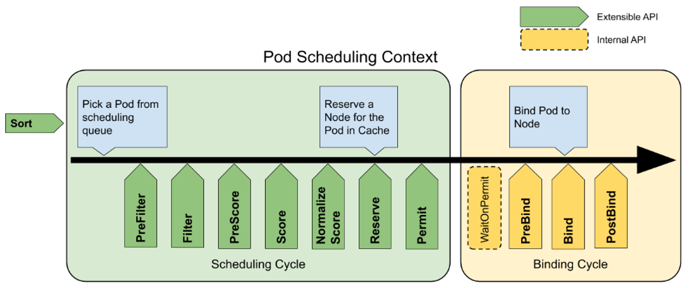

# kube-scheduler 源码分析(基于release-1.18 branch)

**NOTE: 由于代码篇幅太多，在分析的过程中会将不重要的部分删除，我将用//..................代替了.**

## 函数入口[scheduler.go](https://github.com/kubernetes/kubernetes/blob/release-1.18/cmd/kube-scheduler/scheduler.go)

```go
func main() {
    rand.Seed(time.Now().UnixNano())

    command := app.NewSchedulerCommand()

    // TODO: once we switch everything over to Cobra commands, we can go back to calling
    // utilflag.InitFlags() (by removing its pflag.Parse() call). For now, we have to set the
    // normalize func and add the go flag set by hand.
    pflag.CommandLine.SetNormalizeFunc(cliflag.WordSepNormalizeFunc)
    // utilflag.InitFlags()
    logs.InitLogs()
    defer logs.FlushLogs()

    if err := command.Execute(); err != nil {
        os.Exit(1)
    }
}
```

可以看到scheduler和controller基本都是一样的，都是使用了cobra CLI 第三方库。所以下面就直接去看看scheduler真正运行的函数吧.

```go
// Run executes the scheduler based on the given configuration. It only returns on error or when context is done.
func Run(ctx context.Context, cc schedulerserverconfig.CompletedConfig, outOfTreeRegistryOptions ...Option) error {
    // To help debugging, immediately log version
    klog.V(1).Infof("Starting Kubernetes Scheduler version %+v", version.Get())

    outOfTreeRegistry := make(framework.Registry)
    for _, option := range outOfTreeRegistryOptions {
        if err := option(outOfTreeRegistry); err != nil {
            return err
        }
    }

    recorderFactory := getRecorderFactory(&cc)
    // Create the scheduler.
    sched, err := scheduler.New(cc.Client,
        cc.InformerFactory,
        cc.PodInformer,
        recorderFactory,
        ctx.Done(),
        scheduler.WithProfiles(cc.ComponentConfig.Profiles...),
        scheduler.WithAlgorithmSource(cc.ComponentConfig.AlgorithmSource),
        scheduler.WithPreemptionDisabled(cc.ComponentConfig.DisablePreemption),
        scheduler.WithPercentageOfNodesToScore(cc.ComponentConfig.PercentageOfNodesToScore),
        scheduler.WithBindTimeoutSeconds(cc.ComponentConfig.BindTimeoutSeconds),
        scheduler.WithFrameworkOutOfTreeRegistry(outOfTreeRegistry),
        scheduler.WithPodMaxBackoffSeconds(cc.ComponentConfig.PodMaxBackoffSeconds),
        scheduler.WithPodInitialBackoffSeconds(cc.ComponentConfig.PodInitialBackoffSeconds),
        scheduler.WithExtenders(cc.ComponentConfig.Extenders...),
    )

    //..................

    // Start all informers.
    go cc.PodInformer.Informer().Run(ctx.Done())
    cc.InformerFactory.Start(ctx.Done())

    // Wait for all caches to sync before scheduling.
    cc.InformerFactory.WaitForCacheSync(ctx.Done())

    // If leader election is enabled, runCommand via LeaderElector until done and exit.
    if cc.LeaderElection != nil {
        cc.LeaderElection.Callbacks = leaderelection.LeaderCallbacks{
            OnStartedLeading: sched.Run,
            OnStoppedLeading: func() {
                klog.Fatalf("leaderelection lost")
            },
        }
        leaderElector, err := leaderelection.NewLeaderElector(*cc.LeaderElection)
        if err != nil {
            return fmt.Errorf("couldn't create leader elector: %v", err)
        }

        leaderElector.Run(ctx)

        return fmt.Errorf("lost lease")
    }

    // Leader election is disabled, so runCommand inline until done.
    sched.Run(ctx)
    return fmt.Errorf("finished without leader elect")
}

```

上面这个函数基本上干了下面几件事：

1. 通过scheduler.New函数创建一个scheduler， 并且将ComponentConfig API中的相关参数传入进去。

2. start 所有的informer。

3. 调用sched.Run(ctx)将scheduler调度起来。

好了下面将深入探索下[scheduler.New](https://github.com/kubernetes/kubernetes/blob/release-1.18/pkg/scheduler/scheduler.go#L223)和[scheduler.Run](https://github.com/kubernetes/kubernetes/blob/release-1.18/pkg/scheduler/scheduler.go#L363)干了什么。

## Scheduler 的创建

先来看看是如何通过New函数创建一个scheduler的。

```go
// New returns a Scheduler
func New(client clientset.Interface,
    informerFactory informers.SharedInformerFactory,
    podInformer coreinformers.PodInformer,
    recorderFactory profile.RecorderFactory,
    stopCh <-chan struct{},
    opts ...Option) (*Scheduler, error) {

    stopEverything := stopCh
    if stopEverything == nil {
        stopEverything = wait.NeverStop
    }

    //这里是将ComponentConfig中的各种配置的参数赋值给schedulerOptions
    options := defaultSchedulerOptions
    for _, opt := range opts {
        opt(&options)
    }

    schedulerCache := internalcache.New(30*time.Second, stopEverything)
    // 创建一个volume binder
    volumeBinder := scheduling.NewVolumeBinder(
        client,
        informerFactory.Core().V1().Nodes(),
        informerFactory.Storage().V1().CSINodes(),
        informerFactory.Core().V1().PersistentVolumeClaims(),
        informerFactory.Core().V1().PersistentVolumes(),
        informerFactory.Storage().V1().StorageClasses(),
        time.Duration(options.bindTimeoutSeconds)*time.Second,
    )

    //NewInTreeRegistry 构建所有树内的插件的register,如果有树外的插件，也进行合并。
    registry := frameworkplugins.NewInTreeRegistry()
    if err := registry.Merge(options.frameworkOutOfTreeRegistry); err != nil {
        return nil, err
    }

    snapshot := internalcache.NewEmptySnapshot()

    //创建一个configurator
    configurator := &Configurator{
        client:                   client,
        recorderFactory:          recorderFactory,
        informerFactory:          informerFactory,
        podInformer:              podInformer,
        volumeBinder:             volumeBinder,
        schedulerCache:           schedulerCache,
        StopEverything:           stopEverything,
        disablePreemption:        options.disablePreemption,
        percentageOfNodesToScore: options.percentageOfNodesToScore,
        bindTimeoutSeconds:       options.bindTimeoutSeconds,
        podInitialBackoffSeconds: options.podInitialBackoffSeconds,
        podMaxBackoffSeconds:     options.podMaxBackoffSeconds,
        enableNonPreempting:      utilfeature.DefaultFeatureGate.Enabled(kubefeatures.NonPreemptingPriority),
        profiles:                 append([]schedulerapi.KubeSchedulerProfile(nil), options.profiles...),
        registry:                 registry,
        nodeInfoSnapshot:         snapshot,
        extenders:                options.extenders,
    }

    metrics.Register()

    var sched *Scheduler
    source := options.schedulerAlgorithmSource
    switch {
    case source.Provider != nil:
        // Create the config from a named algorithm provider.
        sc, err := configurator.createFromProvider(*source.Provider)
        if err != nil {
            return nil, fmt.Errorf("couldn't create scheduler using provider %q: %v", *source.Provider, err)
        }
        sched = sc
    case source.Policy != nil:
        // Create the config from a user specified policy source.
        policy := &schedulerapi.Policy{}
        switch {
        case source.Policy.File != nil:
            if err := initPolicyFromFile(source.Policy.File.Path, policy); err != nil {
                return nil, err
            }
        case source.Policy.ConfigMap != nil:
            if err := initPolicyFromConfigMap(client, source.Policy.ConfigMap, policy); err != nil {
                return nil, err
            }
        }
        // Set extenders on the configurator now that we've decoded the policy
        // In this case, c.extenders should be nil since we're using a policy (and therefore not componentconfig,
        // which would have set extenders in the above instantiation of Configurator from CC options)
        configurator.extenders = policy.Extenders
        sc, err := configurator.createFromConfig(*policy)
        if err != nil {
            return nil, fmt.Errorf("couldn't create scheduler from policy: %v", err)
        }
        sched = sc
    default:
        return nil, fmt.Errorf("unsupported algorithm source: %v", source)
    }
    // Additional tweaks to the config produced by the configurator.
    sched.DisablePreemption = options.disablePreemption
    sched.StopEverything = stopEverything
    sched.podConditionUpdater = &podConditionUpdaterImpl{client}
    sched.podPreemptor = &podPreemptorImpl{client}
    sched.scheduledPodsHasSynced = podInformer.Informer().HasSynced

    //添加所有的event handler
    addAllEventHandlers(sched, informerFactory, podInformer)
    return sched, nil
}
```

从代码里可以看到，其主要做了:

1. 将传入的ComponentConfig中的各种配置的参数赋值给schedulerOptions。

2. 创建一个volume binder。

3. [frameworkplugins.NewInTreeRegistry()](https://github.com/kubernetes/kubernetes/blob/release-1.18/pkg/scheduler/framework/plugins/registry.go#L45)和registry.Merge构建所有树内的插件的register,如果有树外的插件，也进行合并。

4. 创建一个configurator。

5. 根据不同的算法源来创建scheduler。

   * 如果Provider不为空，就通过configurator.createFromProvider函数创建一个scheduler.

   * 如果Policy不为空。

     1. 从配置文件中读取相关配置并初始化Policy，最后通过configurator.createFromConfig创建scheduler。

     2. 从ConfigMap中读取相关配置并初始化Policy，最后通过configurator.createFromConfig创建scheduler。

6. 注册所有相关的[Eventhandler](https://github.com/kubernetes/kubernetes/blob/release-1.18/pkg/scheduler/eventhandlers.go)。

从上面分析，可以看出真正创建scheduler的是configurator。

首先看看[configurator](https://github.com/kubernetes/kubernetes/blob/release-1.18/pkg/scheduler/factory.go#L73)的结构包含哪些字段。

```go
// Configurator defines I/O, caching, and other functionality needed to
// construct a new scheduler.
type Configurator struct {
    client clientset.Interface

    recorderFactory profile.RecorderFactory

    informerFactory informers.SharedInformerFactory

    podInformer coreinformers.PodInformer

    // Close this to stop all reflectors
    StopEverything <-chan struct{}

    schedulerCache internalcache.Cache

    // Handles volume binding decisions
    volumeBinder scheduling.SchedulerVolumeBinder

    // Disable pod preemption or not.
    disablePreemption bool

    // Always check all predicates even if the middle of one predicate fails.
    alwaysCheckAllPredicates bool

    // percentageOfNodesToScore specifies percentage of all nodes to score in each scheduling cycle.
    percentageOfNodesToScore int32

    bindTimeoutSeconds int64

    podInitialBackoffSeconds int64

    podMaxBackoffSeconds int64

    enableNonPreempting bool

    profiles         []schedulerapi.KubeSchedulerProfile
    registry         framework.Registry
    nodeInfoSnapshot *internalcache.Snapshot
    extenders        []schedulerapi.Extender
}
```

在来看看刚刚调用的两个创建函数

```go
// createFromProvider creates a scheduler from the name of a registered algorithm provider.
func (c *Configurator) createFromProvider(providerName string) (*Scheduler, error) {
    klog.V(2).Infof("Creating scheduler from algorithm provider '%v'", providerName)
    r := algorithmprovider.NewRegistry()
    defaultPlugins, exist := r[providerName]
    if !exist {
        return nil, fmt.Errorf("algorithm provider %q is not registered", providerName)
    }

    for i := range c.profiles {
        prof := &c.profiles[i]
        plugins := &schedulerapi.Plugins{}
        plugins.Append(defaultPlugins)
        plugins.Apply(prof.Plugins)
        prof.Plugins = plugins
    }
    return c.create()
}
```

这个函数比较好理解，首先调用[algorithmprovider.NewRegistry()](https://github.com/kubernetes/kubernetes/blob/release-1.18/pkg/scheduler/algorithmprovider/registry.go#L53)注册算法。然后根据传入的providername查找是否已经注册了。如果没注册，报错返回。如果注册了，就把defualtPlugin和自定义的plugin合并，然后调用create()函数创建scheduler。

```go
// createFromConfig creates a scheduler from the configuration file
// Only reachable when using v1alpha1 component config
func (c *Configurator) createFromConfig(policy schedulerapi.Policy) (*Scheduler, error) {
    lr := frameworkplugins.NewLegacyRegistry()
    args := &frameworkplugins.ConfigProducerArgs{}

    klog.V(2).Infof("Creating scheduler from configuration: %v", policy)

    // validate the policy configuration
    if err := validation.ValidatePolicy(policy); err != nil {
        return nil, err
    }

    predicateKeys := sets.NewString()
    if policy.Predicates == nil {
        klog.V(2).Infof("Using predicates from algorithm provider '%v'", schedulerapi.SchedulerDefaultProviderName)
        predicateKeys = lr.DefaultPredicates
    } else {
        for _, predicate := range policy.Predicates {
            klog.V(2).Infof("Registering predicate: %s", predicate.Name)
            predicateKeys.Insert(lr.ProcessPredicatePolicy(predicate, args))
        }
    }

    priorityKeys := make(map[string]int64)
    if policy.Priorities == nil {
        klog.V(2).Infof("Using default priorities")
        priorityKeys = lr.DefaultPriorities
    } else {
        for _, priority := range policy.Priorities {
            if priority.Name == frameworkplugins.EqualPriority {
                klog.V(2).Infof("Skip registering priority: %s", priority.Name)
                continue
            }
            klog.V(2).Infof("Registering priority: %s", priority.Name)
            priorityKeys[lr.ProcessPriorityPolicy(priority, args)] = priority.Weight
        }
    }

    // HardPodAffinitySymmetricWeight in the policy config takes precedence over
    // CLI configuration.
    if policy.HardPodAffinitySymmetricWeight != 0 {
        v := policy.HardPodAffinitySymmetricWeight
        args.InterPodAffinityArgs = &interpodaffinity.Args{
            HardPodAffinityWeight: &v,
        }
    }

    // When AlwaysCheckAllPredicates is set to true, scheduler checks all the configured
    // predicates even after one or more of them fails.
    if policy.AlwaysCheckAllPredicates {
        c.alwaysCheckAllPredicates = policy.AlwaysCheckAllPredicates
    }

    klog.V(2).Infof("Creating scheduler with fit predicates '%v' and priority functions '%v'", predicateKeys, priorityKeys)

    pluginsForPredicates, pluginConfigForPredicates, err := getPredicateConfigs(predicateKeys, lr, args)
    if err != nil {
        return nil, err
    }

    pluginsForPriorities, pluginConfigForPriorities, err := getPriorityConfigs(priorityKeys, lr, args)
    if err != nil {
        return nil, err
    }
    // Combine all framework configurations. If this results in any duplication, framework
    // instantiation should fail.
    var defPlugins schedulerapi.Plugins
    // "PrioritySort" and "DefaultBinder" were neither predicates nor priorities
    // before. We add them by default.
    defPlugins.Append(&schedulerapi.Plugins{
        QueueSort: &schedulerapi.PluginSet{
            Enabled: []schedulerapi.Plugin{{Name: queuesort.Name}},
        },
        Bind: &schedulerapi.PluginSet{
            Enabled: []schedulerapi.Plugin{{Name: defaultbinder.Name}},
        },
    })
    defPlugins.Append(pluginsForPredicates)
    defPlugins.Append(pluginsForPriorities)
    defPluginConfig, err := mergePluginConfigsFromPolicy(pluginConfigForPredicates, pluginConfigForPriorities)
    if err != nil {
        return nil, err
    }
    for i := range c.profiles {
        prof := &c.profiles[i]
        if prof.Plugins != nil {
            return nil, errors.New("using Plugins and Policy simultaneously is not supported")
        }
        prof.Plugins = &schedulerapi.Plugins{}
        prof.Plugins.Append(&defPlugins)

        if len(prof.PluginConfig) != 0 {
            return nil, errors.New("using PluginConfig and Policy simultaneously is not supported")
        }
        prof.PluginConfig = append(prof.PluginConfig, defPluginConfig...)
    }

    return c.create()
}
```

这个函数做的话就比上个函数多了。

1. 通过这个[frameworkplugins.NewLegacyRegistry()](https://github.com/kubernetes/kubernetes/blob/release-1.18/pkg/scheduler/framework/plugins/legacy_registry.go#L183)函数创建legacy的predicates和priorities算法。

2. 获取predicate Key。

    * 如果Policy没有配置Predicates，将使用legacy register的DefaultPredicates。
    * 如果Policy配置了Predicates，就使用配置的Predicates。

3. 获取priority Key
    * 如果没有配置Priorities，就用default 的Priorities。
    * 如果配置了，就是用配置的Priorities。

4. 调用getPredicateConfigs和getPriorityConfigs分别返回Predicate的plugin，pluginConfig和Priority的plugin，pluginConfig.

5. 合并所有的Plugin configurations。合并Predicates的pluginConfig和Priorities的pluginConfig。

6. 将合并后的plugin存到Configurator的Plugins中，将合并后的PluginConfig存到Configurator的PluginConfig。

7. 调用create()函数创建scheduler。

上面那个函数最后都调用了create的函数去创建scheduler. 下面看看这个函数做了什么。

```go
// create a scheduler from a set of registered plugins.
func (c *Configurator) create() (*Scheduler, error) {
    var extenders []core.SchedulerExtender
    var ignoredExtendedResources []string
    // 如果externder 不为空，创建相应的externder
    if len(c.extenders) != 0 {
        var ignorableExtenders []core.SchedulerExtender
        for ii := range c.extenders {
            klog.V(2).Infof("Creating extender with config %+v", c.extenders[ii])
            extender, err := core.NewHTTPExtender(&c.extenders[ii])
            if err != nil {
                return nil, err
            }
            if !extender.IsIgnorable() {
                extenders = append(extenders, extender)
            } else {
                ignorableExtenders = append(ignorableExtenders, extender)
            }
            for _, r := range c.extenders[ii].ManagedResources {
                if r.IgnoredByScheduler {
                    ignoredExtendedResources = append(ignoredExtendedResources, r.Name)
                }
            }
        }
        // place ignorable extenders to the tail of extenders
        extenders = append(extenders, ignorableExtenders...)
    }

    // If there are any extended resources found from the Extenders, append them to the pluginConfig for each profile.
    // This should only have an effect on ComponentConfig v1alpha2, where it is possible to configure Extenders and
    // plugin args (and in which case the extender ignored resources take precedence).
    // For earlier versions, using both policy and custom plugin config is disallowed, so this should be the only
    // plugin config for this plugin.
    if len(ignoredExtendedResources) > 0 {
        for i := range c.profiles {
            prof := &c.profiles[i]
            prof.PluginConfig = append(prof.PluginConfig,
                frameworkplugins.NewPluginConfig(
                    noderesources.FitName,
                    noderesources.FitArgs{IgnoredResources: ignoredExtendedResources},
                ),
            )
        }
    }

    // 创建 一个profile的集合
    profiles, err := profile.NewMap(c.profiles, c.buildFramework, c.recorderFactory)
    if err != nil {
        return nil, fmt.Errorf("initializing profiles: %v", err)
    }
    if len(profiles) == 0 {
        return nil, errors.New("at least one profile is required")
    }
    // Profiles are required to have equivalent queue sort plugins.
    lessFn := profiles[c.profiles[0].SchedulerName].Framework.QueueSortFunc()
    podQueue := internalqueue.NewSchedulingQueue(
        lessFn,
        internalqueue.WithPodInitialBackoffDuration(time.Duration(c.podInitialBackoffSeconds)*time.Second),
        internalqueue.WithPodMaxBackoffDuration(time.Duration(c.podMaxBackoffSeconds)*time.Second),
    )

    // Setup cache debugger.
    debugger := cachedebugger.New(
        c.informerFactory.Core().V1().Nodes().Lister(),
        c.podInformer.Lister(),
        c.schedulerCache,
        podQueue,
    )
    debugger.ListenForSignal(c.StopEverything)

    // 创建一个Generic Scheduler
    algo := core.NewGenericScheduler(
        c.schedulerCache,
        podQueue,
        c.nodeInfoSnapshot,
        extenders,
        c.informerFactory.Core().V1().PersistentVolumeClaims().Lister(),
        GetPodDisruptionBudgetLister(c.informerFactory),
        c.disablePreemption,
        c.percentageOfNodesToScore,
        c.enableNonPreempting,
    )

    return &Scheduler{
        SchedulerCache:  c.schedulerCache,
        Algorithm:       algo,
        Profiles:        profiles,
        NextPod:         internalqueue.MakeNextPodFunc(podQueue),
        Error:           MakeDefaultErrorFunc(c.client, podQueue, c.schedulerCache),
        StopEverything:  c.StopEverything,
        VolumeBinder:    c.volumeBinder,
        SchedulingQueue: podQueue,
    }, nil
}
```

1. 如果externder 不为空，创建相应的externder。

2. 通过[NewMap](https://github.com/kubernetes/kubernetes/blob/release-1.18/pkg/scheduler/profile/profile.go#L61)函数NewMap构建一个profile的集合，key是scheduler name,value是对应的configuration。

3. 创建Scheduling Queue。

4. 创建一个Generic Scheduler。

5. 创建Scheduler。

好了，到此scheduler的创建部分，算是分析完了。

## Scheduler的调度

下面来分析分析scheduler.Run()做了些什么

```go
// Run begins watching and scheduling. It waits for cache to be synced, then starts scheduling and blocked until the context is done.
func (sched *Scheduler) Run(ctx context.Context) {
    if !cache.WaitForCacheSync(ctx.Done(), sched.scheduledPodsHasSynced) {
        return
    }
    sched.SchedulingQueue.Run()
    wait.UntilWithContext(ctx, sched.scheduleOne, 0)
    sched.SchedulingQueue.Close()
}
```

这个函数代码不多，注释也写的很清楚。这个函数主要是watching和scheduling，它首先等待cache是否被同步了。然后开始scheduling直到context Done. 这里面有两个函数sched.SchedulingQueue.Run()和sched.scheduleOne，一个是往queue里面放消息，一个从里面读取消息来处理。下面将会来详细的分析。

首先来分析下[sched.SchedulingQueue.Run()](https://github.com/kubernetes/kubernetes/blob/release-1.18/pkg/scheduler/internal/queue/scheduling_queue.go#L98). 我们知道这个ScheduingQueue其实是一个接口，所以想要看Run的具体实现，还得看它的具体实现类是什么。这里其实上面也有说到。在create的第三步的时候，我们提到创建一个scheduing queue的，这里其实就是通过调用NewSchedulingQueue创建了一个PriorityQueue。我们首先来看下这个PriorityQueue包含了哪些内容。

```go
// PriorityQueue implements a scheduling queue.
// The head of PriorityQueue is the highest priority pending pod. This structure
// has three sub queues. One sub-queue holds pods that are being considered for
// scheduling. This is called activeQ and is a Heap. Another queue holds
// pods that are already tried and are determined to be unschedulable. The latter
// is called unschedulableQ. The third queue holds pods that are moved from
// unschedulable queues and will be moved to active queue when backoff are completed.
type PriorityQueue struct {
    stop  chan struct{}
    clock util.Clock

    // pod initial backoff duration.
    podInitialBackoffDuration time.Duration
    // pod maximum backoff duration.
    podMaxBackoffDuration time.Duration

    lock sync.RWMutex
    cond sync.Cond

    // activeQ is heap structure that scheduler actively looks at to find pods to
    // schedule. Head of heap is the highest priority pod.
    activeQ *heap.Heap
    // podBackoffQ is a heap ordered by backoff expiry. Pods which have completed backoff
    // are popped from this heap before the scheduler looks at activeQ
    podBackoffQ *heap.Heap
    // unschedulableQ holds pods that have been tried and determined unschedulable.
    unschedulableQ *UnschedulablePodsMap
    // nominatedPods is a structures that stores pods which are nominated to run
    // on nodes.
    nominatedPods *nominatedPodMap
    // schedulingCycle represents sequence number of scheduling cycle and is incremented
    // when a pod is popped.
    schedulingCycle int64
    // moveRequestCycle caches the sequence number of scheduling cycle when we
    // received a move request. Unscheduable pods in and before this scheduling
    // cycle will be put back to activeQueue if we were trying to schedule them
    // when we received move request.
    moveRequestCycle int64

    // closed indicates that the queue is closed.
    // It is mainly used to let Pop() exit its control loop while waiting for an item.
    closed bool
}
```

其实这里我们看到。它维护了三个Queue(activeQ,podBackoffQ,unschedulableQ),

1. activeQ: 存放的是下次调度的时候，需要处理的pod。

2. podBackoffQ: 是一个根据backoff到期时间排序的堆。已经完成回退的Pods在调度程序查看activeQ之前从这个堆中弹出。

3. unschedulableQ: 这个queue存放的是上一次处理失败的pod，放在这里，等待pod状态发生变化，再将其放到activeQ进行处理。

下面看看它的Run做了什么？

```go
// Run starts the goroutine to pump from podBackoffQ to activeQ
func (p *PriorityQueue) Run() {
    go wait.Until(p.flushBackoffQCompleted, 1.0*time.Second, p.stop)
    go wait.Until(p.flushUnschedulableQLeftover, 30*time.Second, p.stop)
}
```

这里就是起了两个goroutine 定期的从BackoffQ和unSchedulableQ中看有没有可以送到activeQ中的pod。

为了便于理解，我先贴下从官方的pod调度上下文。



这个流图上给出了很多步骤，所以下面将会从源码上看看每一步骤做了什么。

下面我们再来看看真正核心的处理函数sched.scheduleOne。

```go
// scheduleOne does the entire scheduling workflow for a single pod.  It is serialized on the scheduling algorithm's host fitting.
func (sched *Scheduler) scheduleOne(ctx context.Context) {
    //1. 从queue中取出需要处理的pod info
    podInfo := sched.NextPod()
    // pod could be nil when schedulerQueue is closed
    if podInfo == nil || podInfo.Pod == nil {
        return
    }
    //2. 看下pod对应的profile 是哪个
    pod := podInfo.Pod
    prof, err := sched.profileForPod(pod)
    if err != nil {
        // This shouldn't happen, because we only accept for scheduling the pods
        // which specify a scheduler name that matches one of the profiles.
        klog.Error(err)
        return
    }
    // 3. 检查是否是skip的pod schedule
    if sched.skipPodSchedule(prof, pod) {
        return
    }

    klog.V(3).Infof("Attempting to schedule pod: %v/%v", pod.Namespace, pod.Name)

    // Synchronously attempt to find a fit for the pod.
    start := time.Now()
    state := framework.NewCycleState()
    state.SetRecordPluginMetrics(rand.Intn(100) < pluginMetricsSamplePercent)
    schedulingCycleCtx, cancel := context.WithCancel(ctx)
    defer cancel()

    //4. 调用Schedule(包括filter 和score)
    scheduleResult, err := sched.Algorithm.Schedule(schedulingCycleCtx, prof, state, pod)
    if err != nil {
        // Schedule() may have failed because the pod would not fit on any host, so we try to
        // preempt, with the expectation that the next time the pod is tried for scheduling it
        // will fit due to the preemption. It is also possible that a different pod will schedule
        // into the resources that were preempted, but this is harmless.
        if fitError, ok := err.(*core.FitError); ok {
            if sched.DisablePreemption {
                klog.V(3).Infof("Pod priority feature is not enabled or preemption is disabled by scheduler configuration." +
                    " No preemption is performed.")
            } else {
                preemptionStartTime := time.Now()
                sched.preempt(schedulingCycleCtx, prof, state, pod, fitError)
                metrics.PreemptionAttempts.Inc()
                metrics.SchedulingAlgorithmPreemptionEvaluationDuration.Observe(metrics.SinceInSeconds(preemptionStartTime))
                metrics.DeprecatedSchedulingDuration.WithLabelValues(metrics.PreemptionEvaluation).Observe(metrics.SinceInSeconds(preemptionStartTime))
            }
            // Pod did not fit anywhere, so it is counted as a failure. If preemption
            // succeeds, the pod should get counted as a success the next time we try to
            // schedule it. (hopefully)
            metrics.PodScheduleFailures.Inc()
        } else if err == core.ErrNoNodesAvailable {
            // No nodes available is counted as unschedulable rather than an error.
            metrics.PodScheduleFailures.Inc()
        } else {
            klog.Errorf("error selecting node for pod: %v", err)
            metrics.PodScheduleErrors.Inc()
        }
        sched.recordSchedulingFailure(prof, podInfo.DeepCopy(), err, v1.PodReasonUnschedulable, err.Error())
        return
    }
    metrics.SchedulingAlgorithmLatency.Observe(metrics.SinceInSeconds(start))
    // Tell the cache to assume that a pod now is running on a given node, even though it hasn't been bound yet.
    // This allows us to keep scheduling without waiting on binding to occur.
    assumedPodInfo := podInfo.DeepCopy()
    assumedPod := assumedPodInfo.Pod

    // Assume volumes first before assuming the pod.
    //
    // If all volumes are completely bound, then allBound is true and binding will be skipped.
    //
    // Otherwise, binding of volumes is started after the pod is assumed, but before pod binding.
    //
    // This function modifies 'assumedPod' if volume binding is required.
    // 5. 先假设pod 的Volume可以binding到对应的node
    allBound, err := sched.VolumeBinder.AssumePodVolumes(assumedPod, scheduleResult.SuggestedHost)
    if err != nil {
        sched.recordSchedulingFailure(prof, assumedPodInfo, err, SchedulerError,
            fmt.Sprintf("AssumePodVolumes failed: %v", err))
        metrics.PodScheduleErrors.Inc()
        return
    }

    // Run "reserve" plugins.
    // 6. 运行reserve 插件
    if sts := prof.RunReservePlugins(schedulingCycleCtx, state, assumedPod, scheduleResult.SuggestedHost); !sts.IsSuccess() {
        sched.recordSchedulingFailure(prof, assumedPodInfo, sts.AsError(), SchedulerError, sts.Message())
        metrics.PodScheduleErrors.Inc()
        return
    }

    // assume modifies `assumedPod` by setting NodeName=scheduleResult.SuggestedHost
    // 7. 假设pod可以调度到指定的node
    err = sched.assume(assumedPod, scheduleResult.SuggestedHost)
    if err != nil {
        // This is most probably result of a BUG in retrying logic.
        // We report an error here so that pod scheduling can be retried.
        // This relies on the fact that Error will check if the pod has been bound
        // to a node and if so will not add it back to the unscheduled pods queue
        // (otherwise this would cause an infinite loop).
        sched.recordSchedulingFailure(prof, assumedPodInfo, err, SchedulerError, fmt.Sprintf("AssumePod failed: %v", err))
        metrics.PodScheduleErrors.Inc()
        // trigger un-reserve plugins to clean up state associated with the reserved Pod
        prof.RunUnreservePlugins(schedulingCycleCtx, state, assumedPod, scheduleResult.SuggestedHost)
        return
    }

    // Run "permit" plugins.
    // 8. 执行permit 插件
    runPermitStatus := prof.RunPermitPlugins(schedulingCycleCtx, state, assumedPod, scheduleResult.SuggestedHost)
    if runPermitStatus.Code() != framework.Wait && !runPermitStatus.IsSuccess() {
        var reason string
        if runPermitStatus.IsUnschedulable() {
            metrics.PodScheduleFailures.Inc()
            reason = v1.PodReasonUnschedulable
        } else {
            metrics.PodScheduleErrors.Inc()
            reason = SchedulerError
        }
        if forgetErr := sched.Cache().ForgetPod(assumedPod); forgetErr != nil {
            klog.Errorf("scheduler cache ForgetPod failed: %v", forgetErr)
        }
        // One of the plugins returned status different than success or wait.
        prof.RunUnreservePlugins(schedulingCycleCtx, state, assumedPod, scheduleResult.SuggestedHost)
        sched.recordSchedulingFailure(prof, assumedPodInfo, runPermitStatus.AsError(), reason, runPermitStatus.Message())
        return
    }

    // bind the pod to its host asynchronously (we can do this b/c of the assumption step above).
    // 9. 异步调用binding 到node上
    go func() {
        bindingCycleCtx, cancel := context.WithCancel(ctx)
        defer cancel()
        metrics.SchedulerGoroutines.WithLabelValues("binding").Inc()
        defer metrics.SchedulerGoroutines.WithLabelValues("binding").Dec()
        //9.1 等待permit完成。
        waitOnPermitStatus := prof.WaitOnPermit(bindingCycleCtx, assumedPod)
        if !waitOnPermitStatus.IsSuccess() {
            var reason string
            if waitOnPermitStatus.IsUnschedulable() {
                metrics.PodScheduleFailures.Inc()
                reason = v1.PodReasonUnschedulable
            } else {
                metrics.PodScheduleErrors.Inc()
                reason = SchedulerError
            }
            if forgetErr := sched.Cache().ForgetPod(assumedPod); forgetErr != nil {
                klog.Errorf("scheduler cache ForgetPod failed: %v", forgetErr)
            }
            // trigger un-reserve plugins to clean up state associated with the reserved Pod
            prof.RunUnreservePlugins(bindingCycleCtx, state, assumedPod, scheduleResult.SuggestedHost)
            sched.recordSchedulingFailure(prof, assumedPodInfo, waitOnPermitStatus.AsError(), reason, waitOnPermitStatus.Message())
            return
        }

        // Bind volumes first before Pod
        // 9.2 绑定volumes
        if !allBound {
            err := sched.bindVolumes(assumedPod)
            if err != nil {
                sched.recordSchedulingFailure(prof, assumedPodInfo, err, "VolumeBindingFailed", err.Error())
                metrics.PodScheduleErrors.Inc()
                // trigger un-reserve plugins to clean up state associated with the reserved Pod
                prof.RunUnreservePlugins(bindingCycleCtx, state, assumedPod, scheduleResult.SuggestedHost)
                return
            }
        }

        // Run "prebind" plugins.
        // 9.3 执行 pre binding 插件
        preBindStatus := prof.RunPreBindPlugins(bindingCycleCtx, state, assumedPod, scheduleResult.SuggestedHost)
        if !preBindStatus.IsSuccess() {
            var reason string
            metrics.PodScheduleErrors.Inc()
            reason = SchedulerError
            if forgetErr := sched.Cache().ForgetPod(assumedPod); forgetErr != nil {
                klog.Errorf("scheduler cache ForgetPod failed: %v", forgetErr)
            }
            // trigger un-reserve plugins to clean up state associated with the reserved Pod
            prof.RunUnreservePlugins(bindingCycleCtx, state, assumedPod, scheduleResult.SuggestedHost)
            sched.recordSchedulingFailure(prof, assumedPodInfo, preBindStatus.AsError(), reason, preBindStatus.Message())
            return
        }
        
        // 9.4 执行 binding 插件
        err := sched.bind(bindingCycleCtx, prof, assumedPod, scheduleResult.SuggestedHost, state)
        metrics.E2eSchedulingLatency.Observe(metrics.SinceInSeconds(start))
        if err != nil {
            metrics.PodScheduleErrors.Inc()
            // trigger un-reserve plugins to clean up state associated with the reserved Pod
            prof.RunUnreservePlugins(bindingCycleCtx, state, assumedPod, scheduleResult.SuggestedHost)
            sched.recordSchedulingFailure(prof, assumedPodInfo, err, SchedulerError, fmt.Sprintf("Binding rejected: %v", err))
        } else {
            // Calculating nodeResourceString can be heavy. Avoid it if klog verbosity is below 2.
            if klog.V(2) {
                klog.Infof("pod %v/%v is bound successfully on node %q, %d nodes evaluated, %d nodes were found feasible.", assumedPod.Namespace, assumedPod.Name, scheduleResult.SuggestedHost, scheduleResult.EvaluatedNodes, scheduleResult.FeasibleNodes)
            }

            metrics.PodScheduleSuccesses.Inc()
            metrics.PodSchedulingAttempts.Observe(float64(podInfo.Attempts))
            metrics.PodSchedulingDuration.Observe(metrics.SinceInSeconds(podInfo.InitialAttemptTimestamp))

            // Run "postbind" plugins.
            // 9.5 执行 post binding 插件
            prof.RunPostBindPlugins(bindingCycleCtx, state, assumedPod, scheduleResult.SuggestedHost)
        }
    }()
}
```

1. 从queue中取一个pod(这里NextPod只是一个接口。其实是在调用create的时候传入了internalqueue.MakeNextPodFunc(podQueue)给了NextPod。所以其实真正取数据的是这个函数。从代码中也能看到，它调用了queue的Pop函数，从queue中取数据)。

2. 通过pod返回对应的profile。

3. 检查是否skip这次调度。

4. 调用sched.Algorithm.Schedule()函数选出最优的node(这里包括里流图里面PreFilter,Filter,PreScore,Score)。
    * 如果成功选出node，将执行step 5。
    * 如果失败，将会执行抢占机制。

5. 调用sched.VolumeBinder.AssumePodVolumes尝试从cache的node中更新相应的pv，pvc。

6. 运行 "reserve" 插件。

7. 调用sched.assume，将pod的nodename更新到cache中。

8. 执行 "permit" 插件。

9. 上面执行步骤全部成功，将会进入binding阶段(这个阶段可以异步执行。所以看到是用了一个go routine执行的)。
    * 等待permit 执行成功。
    * 如果在assumePodVolumes的时候没有相应的binding，那这次就要binding。
    * 执行 "prebind" 插件。
    * 执行 “bind” 操作。
    * 当bind操作成功，执行 "postbind" 插件。

好了，到此pod的scheduler就执行完成了。

对于第4步，我们再来深入分析下。
再此之前，首先就来分析分析[sched.Algorithm.Schedule](https://github.com/kubernetes/kubernetes/blob/release-1.18/pkg/scheduler/core/generic_scheduler.go#L105)，同样ScheduleAlgorithm这个只是个接口类型。我们需要找到对应的实现类。上面我们在分析scheduler创建的时候，有说过create这个函数，它里面就通过调用NewGenericScheduler函数创建了个ScheduleAlgorithm的实现类，然后赋值给了Scheduler的Algorithm。 所以这里的Schedule函数就是genericScheduler实现的[Schedule](https://github.com/kubernetes/kubernetes/blob/release-1.18/pkg/scheduler/core/generic_scheduler.go#L150)函数。

```go
func (g *genericScheduler) Schedule(ctx context.Context, prof *profile.Profile, state *framework.CycleState, pod *v1.Pod) (result ScheduleResult, err error) {
    trace := utiltrace.New("Scheduling", utiltrace.Field{Key: "namespace", Value: pod.Namespace}, utiltrace.Field{Key: "name", Value: pod.Name})
    defer trace.LogIfLong(100 * time.Millisecond)

    if err := podPassesBasicChecks(pod, g.pvcLister); err != nil {
        return result, err
    }
    trace.Step("Basic checks done")

    if err := g.snapshot(); err != nil {
        return result, err
    }
    trace.Step("Snapshotting scheduler cache and node infos done")

    if g.nodeInfoSnapshot.NumNodes() == 0 {
        return result, ErrNoNodesAvailable
    }

    // Run "prefilter" plugins.
    preFilterStatus := prof.RunPreFilterPlugins(ctx, state, pod)
    if !preFilterStatus.IsSuccess() {
        return result, preFilterStatus.AsError()
    }
    trace.Step("Running prefilter plugins done")

    // Filter
    startPredicateEvalTime := time.Now()
    filteredNodes, filteredNodesStatuses, err := g.findNodesThatFitPod(ctx, prof, state, pod)
    if err != nil {
        return result, err
    }
    trace.Step("Computing predicates done")

    if len(filteredNodes) == 0 {
        return result, &FitError{
            Pod:                   pod,
            NumAllNodes:           g.nodeInfoSnapshot.NumNodes(),
            FilteredNodesStatuses: filteredNodesStatuses,
        }
    }

    // Run "prescore" plugins.
    prescoreStatus := prof.RunPreScorePlugins(ctx, state, pod, filteredNodes)
    if !prescoreStatus.IsSuccess() {
        return result, prescoreStatus.AsError()
    }
    trace.Step("Running prescore plugins done")

    metrics.DeprecatedSchedulingAlgorithmPredicateEvaluationSecondsDuration.Observe(metrics.SinceInSeconds(startPredicateEvalTime))
    metrics.DeprecatedSchedulingDuration.WithLabelValues(metrics.PredicateEvaluation).Observe(metrics.SinceInSeconds(startPredicateEvalTime))

    startPriorityEvalTime := time.Now()
    // When only one node after predicate, just use it.
    if len(filteredNodes) == 1 {
        metrics.DeprecatedSchedulingAlgorithmPriorityEvaluationSecondsDuration.Observe(metrics.SinceInSeconds(startPriorityEvalTime))
        return ScheduleResult{
            SuggestedHost:  filteredNodes[0].Name,
            EvaluatedNodes: 1 + len(filteredNodesStatuses),
            FeasibleNodes:  1,
        }, nil
    }

    // score
    priorityList, err := g.prioritizeNodes(ctx, prof, state, pod, filteredNodes)
    if err != nil {
        return result, err
    }

    metrics.DeprecatedSchedulingAlgorithmPriorityEvaluationSecondsDuration.Observe(metrics.SinceInSeconds(startPriorityEvalTime))
    metrics.DeprecatedSchedulingDuration.WithLabelValues(metrics.PriorityEvaluation).Observe(metrics.SinceInSeconds(startPriorityEvalTime))

    host, err := g.selectHost(priorityList)
    trace.Step("Prioritizing done")

    return ScheduleResult{
        SuggestedHost:  host,
        EvaluatedNodes: len(filteredNodes) + len(filteredNodesStatuses),
        FeasibleNodes:  len(filteredNodes),
    }, err
}

```

1. 调用RunPreFilterPlugins执行PreFilter插件。

2. 调用findNodesThatFitPod执行Filter插件。

3. 调用RunPreScorePlugins执行PreScore插件。

4. 调用prioritizeNodes执行Score插件。

下面我们以RunPreFilterPlugins为例，分析下他是怎么样调用到PreFilter的插件的。

首先我们要来看看[Profile](https://github.com/kubernetes/kubernetes/blob/release-1.18/pkg/scheduler/profile/profile.go)是个什么

```go
// Profile is a scheduling profile.
type Profile struct {
    framework.Framework
    Recorder events.EventRecorder
}
```

可以看到它扩展了framework.Framework，所以它支持所有framework.Framework的成员函数。而Profile和FrameWork绑定是通过调用NewMap()函数进行的它将config.KubeSchedulerProfile绑定到了FrameWork中，这一步也是在调用create的时候执行的。

通过上面分析，可以看出，上面那些RunXXX都是Profile从framework.Framework继承来的成员函数。所以下面的分析就直接进入framework.Framework的相关函数进行分析。

首先来看看Framework的实现类

```go
// framework is the component responsible for initializing and running scheduler
// plugins.
type framework struct {
    registry              Registry
    snapshotSharedLister  schedulerlisters.SharedLister
    waitingPods           *waitingPodsMap
    pluginNameToWeightMap map[string]int
    queueSortPlugins      []QueueSortPlugin
    preFilterPlugins      []PreFilterPlugin
    filterPlugins         []FilterPlugin
    preScorePlugins       []PreScorePlugin
    scorePlugins          []ScorePlugin
    reservePlugins        []ReservePlugin
    preBindPlugins        []PreBindPlugin
    bindPlugins           []BindPlugin
    postBindPlugins       []PostBindPlugin
    unreservePlugins      []UnreservePlugin
    permitPlugins         []PermitPlugin

    clientSet       clientset.Interface
    informerFactory informers.SharedInformerFactory
    volumeBinder    scheduling.SchedulerVolumeBinder

    metricsRecorder *metricsRecorder

    // Indicates that RunFilterPlugins should accumulate all failed statuses and not return
    // after the first failure.
    runAllFilters bool
}
```

可以看到framework这个结构里面包含了所有Plugin。如果我们想要实现一个自定义的scheduler，那我们就需要实现其中部分你要想的Plugin的接口。

再来看看[prof.RunPreFilterPlugins](https://github.com/kubernetes/kubernetes/blob/release-1.18/pkg/scheduler/framework/v1alpha1/framework.go#L316)

```go
func (f *framework) RunPreFilterPlugins(ctx context.Context, state *CycleState, pod *v1.Pod) (status *Status) {
    startTime := time.Now()
    defer func() {
        metrics.FrameworkExtensionPointDuration.WithLabelValues(preFilter, status.Code().String()).Observe(metrics.SinceInSeconds(startTime))
    }()
    for _, pl := range f.preFilterPlugins {
        status = f.runPreFilterPlugin(ctx, pl, state, pod)
        if !status.IsSuccess() {
            if status.IsUnschedulable() {
                msg := fmt.Sprintf("rejected by %q at prefilter: %v", pl.Name(), status.Message())
                klog.V(4).Infof(msg)
                return NewStatus(status.Code(), msg)
            }
            msg := fmt.Sprintf("error while running %q prefilter plugin for pod %q: %v", pl.Name(), pod.Name, status.Message())
            klog.Error(msg)
            return NewStatus(Error, msg)
        }
    }

    return nil
}

func (f *framework) runPreFilterPlugin(ctx context.Context, pl PreFilterPlugin, state *CycleState, pod *v1.Pod) *Status {
    if !state.ShouldRecordPluginMetrics() {
        return pl.PreFilter(ctx, state, pod)
    }
    startTime := time.Now()
    status := pl.PreFilter(ctx, state, pod)
    f.metricsRecorder.observePluginDurationAsync(preFilter, pl.Name(), status, metrics.SinceInSeconds(startTime))
    return status
}
```

这里就可以看到最后调用的是PreFilterPlugin的PreFilter函数。其他的函数基本上都是处理下逻辑，最后调用到实现的各种Plugin接口的实现。

下面在讲下如果在sched.Algorithm.Schedule失败的时候，如果抢占机制enabled的话，是如何进行抢占的,主要逻辑在[preempt](https://github.com/kubernetes/kubernetes/blob/release-1.18/pkg/scheduler/scheduler.go#L392)函数中。

```go
// preempt tries to create room for a pod that has failed to schedule, by preempting lower priority pods if possible.
// If it succeeds, it adds the name of the node where preemption has happened to the pod spec.
// It returns the node name and an error if any.
func (sched *Scheduler) preempt(ctx context.Context, prof *profile.Profile, state *framework.CycleState, preemptor *v1.Pod, scheduleErr error) (string, error) {
    preemptor, err := sched.podPreemptor.getUpdatedPod(preemptor)
    if err != nil {
        klog.Errorf("Error getting the updated preemptor pod object: %v", err)
        return "", err
    }

    node, victims, nominatedPodsToClear, err := sched.Algorithm.Preempt(ctx, prof, state, preemptor, scheduleErr)
    if err != nil {
        klog.Errorf("Error preempting victims to make room for %v/%v: %v", preemptor.Namespace, preemptor.Name, err)
        return "", err
    }
    var nodeName = ""
    if node != nil {
        nodeName = node.Name
        // Update the scheduling queue with the nominated pod information. Without
        // this, there would be a race condition between the next scheduling cycle
        // and the time the scheduler receives a Pod Update for the nominated pod.
        sched.SchedulingQueue.UpdateNominatedPodForNode(preemptor, nodeName)

        // Make a call to update nominated node name of the pod on the API server.
        err = sched.podPreemptor.setNominatedNodeName(preemptor, nodeName)
        if err != nil {
            klog.Errorf("Error in preemption process. Cannot set 'NominatedPod' on pod %v/%v: %v", preemptor.Namespace, preemptor.Name, err)
            sched.SchedulingQueue.DeleteNominatedPodIfExists(preemptor)
            return "", err
        }

        for _, victim := range victims {
            if err := sched.podPreemptor.deletePod(victim); err != nil {
                klog.Errorf("Error preempting pod %v/%v: %v", victim.Namespace, victim.Name, err)
                return "", err
            }
            // If the victim is a WaitingPod, send a reject message to the PermitPlugin
            if waitingPod := prof.GetWaitingPod(victim.UID); waitingPod != nil {
                waitingPod.Reject("preempted")
            }
            prof.Recorder.Eventf(victim, preemptor, v1.EventTypeNormal, "Preempted", "Preempting", "Preempted by %v/%v on node %v", preemptor.Namespace, preemptor.Name, nodeName)

        }
        metrics.PreemptionVictims.Observe(float64(len(victims)))
    }
    // Clearing nominated pods should happen outside of "if node != nil". Node could
    // be nil when a pod with nominated node name is eligible to preempt again,
    // but preemption logic does not find any node for it. In that case Preempt()
    // function of generic_scheduler.go returns the pod itself for removal of
    // the 'NominatedPod' field.
    for _, p := range nominatedPodsToClear {
        rErr := sched.podPreemptor.removeNominatedNodeName(p)
        if rErr != nil {
            klog.Errorf("Cannot remove 'NominatedPod' field of pod: %v", rErr)
            // We do not return as this error is not critical.
        }
    }
    return nodeName, err
}
```

上面函数主要通过sched.Algorithm.Preempt()函数进行推算是否可以抢占成功，如果抢占成功，将把这个schedule失败的pod放到NominatedPod Queue中，并在pod中设置NominatedNodeName，然后驱逐掉被抢占的pod。
下面来看看[sched.Algorithm.Preempt()](https://github.com/kubernetes/kubernetes/blob/release-1.18/pkg/scheduler/core/generic_scheduler.go#L270)具体实现。

```go
// preempt finds nodes with pods that can be preempted to make room for "pod" to
// schedule. It chooses one of the nodes and preempts the pods on the node and
// returns 1) the node, 2) the list of preempted pods if such a node is found,
// 3) A list of pods whose nominated node name should be cleared, and 4) any
// possible error.
// Preempt does not update its snapshot. It uses the same snapshot used in the
// scheduling cycle. This is to avoid a scenario where preempt finds feasible
// nodes without preempting any pod. When there are many pending pods in the
// scheduling queue a nominated pod will go back to the queue and behind
// other pods with the same priority. The nominated pod prevents other pods from
// using the nominated resources and the nominated pod could take a long time
// before it is retried after many other pending pods.
func (g *genericScheduler) Preempt(ctx context.Context, prof *profile.Profile, state *framework.CycleState, pod *v1.Pod, scheduleErr error) (*v1.Node, []*v1.Pod, []*v1.Pod, error) {
    // Scheduler may return various types of errors. Consider preemption only if
    // the error is of type FitError.
    fitError, ok := scheduleErr.(*FitError)
    if !ok || fitError == nil {
        return nil, nil, nil, nil
    }
    if !podEligibleToPreemptOthers(pod, g.nodeInfoSnapshot.NodeInfos(), g.enableNonPreempting) {
        klog.V(5).Infof("Pod %v/%v is not eligible for more preemption.", pod.Namespace, pod.Name)
        return nil, nil, nil, nil
    }
    allNodes, err := g.nodeInfoSnapshot.NodeInfos().List()
    if err != nil {
        return nil, nil, nil, err
    }
    if len(allNodes) == 0 {
        return nil, nil, nil, ErrNoNodesAvailable
    }
    potentialNodes := nodesWherePreemptionMightHelp(allNodes, fitError)
    if len(potentialNodes) == 0 {
        klog.V(3).Infof("Preemption will not help schedule pod %v/%v on any node.", pod.Namespace, pod.Name)
        // In this case, we should clean-up any existing nominated node name of the pod.
        return nil, nil, []*v1.Pod{pod}, nil
    }
    var pdbs []*policy.PodDisruptionBudget
    if g.pdbLister != nil {
        pdbs, err = g.pdbLister.List(labels.Everything())
        if err != nil {
            return nil, nil, nil, err
        }
    }
    nodeToVictims, err := g.selectNodesForPreemption(ctx, prof, state, pod, potentialNodes, pdbs)
    if err != nil {
        return nil, nil, nil, err
    }

    // We will only check nodeToVictims with extenders that support preemption.
    // Extenders which do not support preemption may later prevent preemptor from being scheduled on the nominated
    // node. In that case, scheduler will find a different host for the preemptor in subsequent scheduling cycles.
    nodeToVictims, err = g.processPreemptionWithExtenders(pod, nodeToVictims)
    if err != nil {
        return nil, nil, nil, err
    }

    candidateNode := pickOneNodeForPreemption(nodeToVictims)
    if candidateNode == nil {
        return nil, nil, nil, nil
    }

    // Lower priority pods nominated to run on this node, may no longer fit on
    // this node. So, we should remove their nomination. Removing their
    // nomination updates these pods and moves them to the active queue. It
    // lets scheduler find another place for them.
    nominatedPods := g.getLowerPriorityNominatedPods(pod, candidateNode.Name)
    return candidateNode, nodeToVictims[candidateNode].Pods, nominatedPods, nil
}
```

就是调用一堆条件判断 是不是能够抢占成功。这里就不对每个函数进行展开说明了。

好了，至此，scheduler的源码基本分析完了。由于篇幅问题和本人目前还没有太深入了解，所以此篇分析也就是很宽泛的点到为止了。所以其中很多内容，并没有提到。

所以不对的地方还请指出，感兴趣的同学们，可以和我一起学习探讨！
